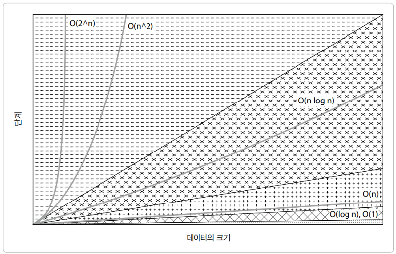

# Big-O 표기법

참고: https://www.hanbit.co.kr/channel/view.html?cmscode=CMS7965376216

- 알고리즘의 수행 시간을 대략적으로 나타내는 방법
- **O(Big O) 표기법**: 알고리즘 성능이 **최악**인 경우를 나타낼 때 사용
  - 모든 경우에서 보장되는 성능 지표
- **Ω(Big Omega) 표기법**: 알고리즘의 성능이 **최선**인 경우를 나타낼 때 사용
- **Θ(Big Theta) 표기법**: 알고리즘이 처리해야 하는 수행 시간의 상한과 하한을 동시에 나타냄

## 상수 → 로그 → 선형 → 선형로그 → 2차 → 3차 → 지수

- O(1) : 해시테이블
- O(log₂n) : 이진탐색
  - n이 증가하는 속도보다 수행 시간이 천천히 증가
- O(n) : 순차탐색
  - n이 증가하는 속도만큼 수행 시간도 증가함
- O(n log n) : 병합 정렬, 퀵 정렬
  - 로그함수이나, 앞선 알고리즘보다 수행시간이 큼
- O(n²) : 버블 정렬, 삽입 정렬
  - for 문의 2회 중첩인 경우
- O(n³) : 행렬 곱셈
- O(2ⁿ)
  - brute-force algorithm

## 공간 복잡도

- 컴퓨터의 메모리도 유한한 자원이므로 알고리즘의 실행을 완료할 때까지 필요한 자원의 양(데이터 구조 공간, 임시 공간의 메모리)
  - 고정 공간 : 프로그램 자체가 차지하는 메모리
  - 자료구조 공간 : 탐색의 대상이 되는 리스트를 저장하는 데 필요한 메모리
  - 임시 공간 : 알고리즘에서 중간 처리를 위해 사용하는 메모리
