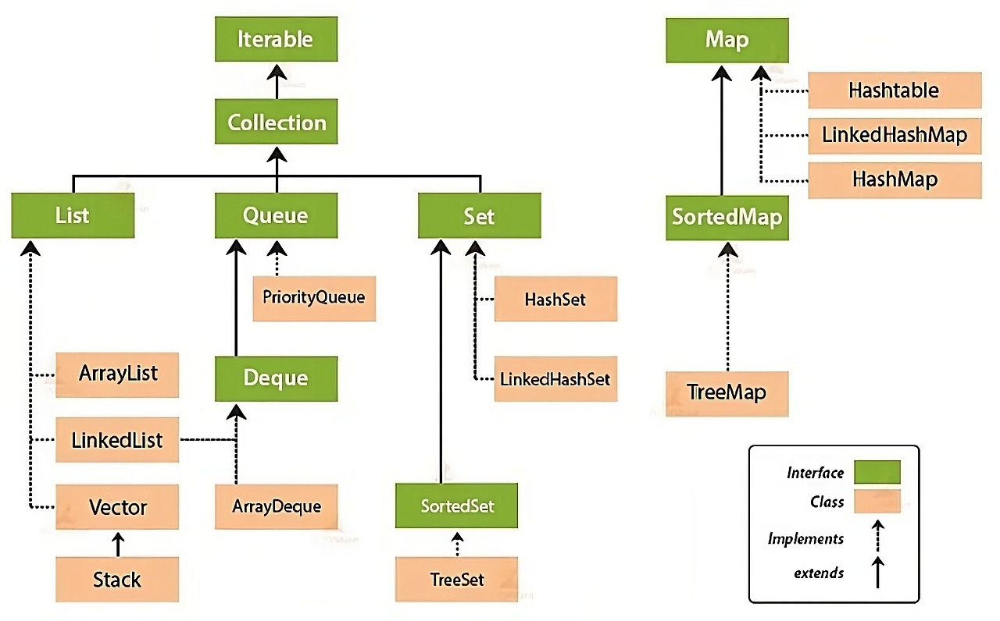
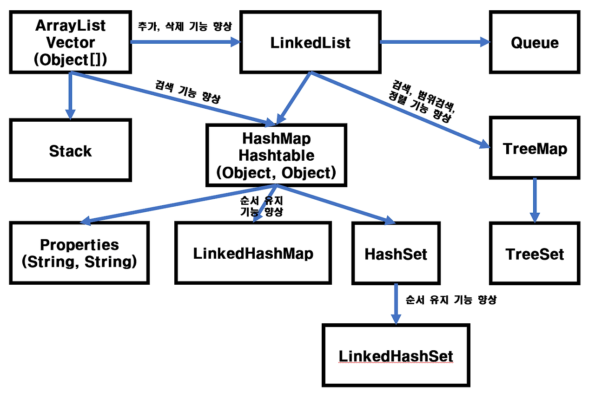

# 자바 (Backend 심화)

## Java Collection Framework

- 자료구조를 모아 클래스로 구현한 프레임워크
- 업캐스팅하여 사용하기 용이함
- 객체 지향적 설계
- cf. 내부에는 primitive 타입을 저장할 수 없어 wrapper 타입으로 Boxing하는 과정을 거친다. 객체(주소)이므로 null도 저장 가능하다.

그러나 Vector, Stack, Hashtable, Properties 같은 클래스들은 컬렉션 프레임워크가 만들어지기 이전부터 존재했기 때문에 명명 규칙을 따르지 않는다. 또한 호환성을 위해 남겨진 것이므로 가급적 사용하지 않는 것이 좋다.

### 인터페이스 계층 구조

크게 `Collection` 계열과 `Map` 계열로 나뉜다. `Map`은 키-값 쌍을 다루기 때문에 `Collection` 인터페이스를 상속하지 않는다.

- **Collection**
  - `List` : 순서가 있고 중복을 허용 (`ArrayList`, `LinkedList`, `Vector`)
  - `Set` : 순서를 보장하지 않고 중복을 허용하지 않음 (`HashSet`, `LinkedHashSet`, `TreeSet`)
  - `Queue` : FIFO 처리를 위한 자료구조 (`LinkedList`, `PriorityQueue`)
    - `Deque` : 양쪽 끝에서 삽입/삭제가 가능한 큐 (`ArrayDeque`)
- **Map** (Collection과 별도 계층)
  - `HashMap`, `LinkedHashMap`, `TreeMap`, `Hashtable`

정렬이 필요하면 `TreeSet`/`TreeMap`처럼 이진 탐색 트리 기반 구현체를, 입력 순서 유지가 필요하면 `LinkedHashSet`/`LinkedHashMap`을 선택하는 식으로 요구사항에 따라 구현체를 고르면 된다.

참고: [Collections Framework 종류 총정리](https://inpa.tistory.com/entry/JCF-🧱-Collections-Framework-종류-총정리)

## HashMap 내부 구조

참고: 네이버 D2 - https://d2.naver.com/helloworld/831311

Java HashMap에서는 해시 충돌을 방지하기 위해 Separate Chaining과 보조 해시 함수를 사용한다. Java 8부터는 Separate Chaining에서 링크드 리스트 대신 트리를 사용하기도 한다. String 클래스의 `hashCode()`가 31을 승수로 사용하는 이유도 성능 향상을 위해서다.

HashMap은 첫 등장 이후 성능 향상을 위해 꾸준히 개선되어 왔다. JDK 1.4에서 처음 도입된 보조 해시 함수와 Java 8의 트리 노드가 대표적이다.

다만 Java 7의 일부 버전에서 성능 향상을 위해 시도했던 MurMur 해시는 결과적으로 효과적이지 않아 삭제되었다. 이후 해시 함수가 균등 분포 결과를 내도록 잘 작성되면서, 기존보다 더 단순한 형태의 보조 해시 함수를 사용하게 되었다.

웹 애플리케이션 서버는 HTTP Request가 생성될 때마다 여러 개의 HashMap을 생성한다. 수많은 HashMap 객체가 1초도 안 되는 시간에 생성되고 다시 GC 대상이 되는데, 메모리 크기가 보편적으로 증가하며 메모리 중심 애플리케이션 제작도 늘어 HashMap에 더 많은 데이터를 저장하는 경향이 커지고 있다.

참고: [String.hashCode() 공식 문서](https://docs.oracle.com/en/java/javase/26/docs/api/java.base/java/lang/String.html#hashCode())

## ConcurrentHashMap

`HashMap`은 스레드 안전하지 않다. 멀티 스레드 환경에서 동시에 `put`이 몰리면 내부 연결 리스트가 꼬여 무한 루프에 빠지거나 데이터가 유실될 수 있다. `ConcurrentHashMap`은 이 문제를 락 범위를 최소화하는 방식으로 해결한 동시성 컬렉션이다.

### 기존 대안과의 비교

- `Hashtable` : 메서드 전체(`get`/`put` 등)에 `synchronized`를 걸어 테이블 전체를 잠근다. 안전하지만 스레드가 많아질수록 병목이 심해진다.
- `Collections.synchronizedMap(new HashMap<>())` : Hashtable과 마찬가지로 맵 전체에 하나의 락만 사용하는 래퍼라 성능상 이점이 없다.
- `ConcurrentHashMap` : 테이블 전체가 아닌 일부만 잠가서 동시성을 높인다.

### 내부 동작 (버전별 변화)

- **Java 7 이전** : 테이블을 여러 개의 `Segment`(기본 16개)로 나누고, 세그먼트 단위로 락을 건다. 서로 다른 세그먼트에 접근하는 스레드끼리는 동시에 작업할 수 있다 (Lock Striping).
- **Java 8 이후** : Segment 방식을 없애고, 버킷(bin)의 첫 번째 노드 단위로 `synchronized`를 걸어 락 범위를 더 세밀하게 좁혔다. 노드 삽입 자체는 CAS(Compare-And-Swap) 연산으로 처리해 락 없이 시도하고, 충돌이 날 때만 최소 범위로 동기화한다. HashMap과 마찬가지로 한 버킷의 노드 수가 임계치(8개)를 넘으면 트리(Red-Black Tree)로 변환된다.

### 주요 특징

- `null` 키/값을 허용하지 않는다. (HashMap은 허용) → 멀티 스레드 환경에서 `get()`이 `null`을 반환했을 때 "값이 없는 것"인지 "다른 스레드가 아직 쓰는 중인 것"인지 구분할 수 없기 때문
- `size()`는 정확한 실시간 값이 아니라 근사치에 가깝다. 정확한 개수가 필요하면 `mappingCount()`를 사용하는 것이 권장된다.
- 반복(iterator) 도중 다른 스레드가 값을 변경해도 `ConcurrentModificationException`이 발생하지 않는다 (weakly consistent iterator).
