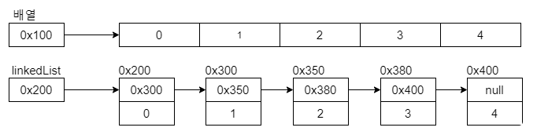
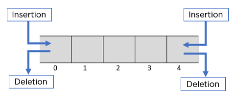

# 선형 구조

java 기준으로 정리했다.

참고: https://inpa.tistory.com/entry/JAVA-☕-자바-배열Array-문법-응용-총정리

## Array

```java
int[] score = new int[5];
int[] score2 = {10, 20, 30};
```

- `println`으로 출력하면 포인터값이 나온다
  - for문을 이용하여 순회하도록 하드코딩하거나
  - `Arrays.toString`을 이용하여 배열을 문자열 형식으로 만들어 출력할 수 있다.
- 미리 length를 지정해야 함
  - javascript의 경우 공간의 제약이 있지만 자동으로 늘였다 줄였다 해주기 때문에 못 느끼는 것

⇒ 배열을 확장하려면? 큰 배열을 새로 만들어 기존 배열을 새 배열에 복사하는 식으로 배열을 확장한다.

- for문 하드코딩
- `System.arraycopy()`
- `Arrays.copyOf()`

```java
class Test {
    public static void main(String[] args) {
        int[] arr1 = {10, 20, 30, 40, 50};

        int[] arr2 = new int[arr1.length * 2]; // 우선 초기 배열보다 길이가 두 배인 새로운 배열을 선언

        // System.arraycopy() 메서드 사용
        System.arraycopy(arr1, 0, arr2, 0, arr1.length);
        /*
        - 첫 번째 인자 : 복사할 배열
        - 두 번째 인자 : 복사를 시작할 배열의 위치
        - 세 번째 인자 : 붙여넣을 배열
        - 네 번째 인자 : 복사된 배열값들이 붙여질 시작 위치 (차례대로 붙여 넣어진다)
        - 다섯 번째 인자 : 지정된 길이만큼 값들이 복사된다.
        */

        // Arrays.copyOf() 메서드 사용
        arr2 = Arrays.copyOf(arr1, arr1.length); // arr1 배열을 arr1.length 전체 길이만큼 복사해서 arr2에 할당
        System.out.println(Arrays.toString(arr2)); // [10, 20, 30, 40, 50]

        arr2 = Arrays.copyOfRange(arr1, 1, 3); // 시작점, 끝점 지정. 1, 2만 복사해서 반환
        System.out.println(Arrays.toString(arr2));
    }
}
```

### 정렬

```java
Arrays.sort(arr);
Arrays.sort(arr, Collections.reverseOrder()); // 내림차순
Arrays.sort(arr, 0, 3); // 0~2까지 정렬
```

### 이차원 배열 - 가변 배열

```java
int[][] score = {
    {100, 100, 100, 100},
    {20, 20, 20},
    {30, 30},
    {40, 40},
    {50, 50, 50}
};
```

정방형일 필요는 없고, 객체를 넣을 수도 있다.

기본 타입의 배열은 `Arrays.copyOf` 등을 이용해 복사가 가능했다면, 배열 자체는 복사가 가능하나 배열의 내용물인 객체는 참조 복사되므로 주의!

### 비교

기본적으로는 `Arrays.equals()`를 활용한다.

#### Comparable 인터페이스의 구현

같은 타입의 인스턴스를 비교할 때 `compareTo()`를 오버라이딩하여 사용한다. 주로 객체를 정렬할 때 사용한다.

```java
class User implements Comparable<User> {
    int age;

    @Override
    public int compareTo(User user) {
        if (this.age < user.age) {
            return -1;
        }
        // ...
    }
}
```

#### Comparator 인터페이스

객체 정렬에 사용되며, 익명 객체를 이용하여 좀 더 간편하게 비교 정렬이 가능하다.

```java
Arrays.sort(users, new Comparator<User>() {
    @Override
    public int compare(User u1, User u2) {
        return Integer.compare(u1.age, u2.age); // 나이(정수) 비교
        // return u1.name.compareTo(u2.name); // 문자열 비교
    }
});

// Java 8 람다식으로 다음과 같이 축약이 가능
Arrays.sort(users, (u1, u2) -> Integer.compare(u1.age, u2.age)); // 나이순 정렬
```

이 외 여러 속성을 동시에 이용해 정렬할 때는 Comparator의 `comparing()`과 `thenComparing()`을 사용하며, getter를 이용해 속성을 가져와야 한다.

```java
Arrays.sort(users, Comparator.comparing(User::getAge));
Arrays.sort(users, Comparator.comparing(User::getAge).thenComparing(User::getName));
```

## LinkedList



각 노드는 next Node를 저장하는 필드, 데이터 저장 필드로 구성된다.

1. 단방향 연결 리스트
   - next만을 갖는다
2. 양방향 연결 리스트
   - prev, next를 갖는다
   - 역순 검색이 가능함
3. 양방향 원형 연결 리스트
   - 끝과 시작을 각각 연결한 구조가 추가됨

- 리스트뿐 아니라 스택과 큐로도 활용이 가능하여 관련 메서드를 제공한다.
  - 멀티 스레드 환경에서 동시에 접근하여 문제가 생기는 경우를 방지하기 위해 동기화 처리된 `synchronizedList`를 반환받아 사용하기도 한다.
- 반복문을 통한 순회가 아닌 `Iterator iterator()`를 지향하는 경우도 있다.
  - Collection 인터페이스 내부에서 iterator가 정의된 형태이므로 List나 Set도 사용 가능하다 (Map은 안 됨)

참고(추후 정리): [ArrayList vs LinkedList 특징/성능 비교](https://inpa.tistory.com/entry/JCF-🧱-ArrayList-vs-LinkedList-특징-성능-비교)

삽입/삭제 시 데이터 이동이 필요한 경우(삽입/삭제 자체는 둘 다 상수 시간), ArrayList는 데이터 이동에 추가 시간이 들고 LinkedList는 이동 자체에 시간이 소요된다.

## Stack (LIFO)

- 탄창 형태처럼 push와 pop을 사용하여 구현되어 있다.

```java
Stack<Number> stack = new Stack<>();
```

- `peek`를 활용하면 확인만 하고 스택에서 제거하지 않는다.
- 데이터가 존재하지 않는데 `pop`이나 `peek`를 하면 `EmptyStackException`이 발생하므로 `isEmpty` 메서드로 예외를 방지해야 한다.
- `search` 메서드를 활용하면 순서값을 반환한다 (인덱스 아님).
- List 인터페이스를 구현한 Vector 클래스를 Stack이 상속했으므로 size를 사용할 수 있다.
- 동적 공간이므로 별도 사이즈 명시가 필요 없다.

### Vector는 deprecated, Deque 사용 권장

Vector는 deprecated 되어 Deque(덱)의 사용이 공식적으로 권장된다.



## Queue (FIFO)

- front : 삭제 연산을 수행
- rear : 삽입 연산을 수행
- BFS(너비 우선 탐색)에서 사용한다. 컴퓨터 버퍼, 큐 등에서 주로 사용

```java
Queue<Integer> queue = new LinkedList<>();
// Queue와 LinkedList를 동시에 사용하여 생성해야 한다.
```

- `add`, `offer`로 값을 추가할 수 있다.
  - `add`는 삽입 실패 시(여유 공간 부족) `IllegalStateException`이 발생하므로 예외 처리할 것
- `poll`, `remove`, `clear`(초기화)로 값을 삭제할 수 있다.
  - `poll`은 큐가 비어 있으면 `null`을 반환한다.

## Hash Table

- 자료를 키-값 쌍으로 매핑하고 각 키에 해시 함수를 적용해 나온 값을 인덱스로 사용한다.
- Bucket : 각 슬롯을 가리키는 용어
- search, insert, remove 메서드를 지원한다.

### 해시 함수

- 키를 균등하게(uniformly) 인덱스로 변환하여 해시 테이블 내에 랜덤하게 흩어지도록 저장함
- 복잡하면 안 됨 (연산 속도)
- mid-square, folding, multiplicative 방식 외에도 mod 연산을 활용한 나눗셈 함수가 가장 많이 사용된다.

### 해시 충돌 (Collision)

동일한 해시값을 갖는 경우 여러 개를 동시에 저장할 수 없기 때문에 발생한다.

- 개방 주소 방식 (Open Addressing) : 충돌 발생 시 새 키를 위해 해시 테이블의 다른 위치를 찾아 사용
  - 선형 조사 (Linear Probing) : 순차 탐색으로 1씩 증가시키며 빈 곳에 끼워 넣기 → 키들이 뭉치며 해시 성능 저하로 이어짐
  - 이차 조사 (Quadratic Probing) : 제곱 함수로 증가시키며 데이터를 삽입 → 군집화 문제는 해결하지만 다른 형태의 군집화를 야기
  - 랜덤 조사 (Random Probing) : 점프 시퀀스를 무작위로 하여 빈 원소에 끼워 넣음 → random step만큼 증가시키지만 동의어들이 일정 패턴에 따라 뭉치는 3차 군집화 존재
  - 이중 해싱 (Double Hashing) : 해시 함수 두 개 사용(하나는 인덱스 변환, 하나는 점프 크기 결정용, 0 초과 step) → key 값과 해시 테이블 크기 M이 서로소 관계일 때 성능이 좋음 (M은 소수로 선택할 것)
- 폐쇄 주소 방식 (Closed Addressing) : 충돌 발생 시 같은 버킷 내에 연결 리스트 등의 자료구조로 항목을 저장
  - 체이닝 (Chaining) : 하나만 저장하지 않고 LinkedList를 사용해 구현하는 방식

```java
class Entry<K, V> {
    private K key;
    private V value;

    public Entry(K key, V value) {
        this.key = key;
        this.value = value;
    }

    public K getKey() {
        return key;
    }

    public V getValue() {
        return value;
    }

    public void setValue(V value) {
        this.value = value;
    }

    @Override
    public String toString() {
        return "[" + this.key + " : " + this.value + "]";
    }
}

// 해시테이블
public class MyHashTable<K, V> {
    private Entry<K, V>[] table;
    private int capacity;
    private int size;

    public MyHashTable(int capacity) {
        this.capacity = capacity;
        this.table = new Entry[capacity];
        this.size = 0;
    }

    private int hash(K key) {
        // 절대값[Key의 해시코드(Integer)] % 배열의 크기 = 해시함수로 사용
        return Math.abs(key.hashCode()) % capacity;
    }

    public void insert(K key, V value) {
        if (size == capacity) {
            System.out.println("해시 테이블이 가득 찼습니다.");
            return;
        }

        int index = hash(key);
        // 충돌 해결 기법을 적용시켜야 함
        table[index] = new Entry<>(key, value);
        size++;
    }

    public V search(K key) {
        int index = hash(key);
        // 충돌 해결 기법을 적용시켜야 함
        return table[index].getValue();
    }

    public void remove(K key) {
        int index = hash(key);
        // 충돌 해결 기법을 적용시켜야 함
        if (table[index].getKey().equals(key)) {
            table[index] = null;
            size--;
        }
    }

    public void print() {
        for (Entry e : table) {
            System.out.print(e + " ");
        }
    }
}
```
> 출처: [데굴데굴 개발자의 기록 - 티스토리](https://sjh9708.tistory.com/208)

- 데이터가 테이블 크기에 비해 늘어나면(적재율이 높아지면) 성능 저하 확률이 높음

### 해시 테이블 확장 대안

1. Rehashing : 해시 테이블을 확장하며, O(N)의 시간이 소요된다.
2. 동적 해싱
   - 확장 해싱 : 디렉터리를 메인 메모리에, 데이터를 디스크 블록 크기인 버킷 단위로 저장해 데이터가 늘어나도 디렉터리만 확장하면 된다.
   - 선형 해싱 : 삽입 시 버킷을 순서대로 추가하며, 저장 공간이 없으면 Overflow 체인에 새 키를 삽입하고 버킷 추가 이후 이동시킨다. 삽입이 빈번한 경우 효율적.

### 시간복잡도

해시 테이블의 시간 복잡도는 어떤 해시 함수를 사용하느냐에 따라 좌우된다. (삽입, 삭제, 검색 기준)

- 충돌이 발생하지 않을 때 : 일반적으로 O(1)
- 충돌이 발생하는 경우 : 최악의 경우 O(N)

이상적인 해시 테이블은 충돌이 적게 발생하고 해시 함수가 키를 균등하게 분배할 때 평균적으로 O(1)의 시간 복잡도를 가진다.
