# 1주차 - 자료구조 / 시간복잡도

## 목차

1. [Big-O](#1-big-o)
2. [Array](#2-array)
3. [LinkedList](#3-linkedlist)
4. [Stack](#4-stack)
5. [Queue](#5-queue)
6. [Hash Table](#6-hash-table)
7. [Hash Collision](#7-hash-collision)
8. [Tree](#8-tree)
9. [Heap](#9-heap)
10. [JS Array / Object / Map / Set](#10-js-array--object--map--set)
11. [배열 연산의 시간복잡도](#11-배열-연산의-시간복잡도)
12. [불변성](#12-불변성)
13. [정리](#13-정리)
14. [자주 헷갈리는 포인트](#14-자주-헷갈리는-포인트)

---

## 1. Big-O

### 개념

- 입력 크기 N이 커질수록 연산량이 얼마나 늘어나는지 나타내는 표기법
- 초 단위 실행 시간이 아니라 **증가하는 패턴**을 봄
- 하드웨어·언어가 달라져도 이 증가 패턴 자체는 바뀌지 않음
- 그래서 서로 다른 알고리즘의 효율을 "공정하게" 비교하는 공통 잣대로 쓰임
- 실행 시간뿐 아니라 메모리 사용량의 증가 패턴을 나타낼 때도 같은 표기법을 쓸 수 있음 (공간 복잡도)

### 비유: 전화번호부에서 이름 찾기

- 정렬돼 있어서 절반씩 건너뛰며 찾음 → O(log N)
- 정렬이 안 돼 있어서 첫 페이지부터 한 장씩 넘김 → O(N)
- 모든 사람과 모든 사람의 쌍을 하나하나 비교 → O(N²)

### N이 10배 늘어났을 때 (10 → 100)

```
O(1)      : 그대로
O(log N)  : 약 3배
O(N)      : 정확히 10배
O(N²)     : 100배
O(2^N)    : 자릿수 자체가 바뀔 정도
```

- 데이터가 적을 땐 O(N)과 O(N²)의 차이가 잘 안 보이지만, 규모가 커질수록 격차가 순식간에 벌어짐

### 계수/상수 제거

```js
for (const x of arr) {}   // N
for (const y of arr) {}   // N
// 합쳐도 O(2N)이 아니라 O(N)
```

- "몇 번 도는가"가 아니라 "어떤 형태로 도는가"를 기준으로 봄

### 최선 / 평균 / 최악

| 케이스 | 예시 | 복잡도 |
|---|---|---|
| 최선 | 찾는 값이 첫 번째 | O(1) |
| 평균 | 어딘가 중간에 있음 | 경우마다 다름 |
| 최악 | 마지막에 있거나 없음 | O(N) |

> 알고리즘 성능은 보통 **최악의 경우**를 기준으로 말한다. "이 알고리즘은 O(N)이다"라는 말은 사실 "최악의 경우에도 O(N)을 넘지 않는다"는 뜻에 가깝다.

---

## 2. Array

### 개념

- 같은 타입의 데이터를 메모리에 연속적으로 저장하는 자료구조
- 크기가 고정된 배열도 있고, 필요할 때 내부적으로 더 큰 공간으로 옮겨가며 늘어나는 배열도 있음 (JS의 배열은 후자)

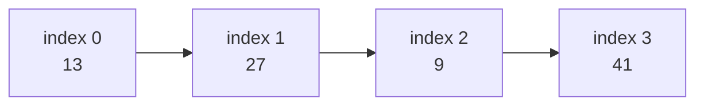

### 접근이 O(1)인 이유

```
목표 주소 = 시작 주소 + (index × 요소 크기)
```

- index만 알면 주소 계산 한 번으로 바로 해당 위치에 접근 가능
- 앞에서부터 순서대로 확인할 필요가 없음

### 탐색은 O(N)

- 값으로 위치를 찾으려면(어느 index인지 모르는 상태) 처음부터 하나씩 비교해야 함
- 최악의 경우 마지막 요소까지 다 확인해야 끝남

### 삽입/삭제

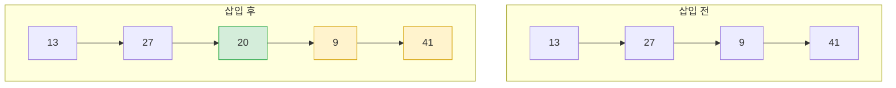

- 맨 끝 삽입/삭제: 다른 요소를 건드리지 않음 → O(1)
- 중간 삽입/삭제: 뒤 요소들을 전부 한 칸씩 밀어야 함 → O(N)

### 복잡도 정리

| 연산 | 복잡도 |
|---|---|
| 인덱스 접근 | O(1) |
| 값 탐색 | O(N) |
| 맨 끝 삽입/삭제 | O(1) |
| 중간 삽입/삭제 | O(N) |

---

## 3. LinkedList

### 개념

- 각 노드가 데이터와 함께 다음 노드를 가리키는 포인터(참조)를 가짐
- 노드들이 메모리 여기저기 흩어져 있어도 상관없음 (연속된 공간이 필요 없음)
- 다음 노드만 아는 단일 연결 리스트도 있고, 이전/다음 노드를 모두 아는 이중 연결 리스트도 있음

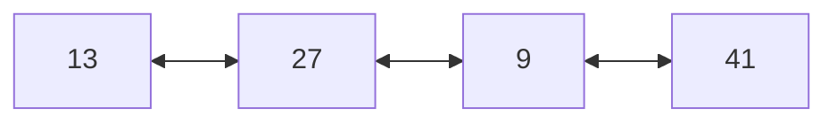

### 접근/탐색은 O(N)

- 몇 번째 노드인지 알려면 head부터 포인터를 하나씩 따라가야 함
- 배열처럼 계산으로 위치를 바로 찾는 방법이 없음

### 삽입/삭제

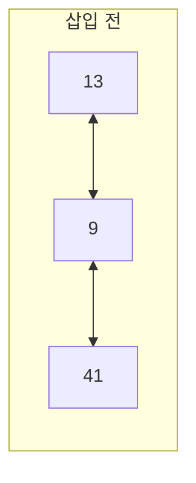

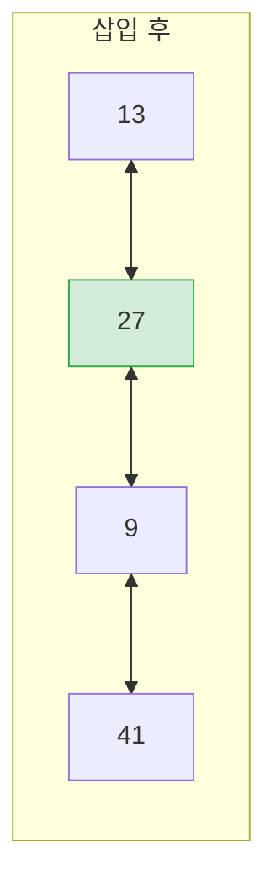

- 삽입/삭제할 위치를 이미 가리키고 있으면 포인터만 바꾸면 됨 → O(1)
- 몇 번째인지 몰라 탐색하는 과정까지 포함하면 → O(N)

### Array vs LinkedList

| | 배열 | 연결리스트 |
|---|---|---|
| 인덱스 접근 | O(1) | O(N) |
| 값 탐색 | O(N) | O(N) |
| 중간 삽입/삭제 | O(N) | 위치를 알면 O(1) |
| 메모리 배치 | 연속 | 분산 |

---

## 4. Stack

### 개념

- **LIFO(Last In First Out)**: 마지막에 넣은 데이터가 가장 먼저 나옴
- 넣고 빼는 게 항상 한쪽 끝(top)에서만 일어남

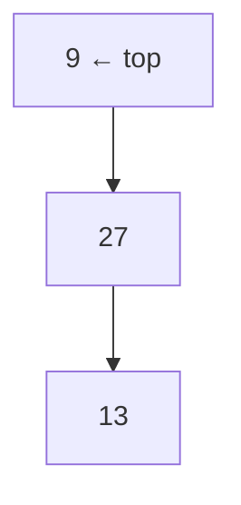

### 핵심 연산

- **push**: 맨 위에 삽입
- **pop**: 맨 위에서 제거
- **peek**: 맨 위 값 확인만 (제거 X)
- 셋 다 맨 위에서만 일어나서 **O(1)**

### 대표 사례: 함수 호출

```js
function a() { b(); }
function b() { c(); }
function c() { /* ... */ }
```

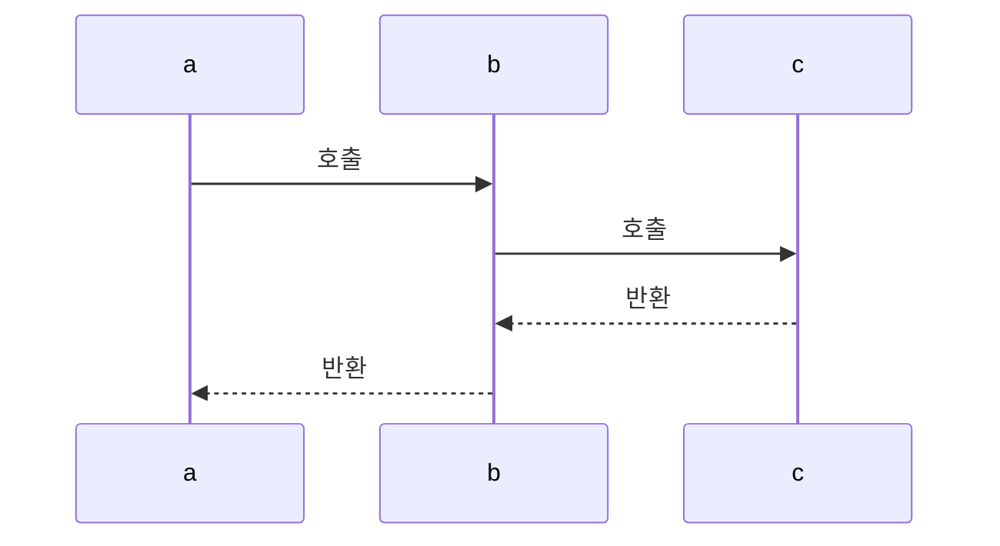

- 호출 순서: a → b → c
- 반환 순서: c → b → a (반드시 역순)
- 재귀가 끝없이 이어지면 스택 오버플로우 발생

```js
function countUp(n, max) {
  if (n > max) return;
  console.log(n);
  countUp(n + 1, max); // 호출될 때마다 쌓임
}
```

### 그 외 사용처

- 브라우저 뒤로가기, 편집기 실행 취소(Undo)
- 재귀 없이 트리/그래프를 순회할 때 배열을 스택처럼 쓰는 구현

---

## 5. Queue

### 개념

- **FIFO(First In First Out)**: 먼저 넣은 데이터가 먼저 나옴


### 핵심 연산

- **enqueue**: 뒤에 삽입
- **dequeue**: 앞에서 제거
- 둘 다 기본적으로 **O(1)**

### 사용처

- 들어온 순서대로 처리해야 하는 작업: 알림 발송, 이미지 변환 요청 등
- 여러 후보 중 "지금 가장 급한 것부터" 처리해야 한다면 우선순위 큐(내부적으로 Heap 사용)를 쓰기도 함

### 주의: 배열의 shift()

```js
const line = [13, 27, 9];
line.shift(); // 간단해 보여도 내부적으로 O(N)
```

- 맨 앞을 빼면서 나머지를 전부 한 칸씩 당겨야 하기 때문에 실제로는 **O(N)**
- 자주 쓰는 큐라면 요소를 옮기지 않고 시작/끝 위치만 기록하는 방식이 낫다

---

## 6. Hash Table

### 개념

- key를 해시 함수에 넣어 저장 위치(index)를 계산하는 자료구조
- 배열처럼 처음부터 순회하지 않고, 계산 한 번으로 위치를 알아낸다는 게 핵심

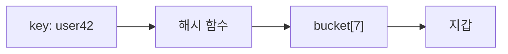

### 시간복잡도

- 조회/삽입/삭제 평균 **O(1)** — 같은 계산을 한 번만 하면 바로 해당 버킷으로 찾아감
- 배열의 값 탐색이 O(N)이었던 것과 비교하면 훨씬 빠름

```ts
const box = new Map<string, string>();
box.set('user42', '지갑'); // O(1) 평균
box.get('user42');         // O(1) 평균
```

### 좋은 해시 함수의 조건 (간단히)

- 같은 key를 넣으면 항상 같은 해시값을 반환해야 함
- 버킷들이 골고루 쓰이도록 값이 고르게 분산돼야 함 (한쪽으로 몰리면 다음 챕터의 문제가 생김)

---

## 7. Hash Collision

### 개념

- 서로 다른 key인데 해시 계산 결과가 같은 버킷으로 나올 수 있음

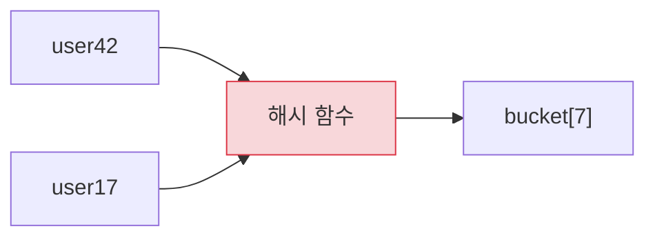

### 해결 방법

- 한 버킷에 여러 개를 연결 리스트 형태로 이어붙임 (체이닝)

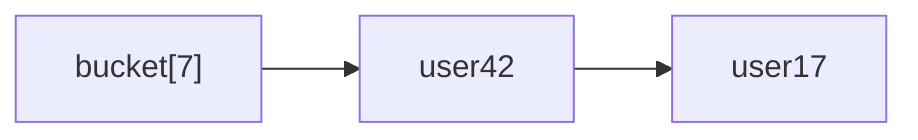

### 복잡도

- 충돌이 드물면 여전히 평균 O(1)
- 충돌이 한 버킷에 몰리면 그 안에서 하나씩 대조해야 해서 최악의 경우 O(N)

> 해시 테이블의 O(1)은 "항상 보장"이 아니라 "평균적으로"라는 전제가 붙는다.

---

## 8. Tree

### 개념

- 노드들이 부모-자식 관계로 연결된 계층적 자료구조
- 배열/리스트가 데이터를 일렬로 나열하는 구조였다면, 트리는 위아래로 갈라지는 구조

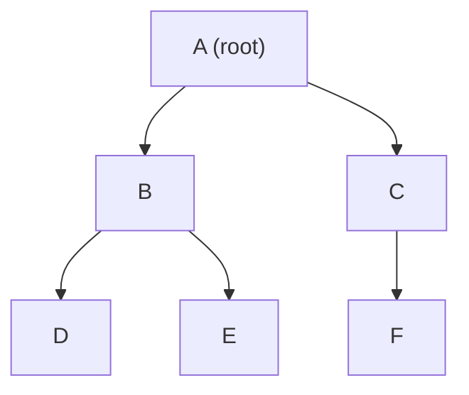

### 용어

| 용어 | 의미 |
|---|---|
| Root | 맨 위 노드 |
| Leaf | 아래로 더 갈라지지 않는 노드 (D, E, F) |
| Depth | 루트에서 몇 단계 내려왔는지 |
| Height | 가장 아래 leaf까지의 단계 수 |

### 이진 탐색 트리 (BST)

- 각 노드가 자식을 최대 둘까지만 가지고, 다음 규칙을 지킴: 왼쪽 자식 < 부모 < 오른쪽 자식

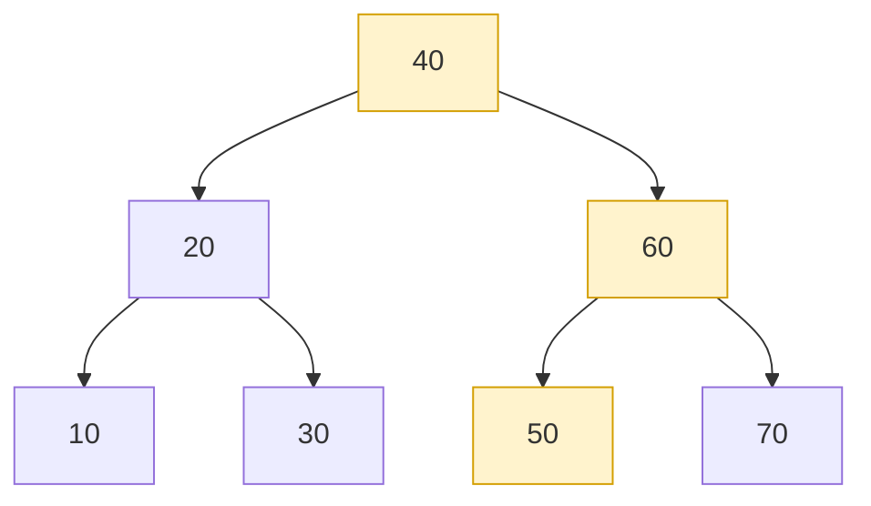

50을 찾는 과정:
1. 40보다 크다 → 오른쪽
2. 60보다 작다 → 왼쪽
3. 50 발견

- 트리가 고르게 뻗어 있으면 매번 후보를 절반씩 버릴 수 있어 **O(log N)**

### 최악의 경우

- 10, 20, 30, 40, 50처럼 정렬된 순서로 그대로 넣으면 한쪽으로만 늘어져 사실상 연결리스트와 같아짐
- 이 경우 탐색도 **O(N)**까지 나빠짐
- 그래서 삽입/삭제할 때마다 스스로 균형을 다시 맞추는 트리 구조가 실무에서 쓰임

### 순회

- 왼쪽 → 자기 자신 → 오른쪽 순서로 도는 방식(Inorder)은, BST에서만큼은 값을 작은 것부터 순서대로 뽑아냄
- 자기 자신 → 왼쪽 → 오른쪽(Preorder)은 트리 구조를 그대로 복사하거나 저장할 때 자주 쓰임

---

## 9. Heap

### 개념

- 트리 모양이지만 BST와 규칙이 다름
- 좌우 구분 없이 "부모가 자식보다 항상 크다"만 지킴 (Max Heap 기준, 반대는 Min Heap)
- 전체가 정렬돼 있는 건 아니고, 딱 "가장 큰 값이 어디 있는지"만 항상 보장됨

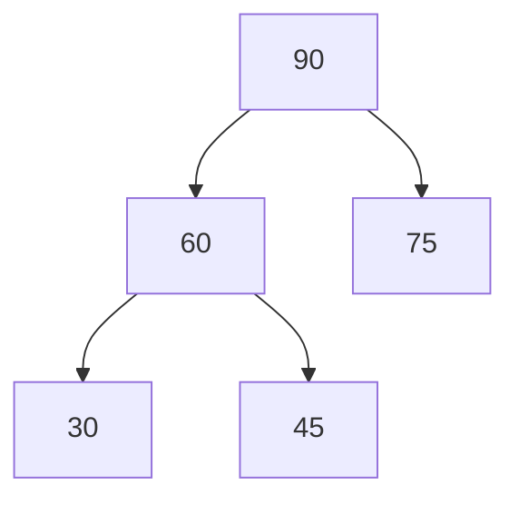

### 시간복잡도

- 최댓값 조회: **O(1)** — 정렬은 안 돼 있어도 맨 위엔 항상 최댓값
- 삽입: **O(log N)** — 맨 끝에 넣고 부모와 비교하며 올라감
- 삭제: **O(log N)** — 맨 끝 값을 위로 옮기고 자식과 비교하며 내려감

```ts
function moveUp(heap: number[], i: number) {
  while (i > 0) {
    const parent = (i - 1) >> 1;
    if (heap[parent] >= heap[i]) break;
    [heap[parent], heap[i]] = [heap[i], heap[parent]];
    i = parent;
  }
}
```

### 쓰이는 곳

- "우선순위가 가장 높은 것부터 계속 꺼내야 하는" 문제: 작업 스케줄링, K번째로 큰 값 찾기 등

| 연산 | 복잡도 |
|---|---|
| 최댓값 조회 | O(1) |
| 삽입 | O(log N) |
| 삭제 | O(log N) |
| 특정 값 검색 | O(N) |

---

# Frontend 심화

## 10. JS Array / Object / Map / Set

### 각각의 용도

- **Array**: 순서 있는 목록, 인덱스로 접근
- **Object**: key-value, 키는 문자열/Symbol만 가능
- **Map**: key-value, 키 타입 제한 없음 + 삽입 순서 보장
- **Set**: 중복 없는 값들의 묶음

### Object의 숫자 키 함정

```js
const point = { 2: 'y', name: 'p1', 1: 'x' };
Object.keys(point);
// ['1', '2', 'name'] — 숫자 키가 앞으로, 오름차순 재배치
```

- 순서가 중요하거나 키가 숫자·객체여야 하면 `Map`이 안전

```ts
const button = document.querySelector('button')!;
const clickCount = new Map<Element, number>();
clickCount.set(button, 0); // DOM 요소를 키로 그대로 사용
```

### Set으로 중복 제거

- `indexOf`로 매번 확인하면 전체 O(N²)
- `Set`은 조회가 O(1)이라 전체 O(N)

```js
const unique = [...new Set([1, 2, 2, 3, 3, 3])]; // [1, 2, 3]
```

## 11. 배열 연산의 시간복잡도

| 메서드 | 복잡도 | 비고 |
|---|---|---|
| `arr[i]` | O(1) | 바로 접근 |
| `push`, `pop` | O(1) | 끝에서만 처리 |
| `shift`, `unshift` | O(N) | 앞쪽 처리 시 나머지 이동 |
| `includes`, `indexOf` | O(N) | 순차 비교 |
| `map`, `filter`, `forEach` | O(N) | 전체 순회 |
| `sort` | O(N log N) | |

### 흔한 실수

```js
// 느림: A의 각 항목마다 B 전체를 다시 훑음 → O(N²)
const matched = listA.filter(a => listB.includes(a.id));

// 빠름: 조회를 O(1)로 바꿔서 전체 O(N)
const idSet = new Set(listB.map(b => b.id));
const fast = listA.filter(a => idSet.has(a.id));
```

## 12. 불변성

### 개념

- 원본 값을 그 자리에서 고치지 않고, 바뀐 내용을 담은 새 값을 만드는 방식

```js
// 직접 수정 — 참조는 그대로
todos.push(newTodo);

// 새로 생성 — 참조가 바뀜
const nextTodos = [...todos, newTodo];
```

### 왜 중요한가

- React는 참조가 같은지만 확인해서 상태 변경을 감지함
- 직접 고치면 값은 바뀌어도 참조는 그대로라 화면이 갱신되지 않을 수 있음
- 데이터가 크면 바뀐 부분만 새로 만드는 라이브러리(Immer 등)를 함께 쓰기도 함

---

## 13. 정리

| 자료구조 | 접근 | 탐색 | 삽입 | 삭제 |
|---|---|---|---|---|
| Array | O(1) | O(N) | O(N) (끝은 O(1)) | O(N) (끝은 O(1)) |
| LinkedList | O(N) | O(N) | 위치 알면 O(1) | 위치 알면 O(1) |
| Stack | - | - | O(1) | O(1) |
| Queue | - | - | O(1) | O(1) |
| Hash Table | - | O(1) 평균 | O(1) 평균 | O(1) 평균 |
| 균형 BST | O(log N) | O(log N) | O(log N) | O(log N) |
| Heap | 최상단 O(1) | O(N) | O(log N) | O(log N) |

## 14. 자주 헷갈리는 포인트

| 오해 | 실제로는 |
|---|---|
| "연결리스트는 삽입/삭제가 항상 O(1)이다" | 위치를 이미 알고 있을 때만 O(1), 위치 탐색까지 포함하면 O(N) |
| "해시 테이블은 무조건 O(1)이다" | 평균이 O(1)이고, 충돌이 심하면 최악의 경우 O(N) |
| "이진 탐색 트리는 항상 O(log N)이다" | 데이터가 정렬된 순서로 들어오면 한쪽으로 치우쳐 O(N)까지 나빠질 수 있음 |
| "큐는 배열로 만들면 다 O(1)이다" | `shift()` 기반 dequeue는 실제로 O(N) |
| "힙에 넣으면 전체가 정렬된다" | 힙은 부모-자식 관계만 보장할 뿐, 좌우 정렬은 보장하지 않음 |
| "불변성을 지키면 항상 성능이 좋다" | 매번 새 객체를 만드는 비용이 있어서, 데이터가 아주 크면 오히려 부담이 될 수 있음 |