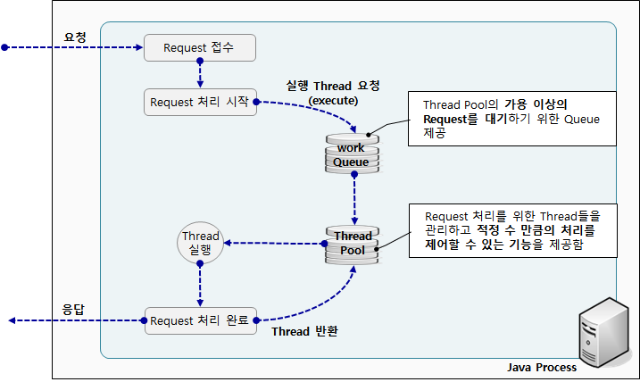

# Thread Pool (Backend 심화)

참고: [Async Size 설정 기준에 대해 고민해보자 (feat. ThreadPoolQueue)](https://velog.io/@vanillacake369/Async-Size-%EC%84%A4%EC%A0%95-%EA%B8%B0%EC%A4%80%EC%97%90-%EB%8C%80%ED%95%B4-%EA%B3%A0%EB%AF%BC%ED%95%B4%EB%B3%B4%EC%9E%90-feat.ThreadPoolQueue)

스레드를 만들어 두고 재사용할 수 있도록 스레드 풀을 정의한다. 메모리 낭비를 하지 않기 위한 스레드 풀 환경 설정은 매우 중요하다.

## 스레드 풀 사용 과정

1. `corePoolSize`만큼 실행한다.
2. Work Queue에서 task를 대기한다.
3. Work Queue가 가득 차면 thread pool이 `maxPoolSize`만큼 늘어난다.
4. 만약 현재 스레드 풀이 `corePoolSize`보다 많은 스레드를 가지고 있다면, 초과한 스레드에 대해서 `keepAliveTime` 파라미터 값보다 오랫동안 할 일이 없으면 제거한다.

## 스레드 풀 옵션

- **corePoolSize**
  - `ThreadPoolExecutor`가 동시에 수행할 수 있는 Thread 수 지정
- **maximumPoolSize**
  - `ThreadPoolExecutor`가 최대 수행할 수 있는 Thread 수 지정
- **keepAliveTime**
  - `corePoolSize`보다 더 많은 Thread가 생성될 경우, 추가된 Thread를 정리(제거)하기 위한 대기 시간
- **TimeUnit**
  - `keepAliveTime` 옵션값을 위한 시간 단위 (Second, millisecond 등)
- **workQueue**
  - `ThreadPoolExecutor`의 실행 가능한 Thread Pool이 없을 경우 Thread를 대기시키기 위한 Queue 지정

## 포화 정책 (Saturation Policies)

- `ThreadPoolExecutor.AbortPolicy` — default
  - Reject 발생 시 `RejectedExecutionException` 발생
- `ThreadPoolExecutor.CallerRunsPolicy`
  - Reject된 task를 실행 중인 main thread에서 동작시킨다
- `ThreadPoolExecutor.DiscardPolicy`
  - Reject된 task는 버려진다
  - Exception도 발생하지 않음
- `ThreadPoolExecutor.DiscardOldestPolicy`
  - 가장 오래된, 처리되지 않은 요청을 삭제하고 다시 시도한다
  - `DiscardPolicy`와 마찬가지로 데이터가 유실될 수 있다

## 사이징 기준

- `corePoolSize`는 `CPU 코어 수 * CPU 사용률 * (1 + I/O 대기 시간 비율)`을 사용하자.
- DB connection pool은 `(CPU 개수 * 2) + DB 서버가 관리할 수 있는 동시 I/O 요청 수`를 사용하자.
- 웬만하면 `queueCapacity`와 `maxPoolSize`는 건드리지 말자. 성능 이슈도 있고, 더군다나 사용자의 요청 수를 예측할 수 없기 때문이기도 하다.

## Atomic

> 추후 정리

## WAS Thread

> 추후 정리
