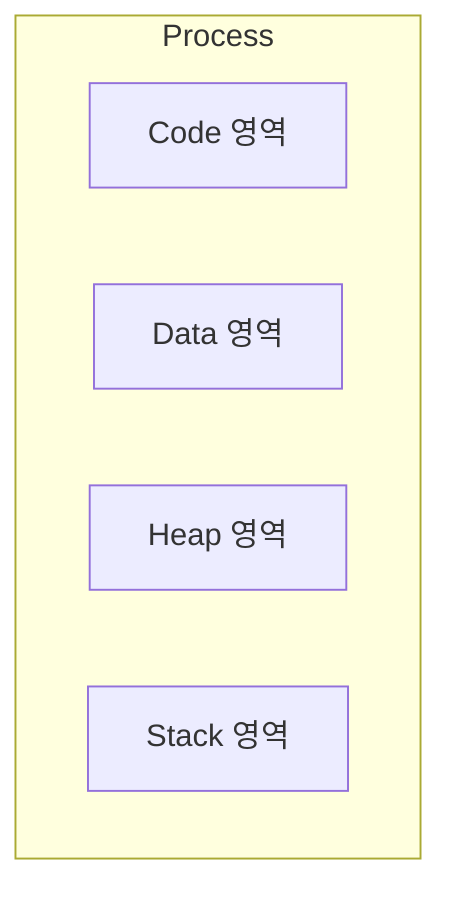
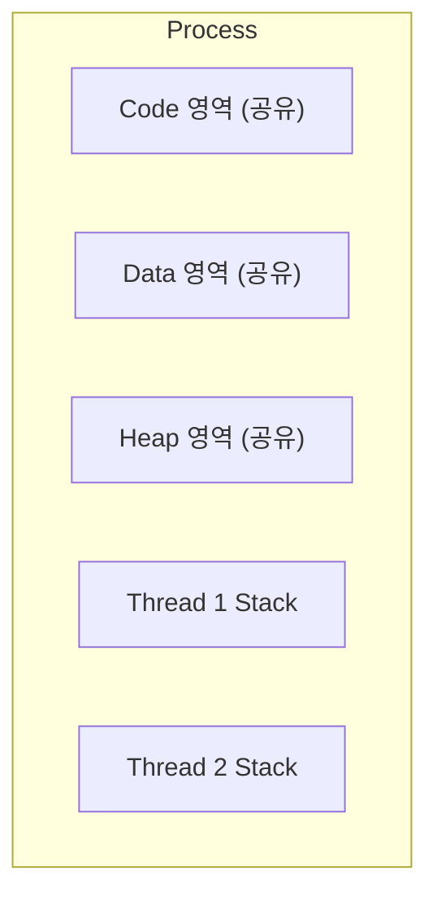
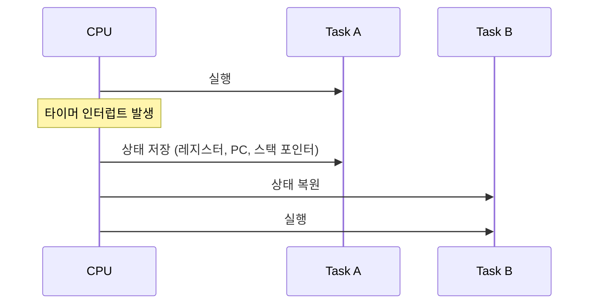
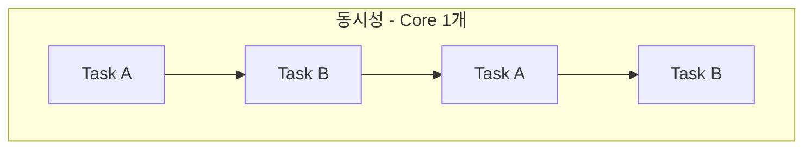
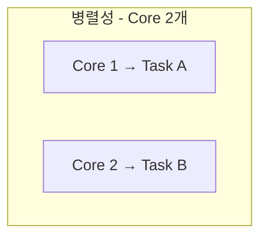
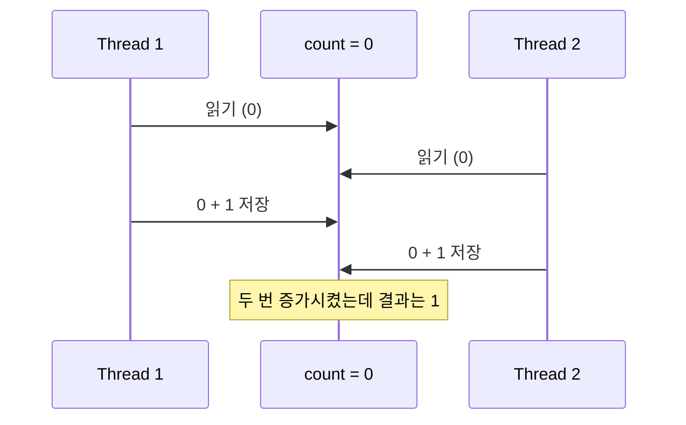
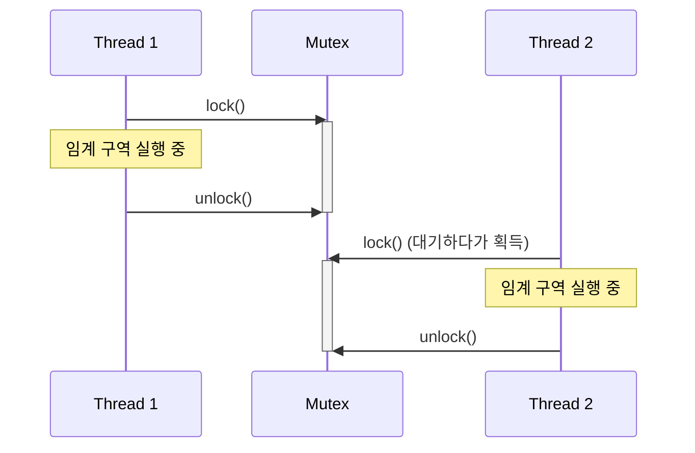
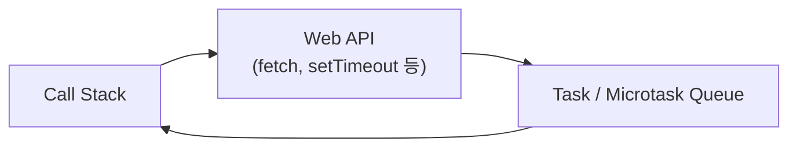
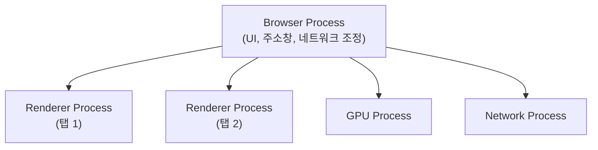

# 2주차 - Process / Thread / 동시성

## 목차

1. [Process](#1-process)
2. [Thread](#2-thread)
3. [Context Switching](#3-context-switching)
4. [동시성/병렬성](#4-동시성병렬성)
5. [Race Condition](#5-race-condition)
6. [Mutex/Semaphore](#6-mutexsemaphore)
7. [JS Single Thread](#7-js-single-thread)
8. [Web Worker](#8-web-worker)
9. [브라우저 Multi-Process 구조](#9-브라우저-multi-process-구조)
10. [정리](#10-정리)
11. [자주 헷갈리는 포인트](#11-자주-헷갈리는-포인트)

---

## 1. Process

### 개념

- 운영체제로부터 독립된 메모리 공간을 할당받아 실행되는 프로그램의 인스턴스
- Code, Data, Heap, Stack 영역을 독자적으로 가짐
- 프로세스마다 메모리 공간이 분리되어 있어서, 한 프로세스가 다른 프로세스의 메모리를 직접 건드릴 수 없음
- 프로세스 안에는 최소 1개 이상의 스레드(메인 스레드)가 존재함



### 프로세스 간 통신 (IPC)

- 메모리가 서로 분리돼 있어서 프로세스끼리 값을 주고받으려면 별도의 통신 방법이 필요함
- 대표적인 방법: 파이프(Pipe), 소켓(Socket), 공유 메모리(Shared Memory), 메시지 큐

### 특징

- 생성 비용이 큼 (메모리 공간을 새로 할당해야 함)
- 프로세스 하나가 죽어도 다른 프로세스에 영향을 주지 않음 (격리)

---

## 2. Thread

### 개념

- 프로세스 안에서 실제로 실행되는 흐름의 단위
- 같은 프로세스에 속한 스레드끼리는 Code, Data, Heap 영역을 공유함
- 단, Stack과 레지스터(현재 실행 위치 등)는 스레드마다 따로 가짐



### Process vs Thread

| | Process | Thread |
|---|---|---|
| 메모리 | 독립적 | Code/Data/Heap 공유, Stack만 분리 |
| 생성 비용 | 큼 | 작음 |
| 통신 방법 | IPC 필요 | 공유 메모리로 바로 접근 가능 |
| 하나가 죽으면 | 다른 프로세스엔 영향 없음 | 같은 프로세스의 다른 스레드도 영향받을 수 있음 |
| Context Switching 비용 | 큼 | 상대적으로 작음 |

### 왜 스레드를 쓰는가

- 메모리를 공유하기 때문에 데이터를 주고받는 속도가 빠름
- 프로세스를 새로 만드는 것보다 스레드를 만드는 게 훨씬 가벼움
- 여러 작업을 동시에 처리해야 할 때(웹 서버가 여러 요청을 처리하는 경우 등) 자주 사용됨

---

## 3. Context Switching

### 개념

- CPU가 하나의 프로세스/스레드를 실행하다가 다른 프로세스/스레드로 전환하는 과정
- 전환 전 현재 실행 상태(레지스터, 프로그램 카운터 등)를 저장하고, 다음 실행할 대상의 상태를 복원함
- CPU 코어 개수보다 실행할 작업이 많을 때, 짧은 시간 단위로 번갈아 실행하기 위해 필요함



### 비용

- 상태를 저장하고 복원하는 작업 자체가 오버헤드 → 그 시간 동안은 실제 작업이 진행되지 않음
- **프로세스 간 전환**: 메모리 주소 공간까지 통째로 바꿔야 해서 비용이 큼
- **스레드 간 전환**: 같은 프로세스 안이라면 메모리 공간은 그대로 두고 Stack/레지스터만 바꾸면 돼서 상대적으로 저렴함

---

## 4. 동시성/병렬성

### 개념

- **동시성(Concurrency)**: 여러 작업을 번갈아 가며 처리해서, 마치 동시에 실행되는 것처럼 보이게 하는 방식. 코어가 1개여도 가능함
- **병렬성(Parallelism)**: 여러 작업을 실제로 같은 시각에 동시에 처리하는 방식. 코어가 여러 개 있어야 가능함





### 비교

| | 동시성 | 병렬성 |
|---|---|---|
| 핵심 | 여러 작업을 번갈아 처리 | 여러 작업을 동시에 처리 |
| 필요 조건 | 코어 1개로도 가능 | 코어 여러 개 필요 |
| 목적 | 자원을 효율적으로 활용, 응답성 확보 | 처리 속도 자체를 높임 |

- 둘은 배타적인 개념이 아니라 함께 쓰일 수 있음 (코어가 여러 개인 상태에서, 각 코어가 다시 여러 작업을 동시성으로 처리)

---

## 5. Race Condition

### 개념

- 여러 스레드가 하나의 공유 자원에 동시에 접근할 때, 실행 순서(타이밍)에 따라 결과가 달라지는 상황
- 코드상으로는 문제없어 보여도 특정 실행 순서에서만 버그가 발생하기 때문에 재현이 어려움

### 예시: 카운터 증가 문제



- 두 스레드가 동시에 같은 값을 읽고, 각자 계산한 결과를 덮어써서 하나의 증가가 사라짐

```js
let count = 0;

async function increment() {
  const current = count;   // 읽기
  await someAsyncWork();   // 이 사이에 다른 실행이 끼어들 수 있음
  count = current + 1;     // 쓰기
}

// increment()를 동시에 여러 번 호출하면 count가 예상보다 적게 늘어날 수 있음
```

### 발생 조건

- 공유 자원이 있고
- 그 자원에 둘 이상이 동시에 접근하고
- 접근 순서에 따라 결과가 달라지는 경우

---

## 6. Mutex/Semaphore

### 개념

- 공유 자원에 동시에 접근하지 못하도록 막는 동기화 도구
- 자원을 안전하게 다뤄야 하는 구간을 임계 구역(Critical Section)이라고 부름

### Mutex (Mutual Exclusion)

- 한 번에 하나의 스레드만 임계 구역에 들어갈 수 있도록 잠그는 락(lock)
- lock을 획득한 스레드만 unlock 할 수 있음 (소유 개념이 있음)



### Semaphore

- 동시에 접근 가능한 개수를 카운터로 관리하는 동기화 도구
- 카운트가 N이면 최대 N개의 스레드가 동시에 접근 가능
- 락을 소유한 스레드가 아니어도 다른 스레드가 신호(signal)를 보낼 수 있음

### Mutex vs Semaphore

| | Mutex | Semaphore |
|---|---|---|
| 동시 접근 허용 개수 | 1개 | N개 (카운터로 설정) |
| 소유 개념 | 있음 (잠근 주체만 해제 가능) | 없음 |
| 용도 | 임계 구역 보호 | 자원 개수 제한, 순서 제어 |

---

# Frontend 심화

## 7. JS Single Thread

### 개념

- JS 엔진은 기본적으로 하나의 실행 스레드(메인 스레드)에서 코드를 실행함
- 그래서 코드 두 줄을 말 그대로 동시에 실행하는 일은 없음 (한 줄씩 순서대로 실행)
- 대신 오래 걸리는 작업(네트워크 요청, 타이머 등)은 브라우저의 Web API에 맡기고, 완료되면 콜백을 큐에 등록해서 처리함



### 싱글 스레드의 함정

- 무거운 연산이 메인 스레드를 오래 점유하면, 그동안 화면 렌더링이나 클릭 이벤트 처리가 멈춤

```js
function heavyTask() {
  let sum = 0;
  for (let i = 0; i < 5_000_000_000; i++) sum += i;
  return sum; // 이 연산이 끝날 때까지 화면이 멈춤
}
```

---

## 8. Web Worker

### 개념

- 메인 스레드와 별도로 백그라운드에서 스크립트를 실행할 수 있게 해주는 브라우저 기능
- 별도의 스레드에서 동작하기 때문에 무거운 연산을 돌려도 메인 스레드(화면)는 멈추지 않음
- DOM에는 직접 접근할 수 없고, `postMessage`로 메인 스레드와 데이터를 주고받음


```js
// main.js
const worker = new Worker('worker.js');
worker.postMessage({ number: 5_000_000_000 });
worker.onmessage = (e) => {
  console.log('결과:', e.data);
};

// worker.js
self.onmessage = (e) => {
  let sum = 0;
  for (let i = 0; i < e.data.number; i++) sum += i;
  self.postMessage(sum); // 메인 스레드로 결과 전달
};
```

### 특징

- 메인 스레드와 메모리를 공유하지 않음 (데이터는 복사되어 전달됨)
- DOM 조작, `window` 객체 접근 불가능
- 이미지 처리, 대용량 데이터 파싱처럼 무거운 계산 작업을 화면 멈춤 없이 처리할 때 사용

---

## 9. 브라우저 Multi-Process 구조

### 개념

- 현대 브라우저(Chrome 등)는 기능별로 여러 개의 프로세스를 나눠서 운영함
- 탭 하나가 렌더러 프로세스 하나에 대응되는 경우가 많음 (사이트에 따라 분리)



### 프로세스별 역할

| 프로세스 | 역할 |
|---|---|
| Browser Process | 주소창, 북마크, 창 관리, 다른 프로세스 총괄 |
| Renderer Process | HTML/CSS 파싱, JS 실행, 화면 렌더링 (탭/사이트별로 분리) |
| GPU Process | 화면 렌더링 가속, 그래픽 처리 |
| Network Process | 네트워크 요청 처리 |

### 왜 여러 프로세스로 나누는가

- 탭 하나가 멈추거나 crash 나도 다른 탭이나 브라우저 자체에는 영향을 주지 않음 (격리)
- 사이트마다 렌더러 프로세스를 분리하면(Site Isolation), 한 사이트의 악성 스크립트가 다른 사이트의 메모리를 들여다보기 어려워짐 (보안)
- 참고로 각 Renderer Process 안에서 JS 실행은 여전히 싱글 스레드로 동작함

---

## 10. 정리

| 개념 | 핵심 |
|---|---|
| Process | 독립된 메모리 공간을 가진 실행 단위 |
| Thread | 프로세스 내에서 메모리를 공유하는 실행 흐름 |
| Context Switching | 실행 상태를 저장/복원하며 다른 작업으로 전환하는 과정 |
| 동시성 | 여러 작업을 번갈아 처리 (코어 1개로도 가능) |
| 병렬성 | 여러 작업을 실제로 동시에 처리 (코어 여러 개 필요) |
| Race Condition | 접근 순서에 따라 결과가 달라지는 문제 |
| Mutex | 한 번에 하나만 접근 가능하게 막는 락 |
| Semaphore | 동시 접근 가능 개수를 카운터로 제한 |
| JS Single Thread | JS는 메인 스레드 하나에서 순차 실행 |
| Web Worker | 별도 스레드에서 무거운 연산 처리, DOM 접근 불가 |
| 브라우저 Multi-Process | 탭/기능별로 프로세스를 나눠 격리와 보안 확보 |

## 11. 자주 헷갈리는 포인트

| 오해 | 실제로는 |
|---|---|
| "동시성과 병렬성은 같은 말이다" | 동시성은 코어 1개로도 가능하지만, 병렬성은 코어가 여러 개 있어야 함 |
| "스레드는 프로세스와 완전히 독립적이다" | 같은 프로세스의 스레드끼리는 Code/Data/Heap을 공유함 |
| "Race Condition은 항상 눈에 보이는 에러를 낸다" | 특정 타이밍에서만 발생해서 재현이 어렵고, 조용히 값만 틀어질 수 있음 |
| "Mutex와 Semaphore는 같은 것이다" | Mutex는 소유 개념이 있는 1개 전용 락, Semaphore는 N개까지 허용하는 카운터 |
| "JS는 절대 동시에 여러 작업을 못 한다" | 메인 스레드 자체는 싱글 스레드지만, Web Worker를 쓰면 별도 스레드에서 병렬로 처리 가능 |
| "탭이 많으면 무조건 브라우저가 느려진다" | 탭마다 프로세스가 분리돼 있어서, 오히려 한 탭의 문제가 전체로 안 번지게 하는 설계에 가까움 (다만 메모리는 더 씀) |