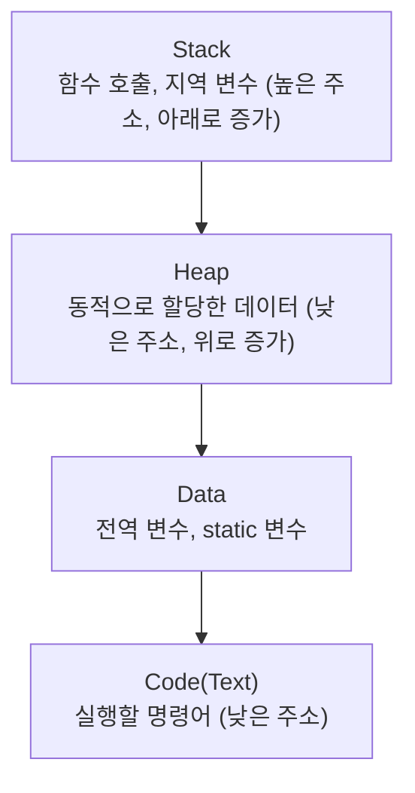
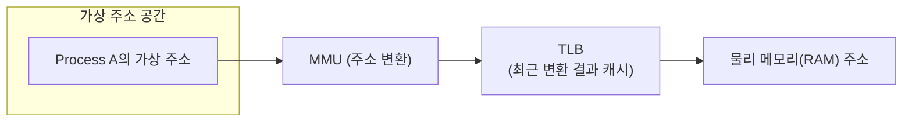
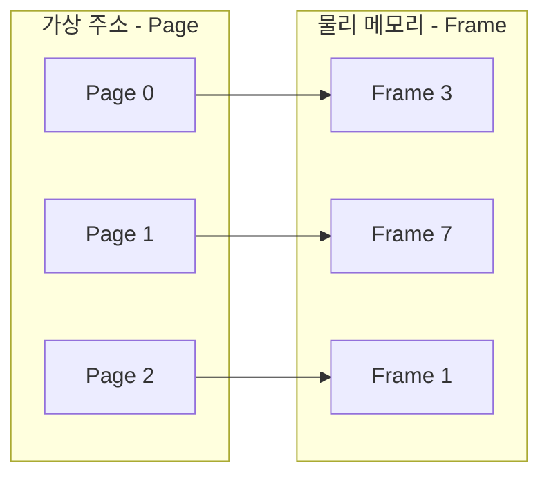
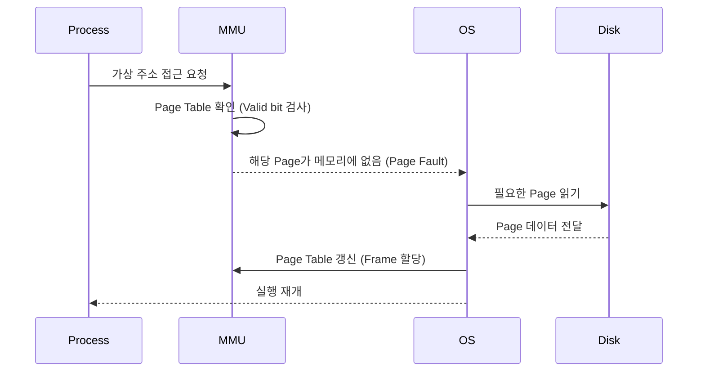
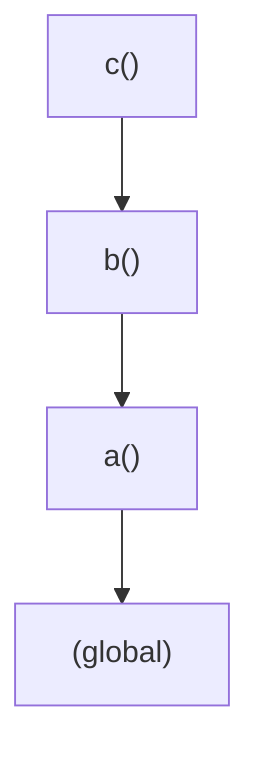
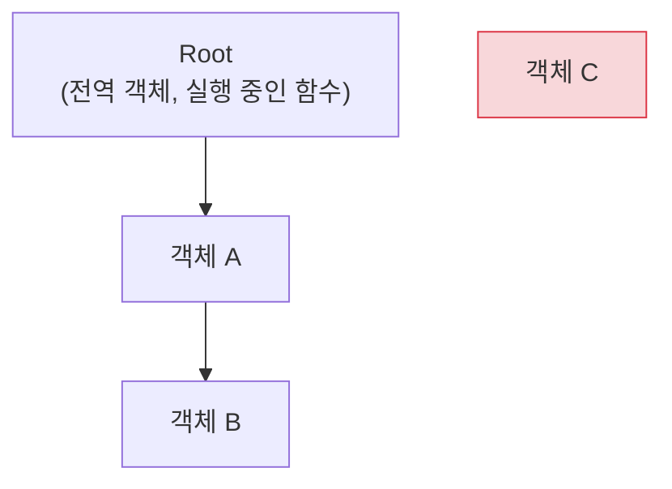

# 3주차 - Memory 구조 / Virtual Memory

## 목차

1. [Memory 구조](#1-memory-구조)
2. [Stack/Heap](#2-stackheap)
3. [Virtual Memory](#3-virtual-memory)
4. [Paging](#4-paging)
5. [Page Fault](#5-page-fault)
6. [JS Memory Heap](#6-js-memory-heap)
7. [Call Stack](#7-call-stack)
8. [Garbage Collection](#8-garbage-collection)
9. [Memory Leak](#9-memory-leak)
10. [정리](#10-정리)

---

## 1. Memory 구조

### 개념

- 하나의 프로세스가 실행될 때, 운영체제는 그 프로세스에게 주소 공간을 4개 영역으로 나눠 배정함
- 각 영역은 저장하는 데이터의 성격이 다르고, 메모리에 올라가는 시점과 생명주기도 다름



### 영역별 역할

| 영역 | 저장하는 것 | 크기 결정 시점 | 생명주기 |
|---|---|---|---|
| Code | 실행할 명령어(컴파일된 코드) | 컴파일 시점 (고정) | 프로세스 종료까지 유지 |
| Data | 초기화된 전역/static 변수(Data), 초기화 안 된 전역/static 변수(BSS) | 컴파일 시점 (고정) | 프로세스 종료까지 유지 |
| Heap | 런타임에 동적으로 할당하는 데이터 | 실행 중 유동적 | 명시적 해제 또는 GC 전까지 유지 |
| Stack | 함수 호출 정보, 지역 변수, 매개변수 | 실행 중 유동적 | 함수 호출이 끝나면 즉시 소멸 |

- Data 영역은 다시 초기값이 있는 변수를 담는 **Data와**, 초기값 없이 0으로 채워지는 **BSS로** 나뉘기도 함
- Stack은 높은 주소에서 낮은 주소 방향으로 자라고, Heap은 낮은 주소에서 높은 주소 방향으로 자람 → 두 영역이 가운데서 마주치면 메모리가 부족해진 것
- 이 구조는 프로세스 하나의 "논리적" 주소 공간을 설명한 것이고, 실제 물리 메모리와의 매핑은 3장의 Virtual Memory에서 다룸

### 코드로 보는 영역 구분

```js
let globalCounter = 0; // Data 영역 — 프로그램이 끝날 때까지 유지됨

function increment() {
  let local = 1;        // Stack 영역 — 함수가 끝나면 사라짐
  globalCounter += local;
  return globalCounter;
}

increment(); // 1
increment(); // 2 — local은 매번 새로 생기지만 globalCounter는 계속 누적됨
```

---

## 2. Stack/Heap

### Stack

- 함수를 호출할 때마다 그 함수의 실행 정보가 담긴 **스택 프레임(Stack Frame)이** 쌓임
- 스택 프레임에는 지역 변수, 매개변수, 반환 주소(함수가 끝나면 어디로 돌아갈지), 이전 프레임 포인터 등이 들어감
- 함수가 끝나면 해당 프레임이 통째로 자동 제거됨 (**LIFO**)
- 크기가 제한되어 있어서, 너무 깊은 재귀 호출은 Stack Overflow를 일으킴
- 컴파일 시점에 크기를 알 수 있는 데이터 위주로 저장되기 때문에 할당/해제가 자동이고 빠름

```js
function factorial(n) {
  if (n <= 1) return 1;
  return n * factorial(n - 1); // 호출마다 새 스택 프레임이 쌓임
}
factorial(100000); // 재귀가 너무 깊어지면 RangeError: Maximum call stack size exceeded
```

### Heap

- 크기가 정해지지 않았거나, 함수 호출이 끝나도 계속 유지돼야 하는 데이터를 저장
- 언어에 따라 직접 할당/해제하거나(C의 malloc/free), 자동으로 관리됨(JS/Java의 GC)
- 데이터가 메모리 여기저기 흩어져 저장될 수 있어서 Stack보다 접근 속도가 느림 (포인터/참조를 따라가야 함)
- 할당과 해제가 반복되면 사용 가능한 공간이 자잘하게 쪼개지는 **단편화(Fragmentation)가** 발생할 수 있음
- 관리가 잘못되면 메모리 누수로 이어질 수 있음 (9장에서 자세히 다룸)

```js
function example() {
  const a = 10;              // Stack에 저장
  const obj = { value: 20 }; // obj라는 참조는 Stack, { value: 20 } 객체 자체는 Heap
}
```

### 참조 공유로 보는 Heap의 특징

```js
function makeUser() {
  return { name: 'kim' }; // Heap에 객체 생성
}

const a = makeUser();
const b = a;        // b는 a와 똑같은 Heap 객체를 가리킴 (값 복사가 아니라 참조 복사)
b.name = 'lee';

console.log(a.name); // 'lee' — 같은 Heap 객체를 공유하고 있기 때문
```

### 비교

| | Stack | Heap |
|---|---|---|
| 할당/해제 | 자동 (함수 호출/반환 시) | 수동 또는 GC |
| 구조 | LIFO | 구조 없음 (자유롭게 할당) |
| 속도 | 빠름 (주소 계산만으로 접근) | 상대적으로 느림 |
| 크기 | 제한적, 초과 시 Stack Overflow | 상대적으로 큼 |
| 단편화 | 거의 없음 | 발생 가능 |
| 저장하는 것 | 지역 변수, 함수 호출 정보 | 동적으로 생성한 객체 |

---

## 3. Virtual Memory

### 개념

- 프로세스마다 실제 물리 메모리 주소 대신, 독립된 **가상의 주소 공간을** 보게 하는 기법
- 프로세스는 자신이 메모리 전체를 혼자 쓰는 것처럼 인식함
- MMU(Memory Management Unit)가 가상 주소를 실제 물리 주소로 변환함



### 주소 변환 속도 문제와 TLB

- 가상 주소마다 매번 Page Table을 조회해서 변환하면 그 자체로 오버헤드가 큼
- 그래서 CPU는 최근에 변환한 주소 몇 개를 **TLB(Translation Lookaside Buffer)라는** 작은 캐시에 저장해둠
- TLB에 이미 변환 기록이 있으면(TLB Hit) Page Table을 다시 조회하지 않고 바로 물리 주소를 얻음

### 왜 필요한가

- **격리**: 프로세스마다 독립된 주소 공간을 가지므로, 한 프로세스가 다른 프로세스의 메모리를 직접 침범할 수 없음
- **물리 메모리보다 큰 프로그램 실행 가능**: 당장 쓰지 않는 부분은 디스크(Swap 영역)에 내려두고, 필요할 때만 RAM으로 가져옴
- **메모리 관리 단순화**: 프로세스 입장에서는 항상 0번지부터 시작하는 것처럼 프로그래밍할 수 있음
- **물리 메모리를 유연하게 배치**: 프로세스 입장에서는 연속된 주소처럼 보여도, 실제 물리 메모리에는 여기저기 흩어져 저장될 수 있음

### 주소 변환을 흉내낸 간단한 예시

```js
// 실제 MMU는 하드웨어로 동작하지만, 개념만 코드로 옮기면 이런 흐름
const pageTable = { 0: 3, 1: 7, 2: 1 }; // virtual page → physical frame
const PAGE_SIZE = 4096;

function translate(virtualAddress) {
  const page = Math.floor(virtualAddress / PAGE_SIZE);
  const offset = virtualAddress % PAGE_SIZE;
  const frame = pageTable[page];
  return frame * PAGE_SIZE + offset; // 물리 주소
}

translate(4100); // page 1, offset 4 → frame 7 기준 물리 주소 계산
```

---

## 4. Paging

### 개념

- 가상 주소 공간과 물리 메모리를 똑같은 크기의 블록으로 나눠서 관리하는 방식
- 가상 메모리 쪽 블록을 **Page**, 물리 메모리 쪽 블록을 **Frame이라고** 부름
- 어떤 Page가 어떤 Frame에 매핑돼 있는지 **Page Table에** 기록해둠



### Page Table Entry에 담기는 정보

- 매핑된 Frame 번호
- **Valid bit**: 이 Page가 현재 물리 메모리에 올라와 있는지 여부
- **Dirty bit**: Page 내용이 변경됐는지 여부 (Swap-out 시 디스크에 다시 써야 하는지 판단하는 데 사용)
- 접근 권한 정보 (읽기/쓰기/실행 가능 여부)

### 왜 페이지 단위로 나누는가

- 프로세스 전체를 통째로 메모리에 올리지 않고, 필요한 Page만 올릴 수 있음 (Demand Paging)
- 물리 메모리를 고정 크기로 나눠 관리하기 때문에, 메모리 이곳저곳에 빈 공간이 흩어지는 **외부 단편화가** 발생하지 않음
- 다만 Page 크기보다 실제 사용하는 데이터가 작으면 그 차이만큼 낭비가 생기는 **내부 단편화는** 여전히 존재함
- 일반적으로 Page 하나의 크기는 4KB 정도

### Page Table을 흉내낸 예시

```js
const pageTable = [
  { frame: 3, valid: true },
  { frame: null, valid: false }, // 아직 물리 메모리에 없음
  { frame: 1, valid: true },
];

function accessPage(pageNumber) {
  const entry = pageTable[pageNumber];
  if (!entry.valid) {
    throw new Error('Page Fault!'); // 5장에서 이어짐
  }
  return `Frame ${entry.frame}에 접근`;
}

accessPage(0); // 'Frame 3에 접근'
accessPage(1); // Error: Page Fault!
```

---

## 5. Page Fault

### 개념

- 프로세스가 접근하려는 Page가 현재 물리 메모리(Frame)에 올라와 있지 않을 때 발생하는 인터럽트
- CPU가 이 상황을 감지하면 실행을 멈추고 OS에게 처리를 넘김



### 처리 과정

1. 필요한 Page가 물리 메모리에 없다는 걸 Valid bit로 감지
2. 디스크(Swap 영역)에서 해당 Page를 읽어옴
3. 빈 Frame이 없으면 기존 Page 중 하나를 내보냄 (Swap-out) — 어떤 Page를 내보낼지 정하는 기준을 **페이지 교체 알고리즘이라고** 하며, 가장 오래 안 쓴 것을 내보내는 LRU(Least Recently Used)가 대표적
4. Page Table을 갱신하고 원래 실행을 이어감

### Minor Fault vs Major Fault

- **Minor Fault**: 필요한 데이터가 이미 물리 메모리 어딘가에 있고, Page Table 매핑만 다시 걸어주면 되는 경우 (상대적으로 가벼움)
- **Major Fault**: 데이터가 디스크에만 있어서 실제 디스크 입출력이 필요한 경우 (상대적으로 무거움)

### 성능 이슈: Thrashing

- Page Fault가 너무 자주 발생하면, CPU가 실제 연산보다 디스크 입출력에 더 많은 시간을 쓰게 됨
- 이렇게 성능이 급격히 떨어지는 현상을 **Thrashing이라고** 함
- 실행 중인 프로세스가 너무 많아 각 프로세스가 쓸 수 있는 Frame 수가 지나치게 적을 때 주로 발생함

### Page Fault 처리 과정을 흉내낸 예시

```js
const disk = { 1: 'Page 1의 데이터' };
const pageTable = [
  { valid: true, frame: 3 },
  { valid: false, frame: null },
];
let nextFreeFrame = 5;

function accessPage(pageNumber) {
  const entry = pageTable[pageNumber];

  if (!entry.valid) {
    console.log('Page Fault 발생! 디스크에서 로드 중...');
    const data = disk[pageNumber];   // 디스크(Swap)에서 읽어옴
    entry.frame = nextFreeFrame++;   // 빈 Frame 할당
    entry.valid = true;              // Page Table 갱신
    return data;
  }

  return `Frame ${entry.frame}에서 바로 읽음`;
}

accessPage(0); // 'Frame 3에서 바로 읽음'
accessPage(1); // 'Page Fault 발생! 디스크에서 로드 중...' → 'Page 1의 데이터'
accessPage(1); // 이제는 Page Table이 갱신돼서 바로 읽어옴
```

---

# Frontend 심화

## 6. JS Memory Heap

### 개념

- JS 엔진도 객체, 배열, 함수처럼 크기가 유동적인 데이터를 Heap에 저장함
- 원시 값(숫자, 문자열 등)은 대체로 Stack에, 객체는 Heap에 저장되고 변수는 그 객체를 가리키는 참조를 가짐

```js
let num = 10;              // Stack
let arr = [1, 2, 3];       // arr(참조)는 Stack, [1, 2, 3] 실체는 Heap
let obj = { name: 'js' };  // obj(참조)는 Stack, { name: 'js' } 실체는 Heap
```

### V8의 Heap 내부 구분

- **Young Generation**: 방금 생성된, 수명이 짧을 것으로 예상되는 객체가 모이는 공간. 다시 From/To 두 영역으로 나뉘어 있음
- **Old Generation**: Young Generation에서 오래 살아남은 객체가 옮겨오는 공간. 크기가 더 크고, 청소 주기가 더 김
- 대부분의 객체는 함수 실행이 끝나면 금방 쓸모없어지기 때문에, 이렇게 나눠서 관리하면 자주 생기고 사라지는 객체를 더 빠르게 청소할 수 있음 (8장에서 이어서 다룸)

### 수명이 짧은 객체 vs 긴 객체

```js
function shortLived() {
  const temp = { data: 'temp' }; // 함수가 끝나면 금방 참조가 사라짐 → Young Generation 후보
  return temp.data.length;
}

const cache = {}; // 전역에 계속 남아있음 → Old Generation으로 승격될 가능성이 높음

for (let i = 0; i < 1000; i++) {
  shortLived();     // 매번 새 객체를 만들었다가 바로 버려짐
  cache[i] = i * 2; // 이건 계속 쌓여서 오래 살아남음
}
```

---

## 7. Call Stack

### 개념

- JS 코드가 실행될 때 함수 호출 정보가 쌓이는 스택
- 함수를 호출하면 새로운 **실행 컨텍스트(Execution Context)가** push되고, 함수가 끝나면 pop됨
- 실행 컨텍스트에는 지역 변수, 스코프 체인 정보, `this` 바인딩 등이 포함됨

```js
function a() { b(); }
function b() { c(); }
function c() { throw new Error('here'); }

a();
```



- 에러 발생 시 스택 트레이스(stack trace)를 보면 `c → b → a` 순서로 호출 경로가 남아있는 걸 확인할 수 있음
- 재귀 호출이 종료 조건 없이 계속되면 Call Stack이 한계를 넘어 `Maximum call stack size exceeded` 에러 발생
- 일부 언어/엔진은 함수의 마지막 동작이 재귀 호출일 때 스택 프레임을 재사용하는 **꼬리 호출 최적화(Tail Call Optimization)를** 지원하지만, JS는 스펙상 정의는 돼 있어도 대부분의 엔진에서 실제로 구현돼 있지 않음

### 현재 호출 스택 출력해보기

```js
function first() { second(); }
function second() { third(); }
function third() {
  console.trace(); // second, first, (anonymous) 순으로 호출 경로가 출력됨
}
first();
```

### 재귀를 반복문으로 바꿔 스택 깊이 줄이기

```js
// 재귀: 호출할 때마다 스택 프레임이 계속 쌓임
function factorialRecursive(n) {
  if (n <= 1) return 1;
  return n * factorialRecursive(n - 1);
}

// 반복문: 스택 프레임을 하나만 사용
function factorialLoop(n) {
  let result = 1;
  for (let i = 2; i <= n; i++) result *= i;
  return result;
}
```

---

## 8. Garbage Collection

### 개념

- JS는 Heap에 할당한 메모리를 개발자가 직접 해제하지 않고, 엔진이 더 이상 필요 없는 객체를 자동으로 찾아 회수함
- 핵심 기준은 **Reachability(도달 가능성)**: 루트(전역 객체, 현재 실행 중인 함수의 지역 변수 등)에서부터 참조를 따라갔을 때 도달할 수 없는 객체는 회수 대상이 됨



- 위 그림에서 객체 C는 Root에서부터 참조를 따라가도 닿지 않으므로 GC 대상이 됨

### Mark and Sweep

1. **Mark**: Root에서 출발해 참조를 따라가며 도달 가능한 객체를 모두 표시
2. **Sweep**: 표시되지 않은(도달 불가능한) 객체를 메모리에서 제거
3. 필요에 따라 남은 객체들을 한쪽으로 모아 빈 공간을 정리하는 **Compact** 단계가 추가되기도 함 (단편화 방지)

### 참고: 다른 방식과의 차이 — Reference Counting

- 일부 환경에서는 객체마다 "몇 군데서 참조하고 있는지" 카운트를 세다가, 0이 되면 즉시 회수하는 방식을 쓰기도 함
- 다만 이 방식은 두 객체가 서로를 참조하는 **순환 참조** 상황에서 카운트가 0이 되지 않아 회수가 안 되는 문제가 있음 → Mark and Sweep은 Reachability만 보기 때문에 이 문제에서 자유로움

### V8의 세대별 GC (Generational GC)

- 대부분의 객체는 생성된 직후 금방 쓸모없어진다는 경험적 사실(Generational Hypothesis)에 기반함
- **Minor GC (Scavenge)**: Young Generation을 대상으로, 살아남은 객체만 From 영역에서 To 영역으로 복사하고 나머지는 통째로 버림. 자주, 빠르게 실행됨
- **Major GC (Mark-Sweep-Compact)**: Old Generation을 대상으로 하는 청소. Young Generation에서 일정 기준 이상 살아남은 객체가 여기로 승격(promotion)됨. 상대적으로 드물게, 더 오래 걸리는 방식으로 실행됨

### Reachability 바꿔보기

```js
let obj = { data: 'hello' };
// 지금은 obj가 이 객체를 참조하고 있어서 GC 대상이 아님

obj = null;
// 이제 이 객체를 가리키는 참조가 하나도 없음 → 다음 GC 때 회수 대상
```

### 순환 참조도 회수되는 이유

```js
function circular() {
  const a = {};
  const b = {};
  a.ref = b;
  b.ref = a; // 서로가 서로를 참조 (순환 참조)
}

circular();
// 함수가 끝나면 a, b는 함수 바깥 어디서도 도달할 수 없음
// Reference Counting이었다면 서로의 카운트가 안 줄어 문제가 될 수 있지만
// Mark and Sweep은 Root에서 도달 가능한지만 보기 때문에 정상적으로 회수됨
```

---

## 9. Memory Leak

### 개념

- 더 이상 사용하지 않는 객체인데, 어딘가에서 참조가 계속 남아있어서 GC가 회수하지 못하는 상황
- Reachability 기준으로는 "도달 가능"하기 때문에 GC 입장에서는 정상적으로 판단해서 지우지 않는 것뿐임

### 흔한 발생 원인

**1) 의도치 않은 전역 변수**

```js
function leak() {
  accidentalGlobal = '나는 전역 변수가 됐다'; // let/const/var 없이 선언
}
```

- 전역 객체는 애플리케이션이 종료될 때까지 항상 Root에서 도달 가능하기 때문에, 여기에 매달린 값은 절대 회수되지 않음

**2) 해제하지 않은 이벤트 리스너**

```js
function setup() {
  const el = document.getElementById('btn');
  el.addEventListener('click', heavyHandler);
  // el을 DOM에서 제거해도 리스너 해제를 안 하면 참조가 남을 수 있음
}
```

**3) 정리하지 않은 타이머**

```js
const timer = setInterval(() => {
  doSomething(); // 컴포넌트가 사라져도 타이머가 계속 이 함수를 참조
}, 1000);

// clearInterval(timer)를 안 하면 콜백과 그 안의 클로저가 계속 살아있음
```

**4) 클로저가 붙잡고 있는 참조**

```js
function outer() {
  const bigData = new Array(1000000).fill('*');
  return function inner() {
    console.log(bigData.length); // bigData를 계속 참조
  };
}

const leaked = outer(); // bigData가 GC되지 않고 계속 메모리에 남음
```

**5) 분리된(Detached) DOM 노드**

```js
let detachedNode;

function remove() {
  const el = document.getElementById('box');
  el.remove();          // 화면(DOM 트리)에서는 사라짐
  detachedNode = el;    // 하지만 변수가 여전히 참조 중이라 GC 대상이 아님
}
```

- 화면에서 보이지 않아도, JS 코드 어딘가에서 여전히 참조하고 있으면 Heap에 남아있는 상태

### 탐지 방법

- 브라우저 개발자 도구의 Memory 탭에서 **Heap Snapshot을** 여러 시점에 찍어 비교하면, 계속 늘어나기만 하고 줄지 않는 객체를 찾을 수 있음
- Performance 탭에서 시간에 따른 JS Heap 크기 변화를 관찰해, 사용 후 다시 떨어지지 않고 계속 우상향하는 패턴이 있는지 확인

### 대처

- 이벤트 리스너는 컴포넌트/화면이 사라질 때 `removeEventListener`로 해제
- 타이머는 `clearInterval` / `clearTimeout`으로 정리
- 더 이상 필요 없는 참조는 명시적으로 `null` 처리하거나, 클로저가 불필요하게 큰 데이터를 붙잡지 않도록 설계

### 개선 예시

```js
function setupFixed() {
  const el = document.getElementById('btn');
  const handler = () => console.log('clicked');

  el.addEventListener('click', handler);
  const timer = setInterval(() => console.log('tick'), 1000);

  // 정리(cleanup) 함수를 반환해서, 필요 없어질 때 명시적으로 호출
  return function cleanup() {
    el.removeEventListener('click', handler);
    clearInterval(timer);
  };
}

const cleanup = setupFixed();
// 화면/컴포넌트가 사라지는 시점에
cleanup(); // 리스너와 타이머를 모두 정리 → 관련 참조도 함께 해제됨
```

---

## 10. 정리

| 개념 | 핵심 |
|---|---|
| Memory 구조 | 프로세스는 Code/Data/Heap/Stack 영역으로 나뉨 |
| Stack/Heap | Stack은 자동·빠름·제한적, Heap은 유동적·느림·관리 필요 |
| Virtual Memory | 프로세스마다 독립된 가상 주소 공간을 제공, MMU(+TLB)가 물리 주소로 변환 |
| Paging | 가상/물리 메모리를 고정 크기(Page/Frame)로 나눠 매핑, 외부 단편화 방지 |
| Page Fault | 필요한 Page가 물리 메모리에 없을 때 발생, 디스크에서 읽어옴. 잦으면 Thrashing |
| JS Memory Heap | 객체 등 유동적 데이터를 저장하는 공간, Young/Old Generation으로 구분 |
| Call Stack | 실행 컨텍스트가 쌓이는 스택, 초과 시 스택 오버플로우 |
| Garbage Collection | Reachability 기준 Mark-Sweep(-Compact), V8은 세대별로 분리 수행 |
| Memory Leak | 참조가 남아 GC가 회수하지 못하는 상황, DevTools Heap Snapshot으로 탐지 |