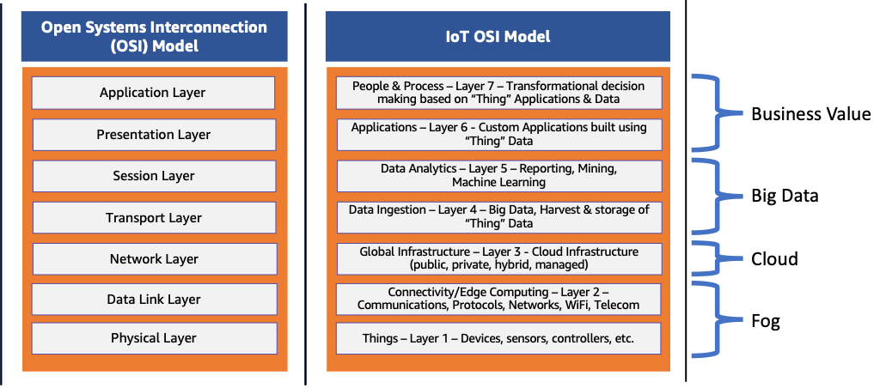

# OSI 7 Layer / TCP-IP / IP

## OSI 7 Layer
- Open Systems Interconnection(OSI) 모델
- 모든 유형의 네트워크 통신을 캡슐화함
- 두 독립된 시스템이 같은 운영 계층에 기반한 표준화된 인터페이스, 프로토콜을 통해서 통신할 수 있도록 설계함
- 세부사항의 추상화를 통하여 시스템 설계 및 개발을 단순화함

### 계층별 역할

- **1. 물리 계층 (Physical)**
  - 물리적 통신 매체와 그 매체로 데이터를 전송하는 기술
  - 광섬유·구리 케이블·공기 등 물리적 채널을 통해 디지털/전자 신호를 전송함
  - 채널과 밀접한 표준 포함 : Bluetooth, NFC, 데이터 전송 속도 등
- **2. 데이터 링크 계층 (Data Link)**
  - 물리 계층이 있는 네트워크 위에서 두 시스템을 연결하는 기술
  - 데이터 패킷에 캡슐화된 디지털 신호인 **프레임(Frame)** 을 관리함
  - 주요 초점 : 흐름 제어, 오류 제어
  - 두 하위 계층으로 나뉨 : 매체 접근 제어(MAC), 논리 링크 제어(LLC)
  - 예 : Ethernet
- **3. 네트워크 계층 (Network)**
  - 하나 또는 여러 네트워크의 노드 사이에서 라우팅·전달·주소 지정을 담당함
  - 흐름 제어도 관리할 수 있음
  - 예 : IPv4, IPv6
- **4. 전송 계층 (Transport)**
  - 데이터 패킷이 손실·오류 없이 올바른 순서로 도착하도록 보장하거나, 필요 시 복구함
  - 주요 초점 : 흐름 제어, 오류 제어
  - **TCP** : 연결 기반, 거의 손실 없음 → 데이터가 온전해야 하는 경우 (예: 파일 공유)
  - **UDP** : 비연결, 손실 허용 → 패킷 보존이 덜 중요한 경우 (예: 비디오 스트리밍)
- **5. 세션 계층 (Session)**
  - 한 세션에서 서로 다른 두 애플리케이션 간의 네트워크 조정을 담당함
  - 일대일 애플리케이션 연결의 시작과 끝, 동기화 충돌을 관리함
  - 예 : NFS, SMB
- **6. 프레젠테이션 계층 (Presentation)**
  - 애플리케이션이 주고받는 데이터 자체의 **구문(형식)** 을 다룸
  - 예 : HTML, JSON, CSV (데이터 구조를 설명하는 모델링 언어)
- **7. 애플리케이션 계층 (Application)**
  - 특정 유형의 애플리케이션과 그 표준화된 통신 방법을 다룸
  - 예 : 브라우저 → HTTP/HTTPS, 이메일 클라이언트 → POP3, SMTP

## TCP/IP 4 Layer
- ip 주소 체계를 따르고, routing을 통해 목적지에 도달하며 TCP의 특성을 활용하여 송신 - 수신자간의 논리적 연결을 생성하고 신뢰성을 확보함을 말함
- TCP는 OSI 7계층 중 4계층에 해당함. ip는 패킷의 관계를 이해하지 못하고 routing에만 중점을 두지만, TCP는 양쪽 단말의 통신 준비, 완결성(변질되지 않았는지, 제대로 전송되었는지)을 검증함.
  - TCP 헤더 내의 SYN, ACK, FIN, RST, Source Port, Destination Port, Sequence Number, Window size, Checksum 등을 이용해 검증함

### TCP/IP 란

- 인터넷에서 컴퓨터들이 서로 정보를 주고받는 데 쓰이는 **통신 규약(프로토콜)의 모음**
- 인터넷 프로토콜 스위트 중 TCP와 IP가 가장 많이 쓰이기 때문에 TCP/IP 프로토콜 슈트라고 부름
- **IP (3계층, 네트워크)**
  - 한 Endpoint가 다른 Endpoint로 가고자 할 때 **경로와 목적지(routing)** 를 찾아줌
  - 패킷 전달 여부를 보증하지 않음
  - 보낸 순서와 받는 순서가 다를 수 있음
- **TCP (4계층, 전송)**
  - IP 위에서 동작하며 **데이터의 전달을 보증하고 보낸 순서대로 받게 해 줌**
  - 송신자와 수신자의 논리적 연결을 생성하고 신뢰성을 유지함
  - 데이터가 제대로 전송되었는지, 도중에 변질되지 않았는지, 수신자가 얼마나 받았고 빠진 부분은 없는지 점검함

### TCP 가 신뢰성을 확보하는 방법

- **3-way Handshake** : TCP 통신은 반드시 3-way handshake 로 시작함. 수신자가 받을 준비가, 송신자가 보낼 준비가 되어 있는지 미리 확인한 뒤 통신을 시작함
  1. 송신자 → 수신자 : `SYN` 을 보내 통신이 가능한지 확인
  2. 수신자 → 송신자 : `SYN/ACK` 을 보내 통신할 준비가 되어 있음을 알림
  3. 송신자 → 수신자 : `ACK` 를 보내 전송을 시작함을 알림
  - 전화 비유 : 번호를 누름 → 상대가 전화를 받음 → "여보세요?" 로 서로 잘 들리는지 확인한 뒤 대화 시작
  - HTTPS 도 TCP 기반이므로 SSL handshake 에 앞서 3-way handshake 를 먼저 수행함
- **Sequence Number / Acknowledgment Number**
  - Sequence Number : 데이터의 순서 번호
  - Acknowledgment Number : 수신자가 지금까지 받은 데이터 양을 송신자에게 알려주는 값
    - 300번째까지 받았으면 1을 더한 301을 보냄 → "300번까지 받았으니 301번부터 보내라"는 뜻
- **흐름 제어 (Window size)**
  - 송신자는 한 번에 얼마나 보낼 수 있는지, 수신자는 어디까지 받았는지 끊임없이 확인함
  - TCP 헤더의 `Window size` 로 한 번에 주고받을 수 있는 데이터 양(window)을 정함
  - 받는 쪽 사정이 더 중요하므로 **Window size 는 수신자가 정함** (3-way handshake 때 정하고, 상황에 따라 조절)
  - 연탄 배달 비유 : 받는 사람이 얼마나 받을 수 있는지 확인하지 않고 넘기면 손에 든 연탄이 있어 못 받고 깨져 버림
- **혼잡 제어 (Slow Start)**
  - 양 단말뿐 아니라 데이터가 지나가는 **네트워크망의 혼잡**도 고려해야 함
  - 연결 초기에 송출량을 낮게 잡고 보내면서, 수신 확인에 따라 조금씩 늘려 현재 네트워크에 가장 적합한 송출량을 찾음

참고 자료 : [TCP/IP 쉽게 이해하기](https://aws-hyoh.tistory.com/57)

## OSI vs TCP/IP

- 두 모델 모두 서로 다른 네트워크 프로토콜이 상호 작용하며 네트워크 서비스를 제공하는 방식을 이해하고 설명하기 위한 **개념적 모델**임
- **TCP/IP 모델** : 미국 국방부(DoD)가 네트워킹 요구 사항을 해결하기 위해 개발. 더 일찍 만들어졌고, 이미 사용 중인 **표준 프로토콜을 기반**으로 한 실용적 접근
- **OSI 모델** : 국제 표준화 기구(ISO)가 개발. 이미 사용 중인 것을 기반으로 한 것이 아니라 네트워크 시스템이 **해야 할 일을 설명**하기 위해 만든 학문적·추상적 접근

### 계층 대응

| OSI 7 Layer | TCP/IP 4 Layer |
| --- | --- |
| 7. Application | Application |
| 6. Presentation | ↑ |
| 5. Session | ↑ |
| 4. Transport | Transport |
| 3. Network | Internet |
| 2. Data Link | Network Access |
| 1. Physical | ↑ |

- TCP/IP 의 Application 계층은 OSI 의 세션·프레젠테이션·애플리케이션 계층 기능을 합친 것
- TCP/IP 의 Network Access(네트워크 인터페이스) 계층은 OSI 의 물리·데이터 링크 계층에 해당함

### 차이점

| 구분 | OSI 7 Layer | TCP/IP 4 Layer |
| --- | --- | --- |
| 개발 주체 | ISO | 미국 국방부(DoD) |
| 개발 시기 | TCP/IP 이후 | 먼저 개발 |
| 접근 방식 | 학문적, 이론적 | 실용적, 실제 사용 사례 기반 |
| 계층 수 | 7개 | 4개 |
| 추상화 수준 | 각 계층이 특정 기능 집합을 제공하도록 높은 수준으로 추상화 | 실제 프로토콜을 기반으로 구성 |
| 유연성 | 계층이 엄격하게 정의되어 모델 특성을 바꾸지 않고는 수정·재배치 불가 | 모델은 그대로 두고 프로토콜만 수정·업데이트 가능 |
| 신뢰성 가정 | - | 패킷 전송이 불안정할 수 있다고 가정 → TCP 등 신뢰성 있는 프로토콜이 필요 |
| 실제 사용 | 학계·이론적 네트워크 설계, 교육용 참조 모델. 완전한 형태로 채택된 사례는 적음 | 인터넷과 대부분의 상용 네트워크에서 전 세계적으로 사용 |

- OSI 는 더 포괄적이고 모듈화·계층 분리가 잘 되어 있어, 실제 구현에 직접 매핑되지 않더라도 네트워크의 복잡한 상호 작용을 이해하기 위한 **교육용 참조 모델**로 자주 쓰임
- TCP/IP 는 실제 프로토콜 위에 세워졌고 프로토콜을 유연하게 개선할 수 있어 **실질적인 표준**이 됨
- 결론 : 네트워킹 개념을 이론적으로 이해하는 것이 목표라면 OSI, 실제 동작을 이해하는 것이 목표라면 TCP/IP

참고 자료 : [OSI 7계층과 TCP/IP 모델 비교](https://easyitwanner.tistory.com/373)

## 캡슐화 / 역캡슐화

- **캡슐화 (Encapsulation)** : 데이터에 헤더를 붙여 **아래 계층**으로 보내는 것. 데이터 전송 시 이뤄짐
- **역캡슐화 (Decapsulation)** : 데이터에서 헤더를 제거하고 **위 계층**으로 보내는 것. 데이터 수신 시 이뤄짐
- 흐름
  - 송신 측 : 상위 계층부터 캡슐화가 이뤄지며 데이터가 아래 계층으로 흘러감
  - 수신 측 : 하위 계층부터 역캡슐화가 이뤄지며 데이터가 상위 계층으로 흘러감
  - 중간의 라우터는 패킷 단위로 처리하므로, 네트워크 계층까지만 역캡슐화했다가 다시 캡슐화해서 다음 경로로 보냄
- (참고) 계층별 PDU 이름 : 전송 계층 세그먼트 → 네트워크 계층 패킷 → 데이터 링크 계층 프레임 → 물리 계층 비트

### 프로토콜과 헤더

- **헤더 = 프로토콜**. 프로토콜을 정의한다는 말은 헤더를 정의한다는 말과 같음
- 각 계층에는 다양한 프로토콜이 있고 그에 따라 헤더가 정의되어 있음
- 프로토콜에 맞춰 일하는 것은 프로그램임. 라우팅, 재결합, 에러 체크, 흐름 제어 등 통신에 필요한 일을 각 계층에서 **헤더를 보고** 수행함
  - 프로그램은 인간이 정한 프로토콜을 이해할 수 없으므로 0/1로 된 헤더로 프로토콜을 표현함 → 헤더를 붙이는 이유
  - 어떤 프로토콜을 이해하고 싶다면 헤더를 살펴보면 됨
- 헤더가 복잡하면 많은 일을 한다는 뜻이지만, 그만큼 헤더 정보가 붙어 **전송 효율이 떨어짐**
  - 프로토콜 설계자는 원하는 기능을 구현하면서도 되도록 작은 헤더를 정의해야 함

### 프로토콜의 진정한 의미 : Peer to Peer 통신 약속

- 프로토콜은 **같은 계층끼리의 통신 약속**임
- 네트워크 계층에서 붙은 헤더는 오직 네트워크 계층에서만 의미를 가짐
  - 하위 계층은 캡슐화되어 내려온 데이터의 내용을 알 수도 없고 알 필요도 없음
  - 상위 계층도 하위 계층의 헤더가 필요 없으므로, 역캡슐화되어 하위 헤더가 떼어진 데이터를 받음

참고 자료 : [[데이터통신 - 3] 캡슐화와 역캡슐화](https://gunjoon.tistory.com/15)

## IP

- **IP (Internet Protocol)** : 인터넷을 통한 데이터 교환을 제공하는 일련의 통신 규칙
- 인터넷은 네트워킹 기술로 서로 데이터를 공유하는 수십억 개 디바이스의 집합체이므로, IP 는 넘버링 시스템을 사용해 연결된 모든 디바이스에 **고유한 식별 번호(IP 주소)** 를 부여함
- 비연결(connectionless) 프로토콜 : 데이터를 작은 블록(패킷)으로 나눠 다중 패킷 라우팅으로 전송함
- 버전으로 IPv4 와 IPv6 가 있으며, 둘 다 TCP/IP 프로토콜 제품군에 속함

## IPv4 / IPv6

### IPv4

- 32비트 주소 → 2³² = 약 42억 9,496만 7,296개
  - 이 중 약 5억 8,800만 개는 예약된 주소, 나머지가 공개적으로 사용 가능
  - 할당되지 않은 IPv4 주소는 **2011년에 고갈**됨 → NAT 같은 주소 지정 시스템을 계층화해 버텨 옴
- 표기 : 0~255 범위의 10진수 4개를 마침표로 구분. 각 숫자는 8비트
  - 예 : `197.0.0.1`, 루프백 `127.0.0.1`
- 헤더 : 가변, 기본 20바이트, 선택 필드·플래그가 붙으면 최대 60바이트. 헤더 체크섬 있음
- 주소 지정 : 유니캐스트(일대일), 브로드캐스트(일대전부), 멀티캐스트(일대다)
- 주소 구성 : 수동 또는 DHCP

### IPv6

- 도입 배경 : 인터넷과 IoT 확장으로 IPv4 주소 범위가 부족해짐. 1995년 처음 지정되었지만 2017년에야 인터넷 표준이 됨
- 128비트 주소 → 2¹²⁸ ≒ 3.4 × 10³⁸ 개 (약 340언데실리온)
- 표기 : 16진수(0~9, A~F) 4자리씩 8개 그룹을 콜론으로 구분. 각 16진수 한 자리는 4비트
  - 연속된 0 그룹은 `::` 으로 한 번 압축 가능
  - 예 : `2600:1400:d:5a3::3bd4`, 루프백 `::1`
- 헤더 : 고정 40바이트 (확장 헤더는 별도). 헤더 체크섬 없음
- 주소 지정 : 유니캐스트, 멀티캐스트, **애니캐스트** (같은 애니캐스트 주소를 가진 수신자 중 가장 가까운 곳으로 전송). 브로드캐스트 없음
- 주소 구성 : SLAAC(Stateless Address Autoconfiguration) 자동 구성, DHCPv6 도 지원
- 보안 : IPsec 기본 내장, 프라이버시 확장, OSPFv3 등 보안 라우팅 프로토콜
- 라우팅 : NAT 제거, 라우팅 헤더 간소화, NDP(Neighbor Discovery Protocol), 계층형 주소 지정·서브넷, 경로 집계
- 현실 : 개선에도 불구하고 대부분의 인터넷은 여전히 IPv4 위에서 동작함. 레거시 인프라 때문에 마이그레이션 비용이 크고 복잡함

### IPv4 vs IPv6 비교

| 구분 | IPv4 | IPv6 |
| --- | --- | --- |
| 주소 크기 | 32비트 (2³²) | 128비트 (2¹²⁸) |
| 표기 | 마침표로 구분한 10진수 4개 (`197.0.0.1`) | 콜론으로 구분한 16진수 8개 (`2600:1400:d:5a3::3bd4`) |
| 루프백 | `127.0.0.1` | `::1` |
| NAT 필요 여부 | 필요 | 불필요 |
| 패킷 주소 지정 | 유니캐스트 / 브로드캐스트 / 멀티캐스트 | 유니캐스트 / 멀티캐스트 / 애니캐스트 |
| 주소 구성 | 수동, DHCP | SLAAC 자동 구성, DHCPv6 |
| 헤더 크기 | 가변 20~60바이트 | 고정 40바이트 |
| 헤더 체크섬 | 있음 | 없음 |
| 프라이버시 | 주소 마지막 8비트를 숨기는 IP 마스킹 | 임의의 임시 주소를 쓰는 프라이버시 확장 |
| 프래그먼테이션 | 라우터에서 처리 | 송신자(originator)가 처리 |
| DNS 레코드 | A | AAAA |
| 라우팅 | 헤더에서 처리 | 라우팅 테이블에서 처리 |
| 모바일 지원 | Mobile IP 필요 | 기본 제공 |
| 보안 | 상대적으로 약함 | IPsec 기본 내장 |

참고 자료 : [IPv4와 IPv6의 차이점 (AWS)](https://aws.amazon.com/ko/compare/the-difference-between-ipv4-and-ipv6/)