# 4주차 - Network 기초

## 목차

1. [OSI 7 Layer/TCP-IP](#1-osi-7-layertcp-ip)
2. [IP](#2-ip)
3. [TCP/UDP](#3-tcpudp)
4. [3-way/4-way Handshake](#4-3-way4-way-handshake)
5. [DNS](#5-dns)
6. [Port](#6-port)
7. [브라우저 Network 요청](#7-브라우저-network-요청)
8. [WebSocket](#8-websocket)
9. [SSE](#9-sse)
10. [정리](#10-정리)

---

## 1. OSI 7 Layer/TCP-IP

### 개념

- 네트워크 통신 과정을 여러 계층으로 나눠서 설명하는 모델
- 각 계층은 자기 바로 아래/위 계층하고만 정해진 방식으로 소통하고, 다른 계층의 동작 방식은 신경 쓰지 않아도 됨
- **OSI 7 Layer**: 이론적으로 통신을 7단계로 나눈 모델
- **TCP/IP 4 Layer**: 실제로 인터넷에서 쓰이는, OSI를 단순화한 4단계 모델

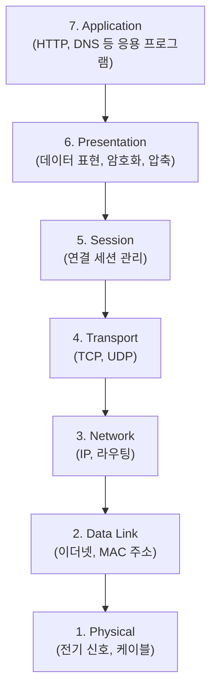

### OSI와 TCP/IP 대응

| OSI 계층 | TCP/IP 계층 | 예시 |
|---|---|---|
| Application, Presentation, Session | Application | HTTP, DNS, FTP |
| Transport | Transport | TCP, UDP |
| Network | Internet | IP |
| Data Link, Physical | Network Interface | Ethernet, Wi-Fi |

### 계층별 대표 프로토콜/장비

| 계층 | 대표 프로토콜 | 관련 장비 |
|---|---|---|
| Application | HTTP, DNS, FTP, SMTP | - |
| Transport | TCP, UDP | - |
| Network | IP, ICMP | 라우터 |
| Data Link | Ethernet, Wi-Fi(802.11) | 스위치 |
| Physical | - | 허브, 리피터, 케이블 |

### 캡슐화(Encapsulation)

- 데이터가 상위 계층에서 하위 계층으로 내려갈 때마다, 각 계층이 자신의 정보를 담은 헤더를 덧붙임
- 그래서 실제로 전선을 타고 흐르는 건 원본 데이터 + 여러 겹의 헤더가 합쳐진 형태
- 계층마다 이 데이터 단위를 부르는 이름이 다름

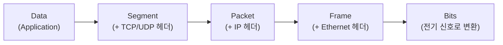

- 받는 쪽에서는 반대로 각 계층을 거치며 해당 계층의 헤더를 하나씩 벗겨내는 **역캡슐화(Decapsulation)** 과정을 거침

### 계층으로 나누는 이유

- 문제가 생겼을 때 어느 계층의 문제인지 좁혀서 파악할 수 있음 (예: 케이블 문제인지, IP 설정 문제인지, 애플리케이션 로직 문제인지)
- 계층마다 구현을 독립적으로 바꿀 수 있음 (Wi-Fi에서 유선으로 바꿔도 그 위의 IP/TCP/HTTP는 그대로 동작)

---

## 2. IP

### 개념

- **IP(Internet Protocol)**: 네트워크 계층에서 데이터를 목적지까지 전달하는 역할을 하는 프로토콜
- 데이터를 **패킷(Packet)** 단위로 쪼개서 전송하고, 각 패킷에는 출발지/목적지 IP 주소가 담김
- 패킷은 여러 라우터를 거쳐(홉을 거쳐) 목적지에 도달함

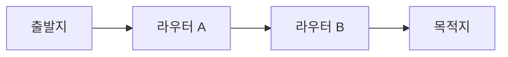

### IP의 특징

- **비연결성(Connectionless)**: 사전에 연결을 맺지 않고 그냥 패킷을 보냄
- **비신뢰성(Unreliable)**: 패킷이 중간에 사라지거나, 순서가 뒤바뀌어 도착해도 IP 자체는 신경 쓰지 않음 (Best-effort delivery)
- 그래서 신뢰성 있는 전달이 필요하면 상위 계층인 TCP의 도움이 필요함 (3장에서 이어짐)

### IP 패킷 헤더에 담기는 정보 (일부)

| 필드 | 역할 |
|---|---|
| 출발지/목적지 IP | 패킷을 어디서 보냈고 어디로 가야 하는지 |
| TTL(Time To Live) | 라우터를 거칠 때마다 1씩 감소, 0이 되면 폐기 → 패킷이 무한히 떠도는 것을 방지 |
| Fragmentation 관련 필드 | 패킷이 한 번에 보낼 수 있는 최대 크기(MTU)보다 크면 여러 조각으로 나눠 보내고, 목적지에서 재조립하기 위한 정보 |

### IPv4 vs IPv6

| | IPv4 | IPv6 |
|---|---|---|
| 주소 길이 | 32bit | 128bit |
| 표기 예시 | 192.168.0.1 | 2001:0db8::1 |
| 주소 개수 | 약 43억 개 | 사실상 고갈 걱정 없음 |
| 도입 배경 | - | IPv4 주소 고갈 문제 해결 |

### Public IP vs Private IP, 그리고 NAT

- **Public IP**: 인터넷상에서 유일하게 식별되는 주소, 외부에서 직접 접근 가능
- **Private IP**: 가정/회사 내부망에서만 쓰이는 주소(예: 192.168.x.x), 외부에서 직접 접근 불가능
- 내부망의 여러 기기가 하나의 Public IP를 공유해서 인터넷에 나갈 수 있도록, 공유기(NAT 장비)가 Private IP를 Public IP로 변환해줌

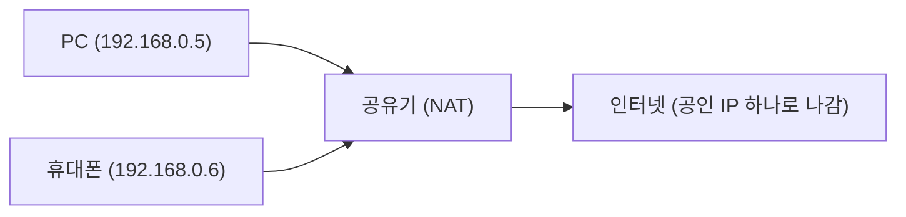

---

## 3. TCP/UDP

### 개념

- 둘 다 Transport 계층에서 동작하는 프로토콜이지만, 신뢰성과 속도에서 정반대의 선택을 함

### TCP (Transmission Control Protocol)

- **연결 지향(Connection-oriented)**: 통신 전에 3-way handshake로 먼저 연결을 맺음
- **신뢰성 보장**: 패킷 손실 시 재전송, 순서가 바뀐 패킷은 재정렬
- **흐름 제어(Flow Control)**: 받는 쪽이 처리할 수 있는 양(Window Size)에 맞춰 보내는 속도를 조절 → 받는 쪽 버퍼가 넘치는 것을 방지
- **혼잡 제어(Congestion Control)**: 네트워크 자체가 혼잡한지 감지해서 전송 속도를 조절 → 처음엔 천천히 보내다가 점점 속도를 늘리는 방식(Slow Start)이 대표적
- 이런 보장 장치들 때문에 UDP보다 헤더가 크고(20byte) 오버헤드가 있음
- 쓰이는 곳: 웹(HTTP), 이메일, 파일 전송처럼 데이터가 하나라도 빠지면 안 되는 경우

### UDP (User Datagram Protocol)

- **비연결(Connectionless)**: 연결 설정 없이 바로 데이터를 보냄
- **신뢰성 보장 없음**: 패킷이 사라져도 재전송하지 않고, 순서도 보장하지 않음
- 헤더가 단순해서(8byte) 오버헤드가 적고 빠름
- 쓰이는 곳: 실시간 스트리밍, 온라인 게임, 화상 통화처럼 약간의 손실보다 지연이 더 치명적인 경우

### 비교

| | TCP | UDP |
|---|---|---|
| 연결 방식 | 연결 지향 | 비연결 |
| 신뢰성 | 보장 (재전송, 순서 보장) | 보장 안 함 |
| 헤더 크기 | 약 20byte | 약 8byte |
| 속도 | 상대적으로 느림 | 상대적으로 빠름 |
| 흐름/혼잡 제어 | 있음 | 없음 |
| 사용 예 | HTTP, FTP, 이메일 | 스트리밍, 게임, DNS 조회 |

### Node.js로 보는 TCP/UDP

```js
// TCP 서버 (net 모듈)
const net = require('net');
const tcpServer = net.createServer((socket) => {
  socket.write('연결됨\n');
});
tcpServer.listen(9000);

// TCP 클라이언트
const client = net.createConnection({ port: 9000 }, () => {
  console.log('서버에 연결됨');
});
client.on('data', (data) => console.log(data.toString()));

// UDP 소켓 (dgram 모듈)
const dgram = require('dgram');
const udpSocket = dgram.createSocket('udp4');
udpSocket.send('hello', 9001, 'localhost'); // 연결 없이 바로 전송
```

---

## 4. 3-way/4-way Handshake

### 3-way Handshake (연결 시작)

- TCP는 데이터를 주고받기 전, 서로 통신할 준비가 됐는지 확인하는 과정을 거침

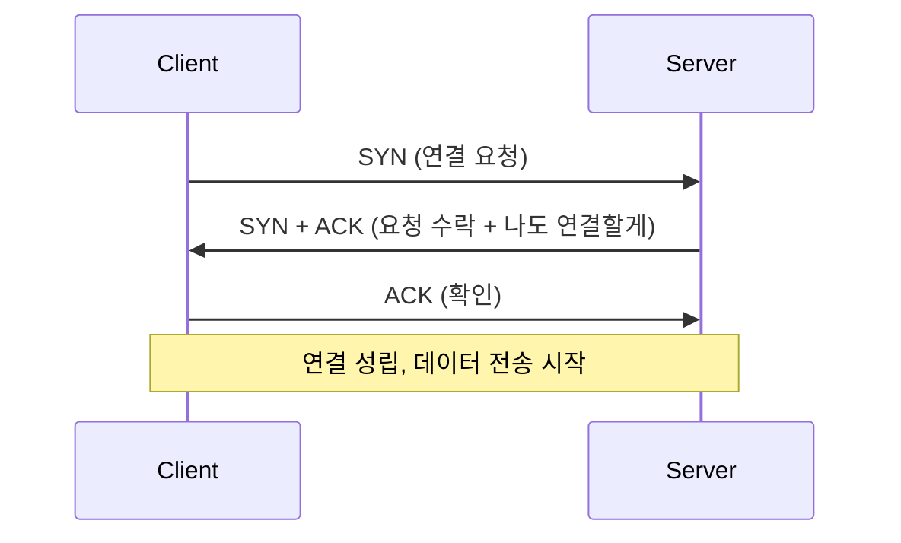

1. Client가 Server에 **SYN(연결 요청)을** 전송
2. Server가 요청을 받았다는 **ACK와** 함께 자신도 연결하겠다는 **SYN을** 함께 전송
3. Client가 마지막으로 **ACK를** 보내 연결 성립

### 4-way Handshake (연결 종료)

- 연결을 끊을 때는 양쪽 모두 "더 이상 보낼 데이터 없음"을 알려야 해서 4단계가 필요함

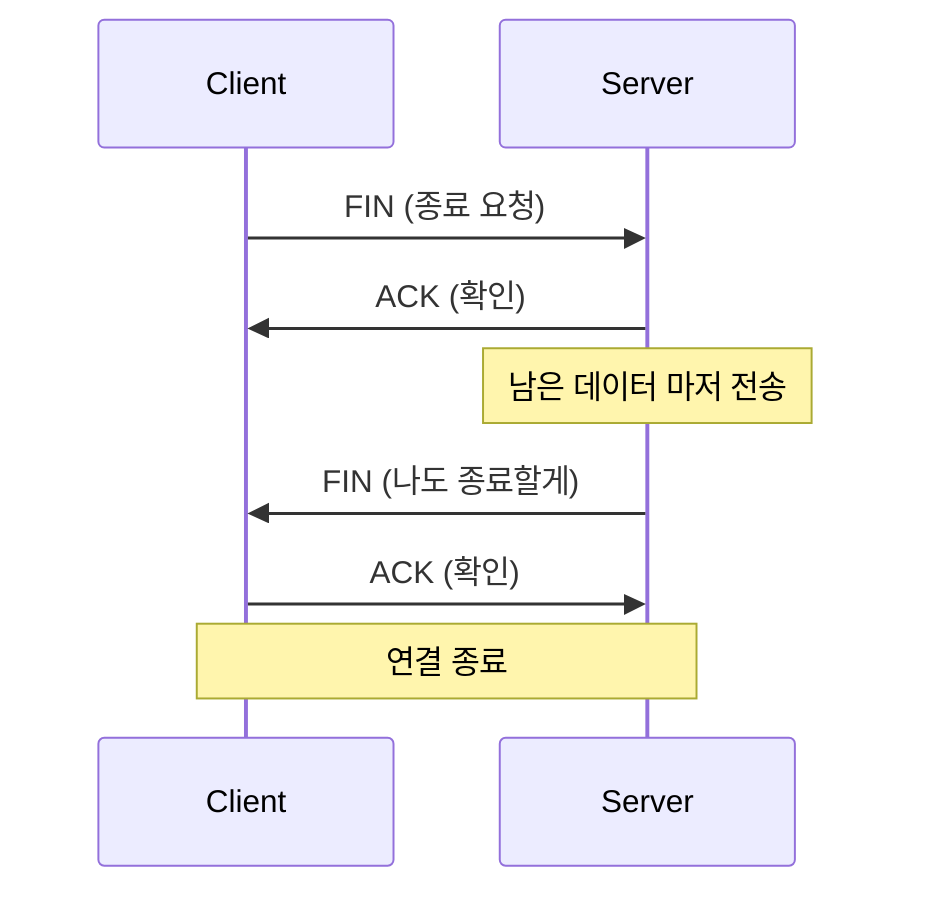

1. Client가 **FIN을** 전송 (더 이상 보낼 데이터 없음)
2. Server가 **ACK로** 확인 (이 시점에 Server는 아직 보낼 데이터가 남아있을 수 있음)
3. Server도 다 보냈으면 **FIN을** 전송
4. Client가 **ACK로** 확인하면 연결 종료

- 종료가 시작보다 한 단계 더 필요한 이유: 연결을 시작할 땐 SYN+ACK를 한 번에 보낼 수 있지만, 종료할 땐 Server가 아직 보낼 데이터가 남아있을 수 있어서 ACK와 FIN을 분리해서 보내기 때문

### TIME_WAIT은 왜 생길까

- 먼저 연결 종료를 시작한 쪽(마지막 ACK를 보낸 쪽)은 바로 연결을 없애지 않고, 일정 시간 동안 **TIME_WAIT** 상태로 남아있음
- 이유는 두 가지: 자신이 보낸 마지막 ACK가 상대방에게 도착하지 못했을 경우 상대가 FIN을 재전송할 수 있으므로 이를 받아 다시 응답해주기 위해서, 그리고 아직 네트워크에 떠돌고 있을 수 있는 지연된 패킷이 같은 포트 조합으로 새로 맺어질 연결에 섞이는 것을 막기 위해서

### 참고: SYN Flooding

- 공격자가 SYN만 대량으로 보내고 마지막 ACK는 보내지 않아서, 서버가 응답을 기다리는 미완성 연결을 계속 쌓이게 만드는 공격 방식
- 서버의 연결 대기 자원이 고갈되면 정상적인 사용자의 연결 요청을 처리할 수 없게 됨

---

## 5. DNS

### 개념

- **DNS(Domain Name System)**: 사람이 기억하기 쉬운 도메인 이름(example.com)을 실제 IP 주소로 변환해주는 시스템
- 전 세계 서버가 역할을 나눠 맡는 계층적 구조로 되어 있음 (Root → TLD → 권한 있는 서버)

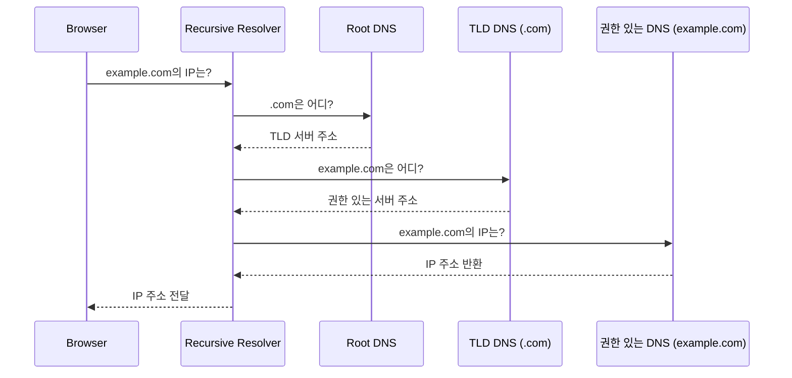

### 조회 과정 요약

1. 브라우저/OS에 캐싱된 결과가 있는지 먼저 확인 (있으면 바로 사용, 이 단계에서 끝나는 경우가 대부분)
2. 없으면 **Recursive Resolver**(보통 ISP나 8.8.8.8 같은 공용 DNS)에게 물어봄
3. Resolver가 Root → TLD(.com, .org 등) → 권한 있는 네임서버 순으로 거슬러 올라가며 IP를 찾음
4. 찾은 IP를 브라우저에 반환하고, 일정 시간 동안 캐싱해둠 (TTL만큼)

### DNS 레코드 종류

| 레코드 | 설명 |
|---|---|
| A | 도메인 → IPv4 주소 |
| AAAA | 도메인 → IPv6 주소 |
| CNAME | 도메인의 별칭, 다른 도메인 이름으로 연결 |
| MX | 이 도메인의 메일을 받을 서버 주소 |
| NS | 이 도메인을 관리하는 네임서버 |
| TXT | 도메인 소유 확인 등에 쓰이는 임의의 텍스트 정보 |

### TTL과 캐싱

- 각 DNS 응답에는 TTL(Time To Live) 값이 함께 오고, 이 시간 동안은 다시 조회하지 않고 캐싱된 결과를 사용함
- TTL을 짧게 설정하면 IP가 바뀌었을 때 빠르게 반영되지만 DNS 서버에 조회 요청이 더 자주 발생하고, 길게 설정하면 그 반대의 트레이드오프가 생김

### 명령어로 직접 조회해보기

```bash
# 도메인의 A 레코드 조회
nslookup example.com

# 더 자세한 조회 결과 (Linux/Mac)
dig example.com
```

```js
// Node.js에서 DNS 조회
const dns = require('dns');

dns.lookup('example.com', (err, address) => {
  console.log(address); // 예: 93.184.216.34
});

dns.resolveMx('example.com', (err, records) => {
  console.log(records); // 메일 서버 목록
});
```

---

## 6. Port

### 개념

- 하나의 IP 주소를 쓰는 컴퓨터 안에서, 어떤 프로세스(프로그램)로 데이터를 전달할지 구분하는 번호
- 0 ~ 65535 범위를 사용

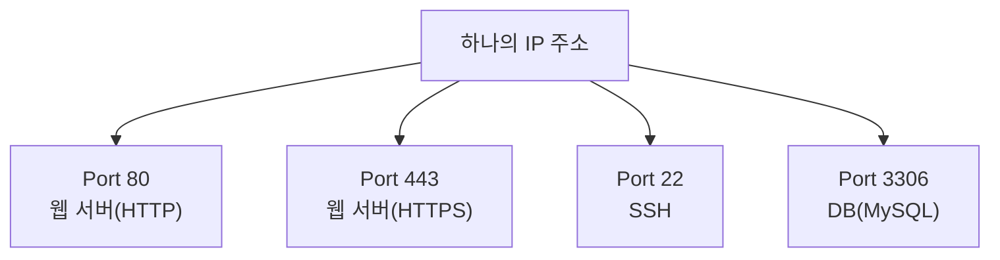

### Port 범위

| 범위 | 이름 | 예시 |
|---|---|---|
| 0 ~ 1023 | Well-known Port | HTTP(80), HTTPS(443), SSH(22), DNS(53) |
| 1024 ~ 49151 | Registered Port | MySQL(3306), Redis(6379) |
| 49152 ~ 65535 | Dynamic/Private Port | 클라이언트가 임시로 쓰는 포트 |

### 자주 쓰이는 Well-known Port

| Port | 프로토콜 |
|---|---|
| 20, 21 | FTP |
| 22 | SSH |
| 23 | Telnet |
| 25 | SMTP (메일 발송) |
| 53 | DNS |
| 80 | HTTP |
| 110 | POP3 (메일 수신) |
| 143 | IMAP (메일 수신) |
| 443 | HTTPS |

### IP + Port = Socket

- "IP 주소 + Port 번호"의 조합을 **소켓(Socket)이라고** 부르며, 이 조합으로 인터넷상의 특정 프로세스 하나를 정확히 식별함
- 예: `93.184.216.34:443`은 해당 서버의 HTTPS 서비스를 가리킴

### 현재 열려있는 Port 확인하기

```bash
# 현재 열려있는 포트와 연결 상태 확인
netstat -an

# 특정 포트를 어떤 프로세스가 쓰고 있는지 확인 (Mac/Linux)
lsof -i :3000
```

---

# Frontend 심화

## 7. 브라우저 Network 요청

### 개념

- 브라우저가 주소창에 URL을 입력하거나 `fetch`를 호출하면, 화면에 뭔가 뜨기 전까지 내부적으로 여러 단계를 거침

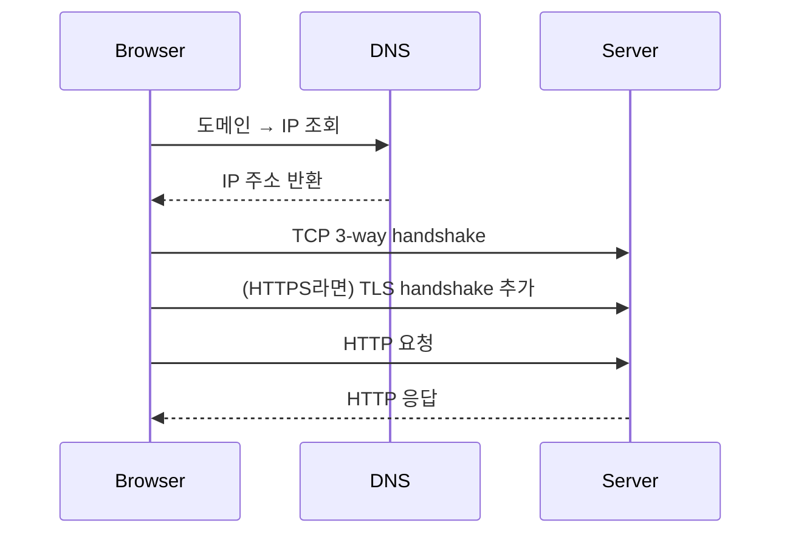

### 단계별 정리

1. **DNS 조회**: 도메인을 IP로 변환
2. **TCP 연결**: 서버와 3-way handshake로 연결 수립
3. **TLS handshake**: HTTPS라면 암호화 연결을 위한 추가 handshake
4. **HTTP 요청/응답**: 실제 데이터 주고받기
5. 필요하면 같은 TCP 연결을 재사용(Keep-Alive)해서 다음 요청 시 1~3단계를 생략

```js
fetch('https://example.com/api/users')
  .then((res) => res.json())
  .then((data) => console.log(data));
```

### HTTP/1.1 vs HTTP/2

| | HTTP/1.1 | HTTP/2 |
|---|---|---|
| 연결 | 요청마다 새 연결 또는 순차 대기 | 하나의 연결에서 여러 요청을 동시에 처리(멀티플렉싱) |
| Head-of-Line Blocking | 앞선 요청이 느리면 뒤 요청도 대기 | 요청 단위로 독립적이라 영향이 적음 |
| 헤더 | 매 요청마다 전체 전송 | 압축해서 중복 제거 |

### 캐싱: 매번 새로 받지 않아도 되는 이유

- 서버가 응답에 캐시 관련 헤더(`Cache-Control`, `ETag` 등)를 함께 보내면, 브라우저는 이후 같은 요청을 보낼 때 "이 버전 그대로면 새로 안 보내도 돼?"라고 물어볼 수 있음
- 서버가 바뀐 게 없다고 판단하면 실제 데이터 없이 **304 Not Modified만** 응답해서, 다운로드 시간을 아낄 수 있음

### CORS와 Preflight 요청

- 다른 출처(origin)로 보내는 요청 중 일부(커스텀 헤더 사용, GET/POST/HEAD 외의 메서드 등)는, 브라우저가 실제 요청을 보내기 전에 `OPTIONS` 메서드로 먼저 "이 요청을 보내도 되는지" 서버에 확인함

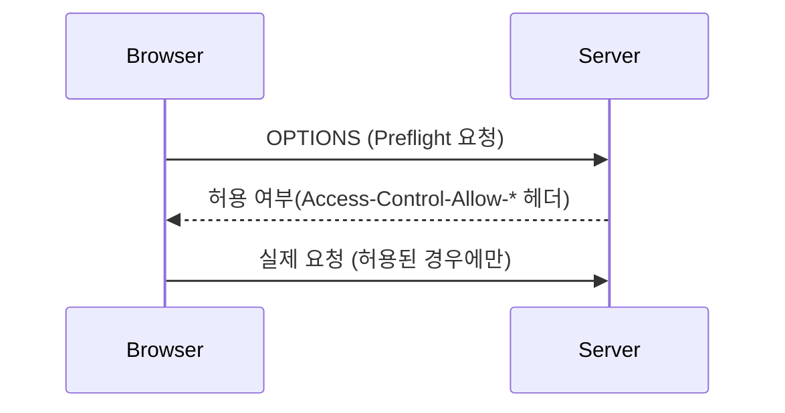

### 개발자 도구에서 확인하기

- 브라우저 Network 탭에서 요청 하나를 클릭하면 **Timing** 항목에서 DNS Lookup, Initial Connection, TLS, TTFB(Time To First Byte), Content Download 구간을 각각 얼마나 썼는지 확인 가능
- 같은 도메인으로 반복 요청 시 Connection이 재사용되면 DNS/TCP 단계가 생략된 걸 확인할 수 있음

---

## 8. WebSocket

### 개념

- 하나의 TCP 연결 위에서 클라이언트와 서버가 **양방향(Full-Duplex)으로** 계속 데이터를 주고받을 수 있게 해주는 프로토콜
- 일반 HTTP 요청처럼 시작하지만, 서버가 `101 Switching Protocols` 응답을 주면 그 연결이 WebSocket 연결로 전환됨
- 연결이 유지되는 동안은 양쪽 다 원할 때 자유롭게 메시지를 보낼 수 있음 (요청-응답 구조가 아님)

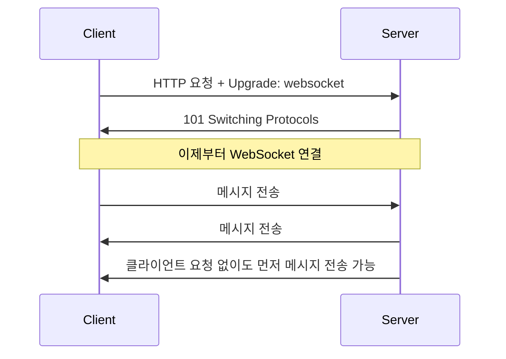

```js
const socket = new WebSocket('wss://example.com/chat');

socket.onopen = () => socket.send('hello');
socket.onmessage = (event) => console.log('받음:', event.data);
socket.onclose = (event) => console.log('연결 종료:', event.code);
```

### 연결 종료 코드

- 연결이 닫힐 때 이유를 나타내는 숫자 코드가 함께 전달됨

| 코드 | 의미 |
|---|---|
| 1000 | 정상 종료 |
| 1001 | 페이지 이동 등으로 연결 종료 |
| 1006 | 비정상 종료 (네트워크 끊김 등) |

### Heartbeat (Ping/Pong)

- 연결이 오래 유지되다 보면, 실제로는 끊겼는데도 양쪽이 이를 모르고 있는 상황이 생길 수 있음
- 이를 감지하기 위해 주기적으로 `ping` 메시지를 보내고, 상대가 `pong`으로 응답하지 않으면 연결이 끊긴 것으로 간주하고 재연결을 시도하는 방식을 많이 씀

### 재연결은 자동이 아님

- SSE와 달리 WebSocket은 연결이 끊겨도 브라우저가 알아서 재연결해주지 않기 때문에, 재연결 로직을 직접 구현해야 함

```js
function connect() {
  const socket = new WebSocket('wss://example.com/chat');
  socket.onclose = () => {
    setTimeout(connect, 3000); // 3초 후 재연결 시도
  };
  return socket;
}
connect();
```

### 쓰이는 곳

- 채팅, 실시간 협업 툴, 주식 시세처럼 서버와 클라이언트가 서로 수시로 메시지를 주고받아야 하는 경우

---

## 9. SSE

### 개념

- **SSE(Server-Sent Events)**: 서버에서 클라이언트로 **한 방향**으로만 계속 데이터를 흘려보낼 수 있게 해주는 기술
- 별도의 프로토콜 전환 없이, 그냥 하나의 HTTP 응답을 끝내지 않고 계속 열어둔 채로 데이터를 조금씩 흘려보내는 방식으로 동작함
- 응답의 `Content-Type`이 `text/event-stream`이라는 점이 일반 HTTP 응답과 다름

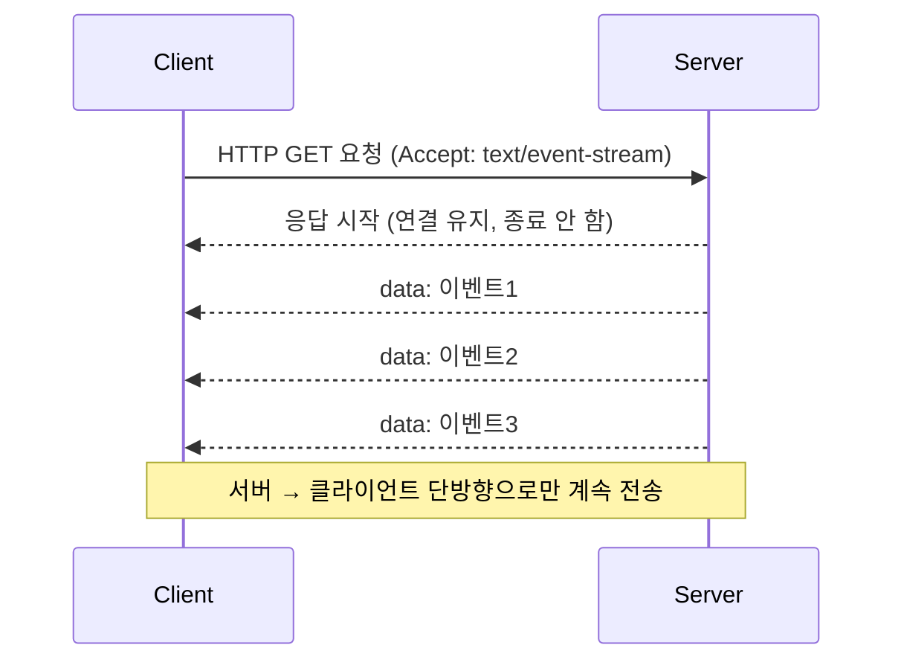

### 데이터 형식

- 응답 본문은 텍스트 기반의 단순한 형식으로 구성됨

```
data: 첫 번째 메시지

data: 두 번째 메시지
id: 102
retry: 3000

event: notice
data: {"type": "alert", "msg": "서버 점검 예정"}
```

- `data`: 실제 전달할 내용
- `id`: 이 이벤트의 번호 (재연결 시 이어받기 위한 기준점)
- `retry`: 연결이 끊겼을 때 재연결까지 기다릴 시간(ms)
- `event`: 이벤트 종류를 구분하는 이름 (지정하지 않으면 기본 `message` 이벤트로 처리)
- 이벤트 사이는 빈 줄로 구분됨

### 재연결(Reconnection)

- WebSocket과 달리 SSE는 브라우저의 `EventSource`가 연결이 끊기면 **자동으로 재연결을 시도함** (별도 구현 불필요)
- 재연결할 때, 마지막으로 받은 이벤트의 `id`를 `Last-Event-ID`라는 헤더에 담아 서버에 보냄 → 서버는 그 이후 이벤트부터 이어서 보내줄 수 있음

```js
const events = new EventSource('/updates');

events.onmessage = (e) => console.log('받음:', e.data);

events.addEventListener('notice', (e) => {
  console.log('알림 이벤트:', JSON.parse(e.data));
});

events.onerror = () => {
  console.log('연결 문제 발생 — 브라우저가 자동으로 재연결을 시도함');
};
```

### 간단한 서버 쪽 구현 예시 (Node.js)

```js
app.get('/updates', (req, res) => {
  res.set({
    'Content-Type': 'text/event-stream',
    'Cache-Control': 'no-cache',
    Connection: 'keep-alive',
  });

  const interval = setInterval(() => {
    res.write(`data: ${new Date().toISOString()}\n\n`); // 형식 규칙: 빈 줄로 이벤트 구분
  }, 1000);

  req.on('close', () => clearInterval(interval)); // 연결 끊기면 정리
});
```

### 브라우저 연결 개수 제한과 주의점

- HTTP/1.1을 쓰는 경우, 브라우저가 같은 도메인에 동시에 열 수 있는 연결 수는 보통 6개로 제한되어 있음
- SSE 연결은 계속 열려있는 상태이기 때문에, 탭을 여러 개 띄워 같은 도메인에 SSE 연결을 여러 개 맺으면 이 제한에 걸려 다른 요청이 막힐 수 있음 (HTTP/2에서는 하나의 연결을 공유하기 때문에 이 문제가 완화됨)

### Polling / Long Polling / SSE / WebSocket 비교

실시간성이 필요한 기능을 만들 때 선택할 수 있는 방식은 여러 가지이고, 방향성과 복잡도에서 차이가 있음.

| | Polling | Long Polling | SSE | WebSocket |
|---|---|---|---|---|
| 방식 | 일정 주기로 요청 반복 | 응답이 올 때까지 요청을 붙잡아둠 | HTTP 응답을 계속 열어둠 | 별도 프로토콜로 전환 |
| 방향 | 클라이언트 → 서버 | 클라이언트 → 서버 | 서버 → 클라이언트만 | 양방향 |
| 연결 방식 | 매번 새 연결 | 매번 새 연결(응답 지연) | 연결 하나를 계속 유지 | 연결 하나를 계속 유지 |
| 재연결 처리 | 해당 없음 | 매번 재요청 | 브라우저가 자동 처리 | 직접 구현 필요 |
| 대표 사용처 | 간단한 상태 확인 | 초기 실시간 기능 구현 | 알림, 실시간 피드 | 채팅, 실시간 협업 |

### SSE를 선택하는 기준

- 서버 → 클라이언트로만 데이터가 흐르면 충분하고, 클라이언트가 수시로 메시지를 보낼 필요는 없는 경우
- 양방향이 필요 없다면 WebSocket보다 구현이 단순하고, 기본 HTTP 인프라를 그대로 활용할 수 있다는 장점이 있음
- 반대로 클라이언트도 서버에 실시간으로 메시지를 보내야 한다면 WebSocket을 선택하는 게 맞음

---

## 10. 정리

| 개념 | 핵심 |
|---|---|
| OSI 7 Layer/TCP-IP | 통신 과정을 계층으로 나눈 모델, 실제로는 TCP/IP 4계층이 주로 쓰임 |
| IP | 패킷을 목적지까지 전달, 비연결·비신뢰성(Best-effort) |
| TCP/UDP | TCP는 신뢰성 보장·연결 지향, UDP는 빠르지만 신뢰성 보장 없음 |
| 3-way/4-way Handshake | 연결 시작은 3단계(SYN, SYN+ACK, ACK), 종료는 4단계(FIN, ACK, FIN, ACK) |
| DNS | 도메인을 IP로 변환, Root → TLD → 권한 있는 서버 순으로 조회 |
| Port | 같은 IP 안에서 프로세스를 구분하는 번호, IP+Port가 소켓 |
| 브라우저 Network 요청 | DNS 조회 → TCP 연결 → (TLS) → HTTP 요청/응답 순으로 진행 |
| WebSocket | HTTP로 시작해 프로토콜 전환, 양방향 실시간 통신, 재연결은 직접 구현 |
| SSE | 서버 → 클라이언트 단방향 스트리밍, 브라우저가 자동 재연결 |