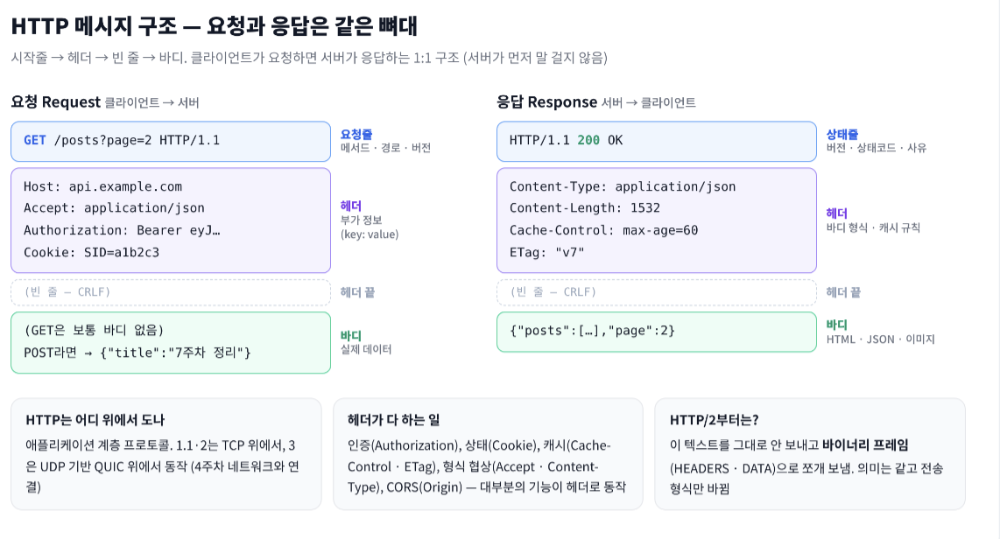
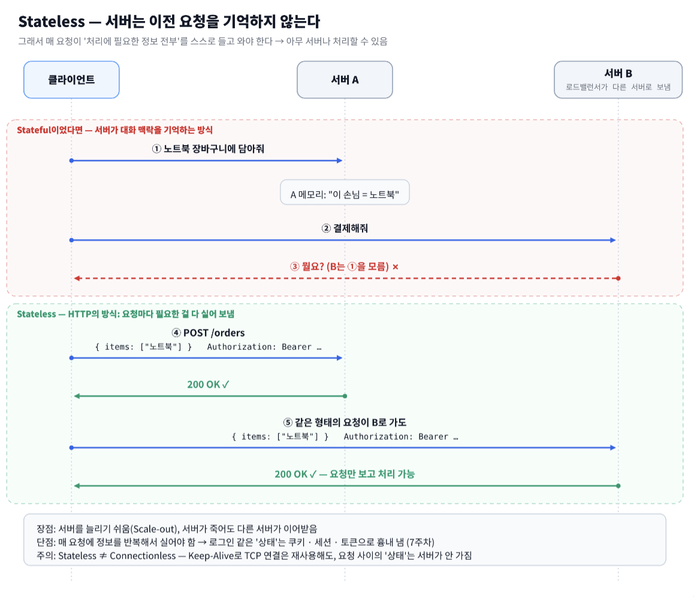
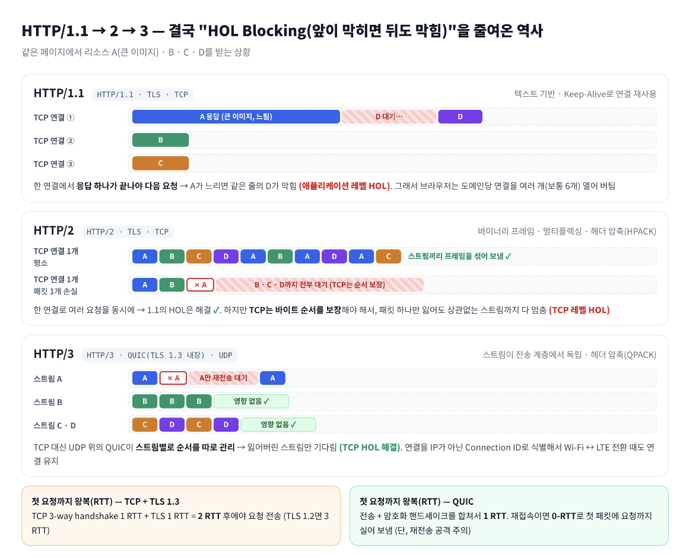
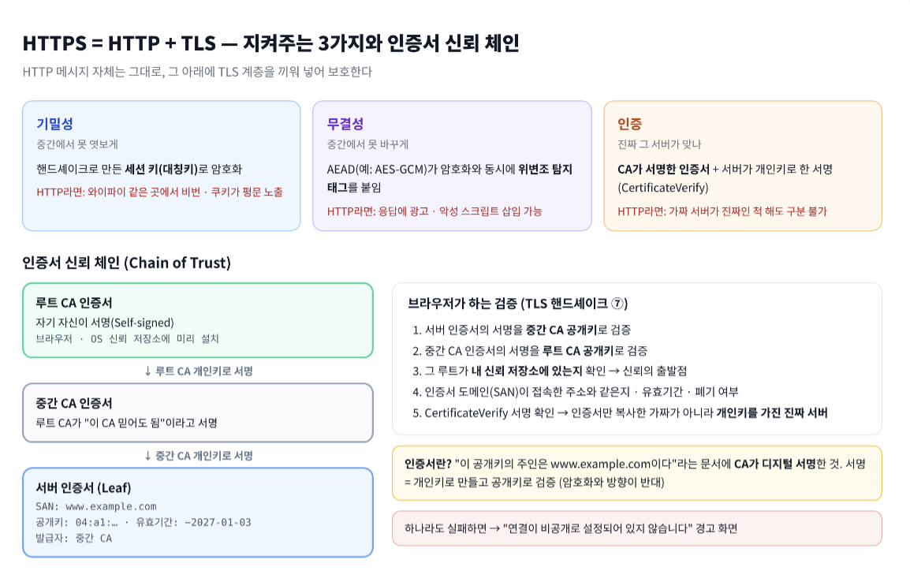
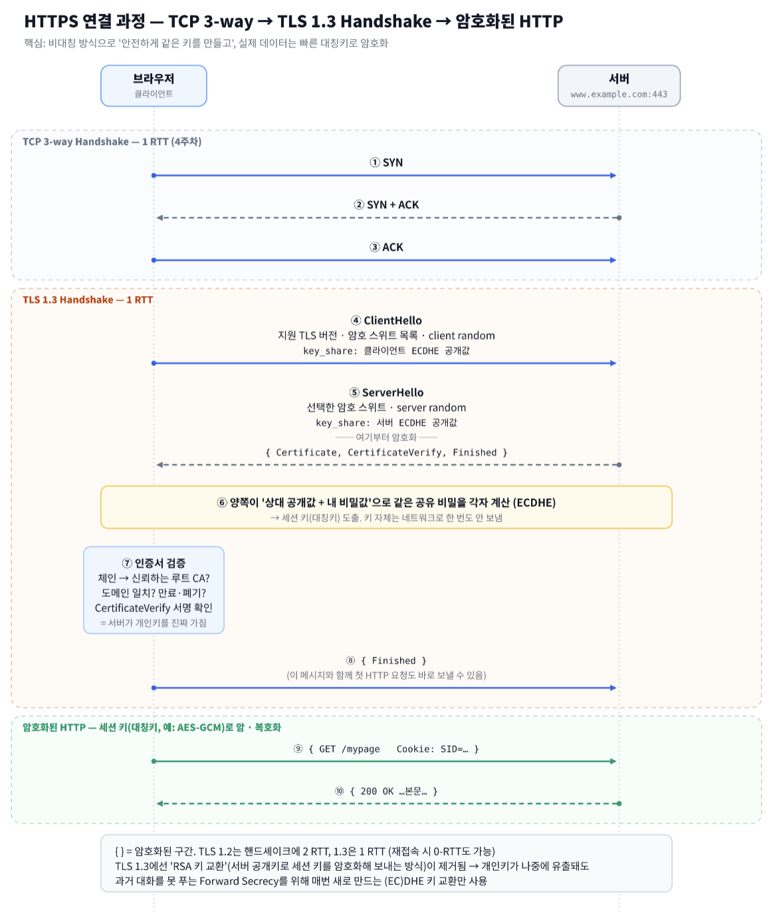
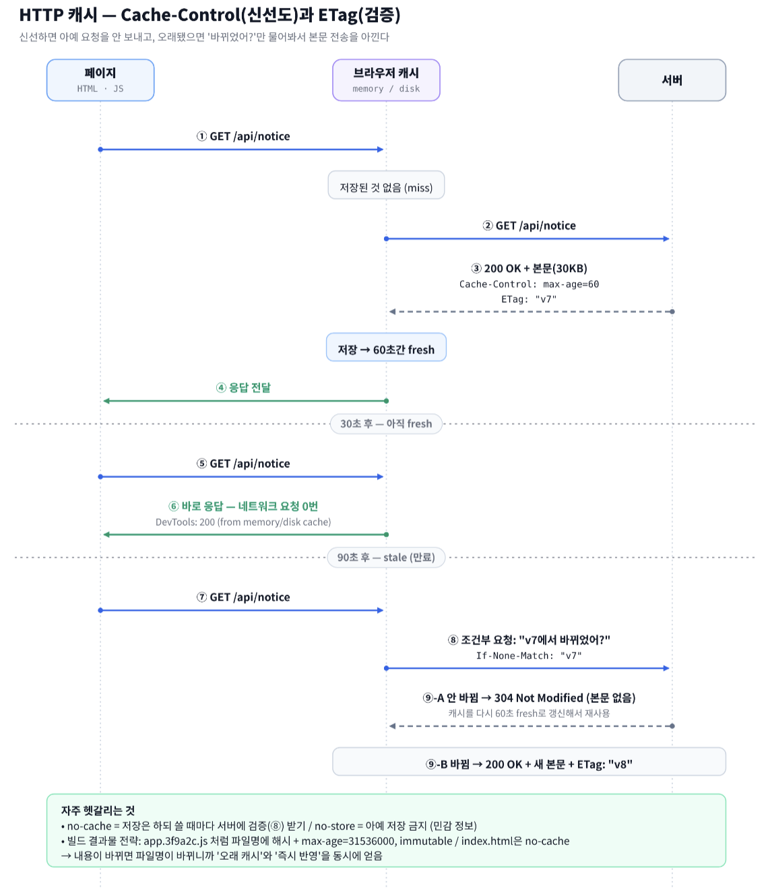
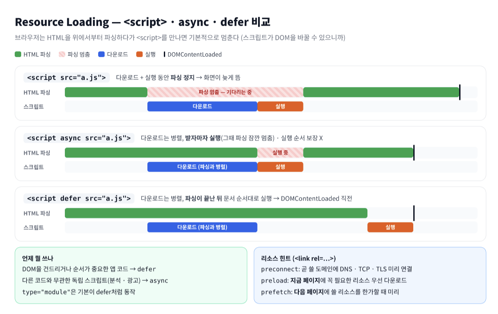

# 5주차 — HTTP / HTTPS

> **키워드** HTTP · Stateless · Method · 상태 코드 · HTTP/1.1·2·3 · HTTPS · TLS
> **FE 심화** HTTP Cache · Fetch/Axios · Resource Loading

---

## 0. 개요

| 묶음 | 키워드 | 한 줄 요약 |
|---|---|---|
| HTTP의 규칙 | HTTP, Stateless, Method, 상태 코드 | "무엇을 요청하고 어떻게 답하나" — 메시지의 **의미** |
| 전송 방식 | HTTP/1.1·2·3 | 같은 의미를 **더 빨리** 보내는 방법의 변화 |
| 보안 | HTTPS, TLS | 같은 메시지를 **안전하게** 보내는 방법 |

연결 고리

- 메서드·상태 코드·헤더(= HTTP의 **의미**)는 1.1이든 3이든 그대로. 버전이 바뀌며 달라진 건 **전송 형식**뿐
- HTTP는 Stateless → 로그인은 쿠키·토큰을 **매 요청마다** 실어 보냄 → 그게 평문이면 그대로 털림 → **HTTPS가 사실상 필수**
- HTTPS는 연결할 때 TLS 핸드셰이크 비용이 듦 → HTTP/3는 QUIC 안에 TLS를 합쳐서 그 비용을 줄임

---

## 1. HTTP (HyperText Transfer Protocol)

**정의** — 클라이언트와 서버가 리소스(HTML, JSON, 이미지 …)를 주고받기 위한 **애플리케이션 계층 프로토콜**. 클라이언트가 요청하면 서버가 응답하는 구조.



- 메시지 = **시작줄 → 헤더 → 빈 줄 → 바디**
- 기능 대부분이 **헤더**로 확장됨 (인증, 캐시, CORS, 쿠키, 형식 협상) → 그래서 수십 년째 버틴 프로토콜
- 서버가 먼저 말을 걸 수 없음 → 실시간이 필요하면 WebSocket(`101 Switching Protocols`로 업그레이드)이나 SSE를 씀

---

## 2. Stateless (무상태성)

**정의** — 서버가 **이전 요청을 기억하지 않는** 성질. 각 요청은 그 자체로 처리에 필요한 정보를 다 담고 있어야 함.



- **장점** — 아무 서버나 요청을 처리할 수 있음 → 서버를 늘리기(Scale-out) 쉽고, 한 대가 죽어도 다른 서버가 이어받음
- **단점** — 같은 정보를 매번 실어 보내야 함 → 로그인 같은 상태는 **쿠키·세션·토큰**으로 흉내 냄

**헷갈리는 포인트**

| 질문 | 답 |
|---|---|
| 쿠키·세션 쓰면 Stateful 아닌가? | **프로토콜**은 여전히 Stateless. 클라이언트가 매 요청에 상태를 **실어 보내는** 것뿐. 세션은 서버 **애플리케이션**이 상태를 갖는 것 |
| Stateless = Connectionless? | 다름. Keep-Alive로 **TCP 연결은 재사용**해도, 요청과 요청 사이의 **상태**는 서버가 안 가짐 |

---

## 3. HTTP Method

| 메서드 | 용도 | 요청 바디 | Safe | Idempotent | 캐시 |
|---|---|---|---|---|---|
| `GET` | 조회 | 안 씀 | ✓ | ✓ | ✓ |
| `HEAD` | GET인데 헤더만 | ✗ | ✓ | ✓ | ✓ |
| `POST` | 생성 · 처리 | ✓ | ✗ | ✗ | 거의 안 함 |
| `PUT` | **전체** 교체 (없으면 생성) | ✓ | ✗ | ✓ | ✗ |
| `PATCH` | **부분** 수정 | ✓ | ✗ | 보장 X | ✗ |
| `DELETE` | 삭제 | 보통 안 씀 | ✗ | ✓ | ✗ |
| `OPTIONS` | 지원 기능 확인 (CORS Preflight) | ✗ | ✓ | ✓ | ✗ |

- **Safe** — 서버 리소스를 **바꾸지 않음** (조회만)
- **Idempotent(멱등)** — 같은 요청을 **여러 번 보내도 서버 상태 결과가 같음**
  - `DELETE /posts/1`을 두 번 → 두 번째 응답은 404일 수 있지만 "1번 글이 없는 상태"는 같음 → 멱등
  - 응답 코드가 같아야 하는 게 아니라 **서버 상태**가 같아야 함

**멱등이 왜 중요한가** — 네트워크가 끊겨서 응답을 못 받았을 때 **재시도해도 되는지**의 기준. `PUT`은 다시 보내도 안전하지만 `POST /payments`를 재시도하면 결제가 두 번 될 수 있음 → 결제 API는 `Idempotency-Key` 같은 헤더로 중복을 막음.

**헷갈리는 포인트**
- **PUT vs PATCH** — `PUT`에 `{ title }`만 보내면 원칙상 나머지 필드는 **사라짐**(전체 교체). 일부만 바꿀 땐 `PATCH`
- **GET에 민감 정보 X** — 쿼리 스트링은 브라우저 히스토리·서버 로그·Referer에 남음 (HTTPS여도 URL은 이런 곳에 기록됨)

---

## 4. 상태 코드

| 범위 | 의미 | 자주 보는 코드 |
|---|---|---|
| **1xx** | 처리 중 | `101` Switching Protocols (WebSocket 업그레이드) |
| **2xx** | 성공 | `200` OK · `201` Created (+ `Location` 헤더) · `204` No Content |
| **3xx** | 다른 데로 가라 / 캐시 써라 | `301` · `302` · `304` Not Modified · `307` · `308` |
| **4xx** | **클라이언트** 잘못 | `400` Bad Request · `401` · `403` · `404` · `405` Method Not Allowed · `409` Conflict · `422` Unprocessable Content · `429` Too Many Requests |
| **5xx** | **서버** 잘못 | `500` Internal Server Error · `502` Bad Gateway · `503` Service Unavailable · `504` Gateway Timeout |

**헷갈리는 포인트**

| 비교 | 차이 |
|---|---|
| `301` / `308` | 둘 다 **영구** 이동. `301`은 브라우저가 POST를 GET으로 바꿔버릴 수 있음, `308`은 메서드 **유지** |
| `302` / `307` | 둘 다 **임시** 이동. 마찬가지로 `307`이 메서드 **유지** |
| `401` / `403` | 누군지 모름(인증 실패) vs 누군지는 아는데 권한 없음(인가 실패) — 7주차 |
| `502` / `504` | 둘 다 앞단 게이트웨이(Nginx, 로드밸런서)가 내는 에러. 뒷단 서버가 **이상한 응답**을 주면 502, **응답이 안 오면(타임아웃)** 504 |
| `400` / `422` | 요청 **형식** 자체가 깨짐 vs 형식은 맞는데 **내용**이 규칙 위반 (예: 이메일 형식 오류) |

---

## 5. HTTP/1.1 · 2 · 3



| | HTTP/1.1 | HTTP/2 | HTTP/3 |
|---|---|---|---|
| 전송 계층 | TCP | TCP | **QUIC (UDP 기반)** |
| 메시지 형식 | 텍스트 | **바이너리 프레임** | 바이너리 프레임 |
| 한 연결에서 동시 요청 | ✗ (순서대로) | ✓ 멀티플렉싱 | ✓ 멀티플렉싱 |
| HOL Blocking | 애플리케이션 레벨 | TCP 레벨에 남음 | **해결** (스트림별 독립) |
| 헤더 압축 | ✗ | HPACK | QPACK |
| TLS | 선택 | 사실상 필수 (브라우저는 TLS 위에서만 지원) | **내장** (TLS 1.3) |

**HTTP/1.1에서 생긴 것** (1.0 대비)
- **Keep-Alive 기본** — 요청마다 TCP 연결을 새로 안 맺고 재사용
- **`Host` 헤더 필수** — IP 하나에 여러 도메인을 올리는 가상 호스팅 가능
- 파이프라이닝(응답 안 기다리고 요청 여러 개 보내기)도 있었지만, 응답은 **순서대로** 와야 해서 HOL 문제 그대로 → 브라우저들이 실제로는 안 씀

**HTTP/2**
- 메시지를 HEADERS · DATA **프레임**으로 쪼개고, 스트림 번호를 붙여 한 연결에 섞어 보냄
- Server Push(요청 전에 서버가 미리 보내기)도 있었지만 효과가 적어서 Chrome 106부터 기본 비활성화 → 지금은 사실상 안 씀

**HTTP/3**
- **왜 UDP?** — TCP는 OS 커널에 박혀 있어서 바꾸기 어려움. UDP 위에 QUIC이 **신뢰성·순서·혼잡 제어를 직접 구현** → "UDP라서 신뢰성 없다"는 틀린 말
- 연결을 IP가 아닌 **Connection ID**로 식별 → Wi-Fi ↔ LTE 바뀌어도 연결 유지
- 서버가 `Alt-Svc` 헤더로 "h3 돼"라고 알려주면 브라우저가 그다음부터 HTTP/3로 시도

**FE 관점** — 1.1 시절 최적화(이미지 스프라이트, JS 파일 하나로 합치기, 도메인 샤딩)는 HTTP/2 이후엔 불필요하거나 **역효과** (도메인 샤딩은 멀티플렉싱 이점을 깨고 연결만 늘림). DevTools Network 탭 → `Protocol` 컬럼에서 `h2`, `h3` 확인 가능.

---

## 6. HTTPS

**정의** — HTTP 메시지를 **TLS로 암호화**해서 주고받는 것. 기본 포트 443. HTTP 메시지 자체는 그대로고, 아래에 보안 계층이 하나 끼는 구조.



### 대칭키 vs 비대칭키 — 왜 둘 다 쓰나

| | 대칭키 | 비대칭키 (공개키 · 개인키) |
|---|---|---|
| 키 | 하나를 양쪽이 공유 | 공개키는 공개, 개인키는 본인만 |
| 속도 | **빠름** | 느림 |
| 약점 | 처음에 키를 **어떻게 안전하게 나누나** | 대량 데이터 암호화엔 부적합 |
| TLS에서 역할 | 실제 **데이터 암호화** | **키 교환 + 신원 증명(서명)** |

→ 비대칭 방식으로 "안전하게 같은 대칭키를 만들고", 이후엔 빠른 대칭키로 통신. 둘의 단점을 서로 메움.

**헷갈리는 포인트**
- **"HTTPS = 안전한 사이트"가 아님** — 보호하는 건 **전송 구간**뿐. 피싱 사이트도 도메인만 있으면 인증서를 받을 수 있음
- **Mixed Content** `FE` — HTTPS 페이지에서 `http://` 이미지·스크립트를 불러오면 브라우저가 차단하거나 경고 → API 주소, CDN 주소 전부 https로
- **HSTS** — 서버가 `Strict-Transport-Security` 헤더를 주면 브라우저가 이후 그 도메인은 무조건 HTTPS로만 접속 (http로 쳐도 내부에서 바꿈)
- **SSL vs TLS** — SSL은 TLS의 전신이고 SSL 버전은 전부 폐기됨. "SSL 인증서"는 습관적인 이름일 뿐 실제로는 TLS

---

## 7. TLS (Transport Layer Security)

**정의** — 두 지점 사이 통신의 **기밀성 · 무결성 · 인증**을 보장하는 보안 프로토콜. HTTPS의 S가 이것. 현재 표준은 **TLS 1.3**.



핸드셰이크에서 일어나는 일을 3줄로
1. **키 재료 교환** — ClientHello · ServerHello에 각자 ECDHE 공개값(`key_share`)을 실어 보냄 → 양쪽이 같은 비밀을 **각자 계산**
2. **서버 신원 확인** — 인증서 체인 검증 + 서버가 개인키로 서명한 `CertificateVerify` 확인
3. **완료 확인** — 양쪽 `Finished`로 핸드셰이크가 변조되지 않았는지 확인 → 이후 대칭키로 HTTP 통신

### TLS 1.2 vs 1.3

| | TLS 1.2 | TLS 1.3 |
|---|---|---|
| 핸드셰이크 왕복 | 2 RTT | **1 RTT** (재접속 0-RTT 가능) |
| 키 교환 | RSA 또는 (EC)DHE | **(EC)DHE만** (RSA 키 교환 제거) |
| 인증서 전송 | 평문 | **암호화됨** |
| 약한 암호 | 선택 가능 | 대거 제거 |

**헷갈리는 포인트 — 면접 단골 오답**

> "클라이언트가 대칭키를 만들어서 **서버 공개키로 암호화해 보낸다**"

→ 이건 **TLS 1.2 이하의 RSA 키 교환** 방식이고 TLS 1.3에선 **제거됨**. 이 방식은 서버 개인키가 나중에 유출되면 과거에 녹화해둔 통신을 전부 풀 수 있음.
지금은 매 연결마다 새 키쌍을 만드는 **ECDHE**로, 키를 보내지 않고 **양쪽이 같은 값을 계산** → 개인키가 유출돼도 과거 통신은 안전 (**Forward Secrecy**). 이때 서버 공개키(인증서)는 암호화가 아니라 **"내가 진짜 서버"라는 서명 검증**에 쓰임.

---

## 8. FE 심화

### 8-1. HTTP Cache `FE 심화`



**두 가지 축**
- **신선도(Freshness)** — `Cache-Control: max-age=60` → 60초 동안은 서버에 묻지도 않고 캐시 사용
- **검증(Validation)** — 만료 후엔 `ETag`/`If-None-Match` (또는 `Last-Modified`/`If-Modified-Since`)로 "바뀌었어?"만 물어봄 → 안 바뀌었으면 `304` + 본문 없음

| `Cache-Control` 값 | 의미 |
|---|---|
| `max-age=N` | N초 동안 fresh |
| `no-cache` | 저장은 OK, **쓸 때마다 서버에 검증** (이름과 달리 "캐시 금지" 아님) |
| `no-store` | **저장 자체 금지** (개인정보 · 결제 화면) |
| `private` / `public` | 브라우저만 저장 / CDN 같은 공유 캐시도 저장 가능 |
| `immutable` | 만료 전엔 새로고침해도 검증 안 함 (해시 파일명용) |
| `s-maxage=N` | CDN 같은 공유 캐시 전용 max-age |

**빌드 결과물 캐시 전략**
- `app.3f9a2c.js` (내용 해시가 파일명에) → `max-age=31536000, immutable` — 내용 바뀌면 파일명이 바뀌니까 1년 캐시해도 안전
- `index.html` → `no-cache` — 매번 검증해서 새 해시 파일명을 바로 가리키게

**HTTP 캐시 ≠ React Query 캐시** — React Query의 `staleTime`은 **JS 메모리**에 있는 앱 레벨 캐시. HTTP 캐시는 **브라우저**가 헤더 보고 하는 것. 두 층이 따로 존재 (6주차 Server State와 연결).

### 8-2. Fetch vs Axios `FE 심화`

| | `fetch` | `axios` |
|---|---|---|
| 제공 | 브라우저 내장 | 라이브러리 설치 |
| JSON 응답 | `await res.json()` 직접 | `res.data`에 자동 파싱 |
| JSON 요청 | `JSON.stringify` + `Content-Type` 직접 | 객체 넣으면 자동 |
| **4xx · 5xx** | **reject 안 함** → `res.ok` 직접 확인 | **reject** (`validateStatus`로 조절) |
| 타임아웃 | `AbortSignal.timeout(ms)` | `timeout` 옵션 |
| 요청 취소 | `AbortController` | `AbortController` (`signal`) |
| 인터셉터 | 없음 → 래퍼 함수로 구현 | request / response interceptors |
| 쿠키 전송 (cross-origin) | `credentials: 'include'` | `withCredentials: true` |

**fetch 최대 함정** — `fetch`는 **네트워크 자체가 실패**했을 때만 reject. 404, 500은 "응답은 잘 받았음"이라 `then`으로 감.

```js
const res = await fetch('/api/posts', { signal: AbortSignal.timeout(5000) });
if (!res.ok) throw new Error(`HTTP ${res.status}`);   // 이거 없으면 404도 성공 처리됨
const data = await res.json();
```

axios를 쓰는 대표 이유는 결국 **인터셉터** — 모든 요청에 토큰 붙이기, 401 받으면 refresh 후 재시도 (7주차 JWT 흐름 ⑫)를 한 곳에서 처리.

### 8-3. Resource Loading `FE 심화`



- **`<script>` 기본** — HTML 파싱을 멈춤 (render-blocking). 그래서 옛날엔 `</body>` 직전에 뒀음
- **`defer`** — 병렬 다운로드, 파싱 끝난 뒤 **순서대로** 실행 → 앱 코드 기본값으로 적합. `type="module"`은 기본이 defer처럼 동작
- **`async`** — 병렬 다운로드, **받자마자** 실행 → 순서 보장 X, 독립 스크립트(분석 · 광고)용
- **CSS도 render-blocking** — CSSOM이 완성돼야 화면을 그릴 수 있어서 `<head>`의 CSS는 빨리 받아야 함
- **리소스 힌트** — `preconnect`(연결 미리) · `preload`(지금 페이지 핵심 리소스 우선) · `prefetch`(다음 페이지 리소스 미리)
- **이미지** — 첫 화면 밖 이미지는 `loading="lazy"`, 첫 화면 대표 이미지(LCP)는 `fetchpriority="high"`

---

## 예상 면접 질문

<details><summary>Q1. HTTP가 Stateless라는 건 무슨 뜻이고, 그럼 로그인은 어떻게 유지하나?</summary>

서버가 이전 요청을 기억하지 않는다는 것. 그래서 매 요청에 상태(세션 ID 쿠키나 토큰)를 실어 보내서 "누구인지"를 매번 증명함. Stateless라서 서버를 수평 확장하기 쉬움.
</details>

<details><summary>Q2. GET과 POST의 차이는?</summary>

"데이터가 URL에 가냐 바디에 가냐"를 넘어서: GET은 **Safe + 멱등 + 캐시 가능**, POST는 셋 다 아님. 그래서 GET은 재시도·캐시·프리페치가 자유롭고, POST는 중복 실행 위험이 있음.
</details>

<details><summary>Q3. 멱등성이란? PUT과 PATCH는 멱등한가?</summary>

같은 요청을 여러 번 해도 서버 상태 결과가 같은 것. PUT은 전체 교체라 멱등. PATCH는 구현에 따라 다름 — "조회수 +1"처럼 현재 값 기준 증가 연산이면 보낼 때마다 결과가 달라지니 멱등 아님.
</details>

<details><summary>Q4. 301, 302, 307, 308의 차이는?</summary>

301·308은 영구, 302·307은 임시 이동. 301·302는 브라우저가 POST를 GET으로 바꿀 수 있고, 307·308은 원래 메서드를 유지.
</details>

<details><summary>Q5. 304 Not Modified는 언제 오나?</summary>

캐시가 만료된 뒤 `If-None-Match`(ETag)나 `If-Modified-Since`로 조건부 요청을 보냈는데 서버 리소스가 안 바뀌었을 때. 본문 없이 와서 대역폭을 아낌.
</details>

<details><summary>Q6. HTTP/2가 1.1보다 빠른 이유와, 그래도 남은 문제는?</summary>

바이너리 프레임 + 멀티플렉싱으로 한 연결에서 여러 요청을 동시에 처리하고, HPACK으로 헤더를 압축. 하지만 TCP 위라서 패킷 하나 손실 시 모든 스트림이 기다리는 TCP 레벨 HOL이 남음 → HTTP/3가 해결.
</details>

<details><summary>Q7. HTTP/3는 왜 신뢰성 없는 UDP를 쓰나?</summary>

UDP 자체가 목적이 아니라 **TCP를 피하려는 것**. TCP는 OS 커널에 있어서 개선이 느리고 HOL 문제가 구조적. UDP 위에 QUIC이 신뢰성·순서 보장·혼잡 제어를 스트림 단위로 직접 구현함.
</details>

<details><summary>Q8. HTTPS 연결 과정을 설명해보세요.</summary>

TCP 3-way handshake → TLS 핸드셰이크(ClientHello/ServerHello로 ECDHE 키 재료 교환, 인증서 체인 검증, CertificateVerify 서명 확인, Finished) → 양쪽이 계산한 세션 키(대칭키)로 HTTP 메시지를 암호화해 통신. TLS 1.3 기준 핸드셰이크 1 RTT.
</details>

<details><summary>Q9. 대칭키와 비대칭키를 둘 다 쓰는 이유는?</summary>

대칭키는 빠르지만 키를 안전하게 나눌 방법이 문제, 비대칭키는 그 문제를 풀지만 느림. 그래서 비대칭(키 교환·서명)으로 안전하게 대칭키를 만들고, 실제 데이터는 대칭키로 암호화.
</details>

<details><summary>Q10. 브라우저는 서버 인증서를 어떻게 믿나?</summary>

인증서 체인을 따라 올라가며 각 인증서의 서명을 상위 CA 공개키로 검증 → 최종적으로 브라우저·OS 신뢰 저장소에 있는 루트 CA에 닿으면 신뢰. 도메인 일치·유효기간·폐기 여부도 확인.
</details>

<details><summary>Q11. fetch로 요청했는데 404인데 catch로 안 가요. 왜죠?</summary>

fetch는 네트워크 실패만 reject하고, HTTP 에러 응답은 "정상적으로 받은 응답"으로 취급. `res.ok`(200~299)나 `res.status`를 직접 확인해서 throw해야 함.
</details>

<details><summary>Q12. Cache-Control의 no-cache와 no-store 차이는?</summary>

no-cache는 저장은 하되 사용 전에 매번 서버 검증(304 가능), no-store는 아예 저장 금지. "캐시 안 하려면 no-cache"는 흔한 오해.
</details>

<details><summary>Q13. script의 async와 defer 차이는?</summary>

둘 다 HTML 파싱과 병렬로 다운로드. async는 다운로드 끝나는 즉시 실행(순서 보장 X), defer는 파싱 완료 후 문서 순서대로 실행(DOMContentLoaded 직전).
</details>

---

## 참고 자료

- [MDN — HTTP 개요](https://developer.mozilla.org/ko/docs/Web/HTTP/Guides/Overview)
- [MDN — HTTP 요청 메서드](https://developer.mozilla.org/ko/docs/Web/HTTP/Reference/Methods) · [HTTP 상태 코드](https://developer.mozilla.org/ko/docs/Web/HTTP/Reference/Status)
- [MDN — HTTP 캐싱](https://developer.mozilla.org/ko/docs/Web/HTTP/Guides/Caching)
- [Chrome — Removing HTTP/2 Server Push](https://developer.chrome.com/blog/removing-push)
- [RFC 9110 — HTTP Semantics](https://datatracker.ietf.org/doc/html/rfc9110) · [RFC 9111 — HTTP Caching](https://datatracker.ietf.org/doc/html/rfc9111) · [RFC 9114 — HTTP/3](https://datatracker.ietf.org/doc/html/rfc9114)
- [RFC 8446 — TLS 1.3](https://datatracker.ietf.org/doc/html/rfc8446) · [RFC 9000 — QUIC](https://datatracker.ietf.org/doc/html/rfc9000)
