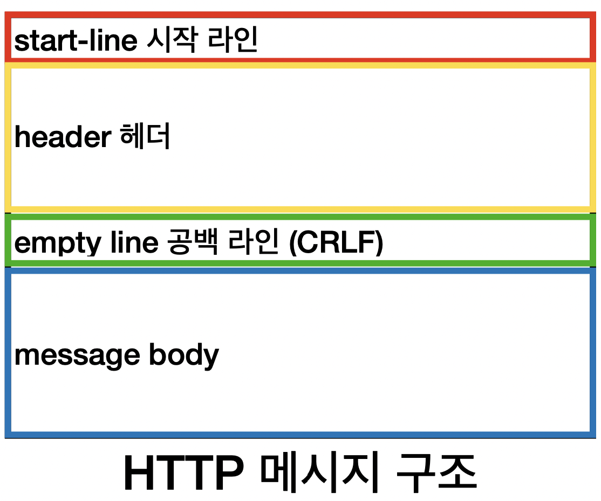
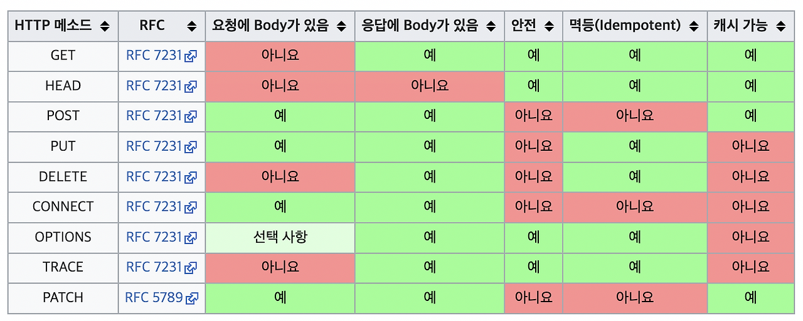

# HTTP 기본

## HTTP

### 특징

- 클라이언트 - 서버 구조
  - HTTP 도입 이전에는 Request-Response 구조가 사용되지 않았었음
- Stateless 한 프로토콜
  - 서버가 클라이언트의 상태를 보존하지 않는다.
  - Stateless하다면 서버 장애 시에 정보를 보존한 상태로 요청할 필요가 없으므로, 다른 응답 서버를 통하여 통신을 이어갈 수 있다
  - 다만, Session을 이용한 로그인의 경우는 불가피하게 Stateful 해야 한다.
- 비연결성 (Connectionless)
  - 연결을 유지하지 않고 있으므로 최소한의 자원만 사용된다.
  - 요청을 보내는 경우에만 클라이언트와 서버가 연결되어있다.
  - 다만, TCP/IP 연결 시의 3way handshake 방식으로 시간이 상대적으로 오래걸린다. 해당 연결을 요청시마다 새로 해주게 된다면 비효율적일 수 있다.
  - 해당 한계점을 극복하기 위하여 HTTP Persistent Connections 가 도입되었다.
- HTTP 메시지



### start-line

- request line으로 이루어져 있다.
- method SP(space) request-target SP HTTP-version CRLF(개행)
  - method: http 메서드
  - request-target: 리소스의 경로. absolute-path?query=를 의미한다.
  - HTTP-version: http의 버전을 의미

#### Response

```
HTTP-version SP status-code SP reason-phrase CRLF
```

- reason-phrase는 사람이 이해할 수 있도록 적는 짧은 상태코드를 의미한다.


#### HTTP header

```
field-name ":" OWS(띄어쓰기 허용) field-value OWS
```

field-name은 대소문자에 대한 구분이 없으며, 헤더에는 부가정보를 포함한다.

- 바디 내용, 크기, 인증, 요청 주체의 정보 및 개발자가 정의한 헤더


#### HTTP 메시지 바디

실제 전송할 데이터(HTML 문서, 이미지, 영상, JSON 등등 byte로 표현할 수 있는 모든 데이터)

## Method



- 메서드의 속성에 대해서만 정리하면,
- Safe(안전)
  - 메서드 호출시 서버 리소스의 변경 여부를 의미
- Idempotent(멱등)
  - 메서드의 호출 횟수와 관계없이 결과가 동일한지
  - GET과 DELETE는 멱등메서드이다. 이때, 외부 요인에 의해 리소스가 변경되는 것까지는 고려하지 않는다.

