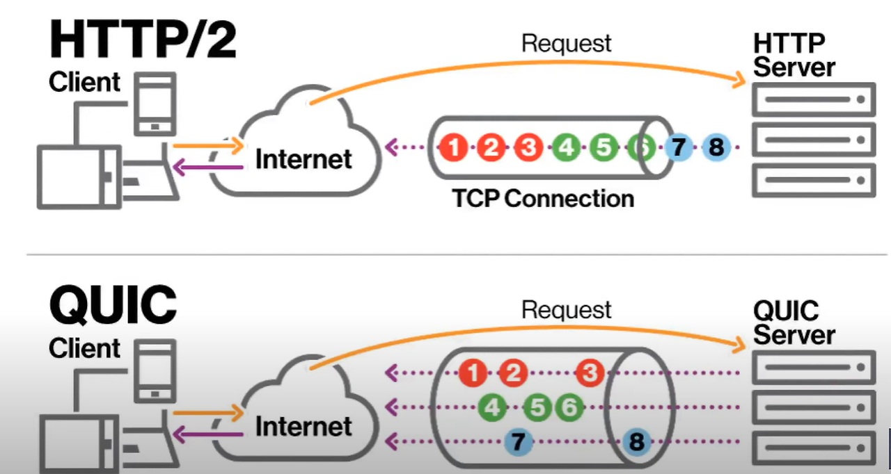

# HTTP 버전별 특징

## HTTP/1.1

### 지속 연결 Keep-Alive

1.0에서는 Connection 지속 기능이 없었음, 이를 최적화하기 위해 1.1이 도입됨.

- 하나의 TCP connection을 통한 여러 응답의 처리 가능
- 기본 동작으로 포함되었음
- 연결을 끊고 싶다면 Connection: close를 헤더에 포함하여 명시적 요청 가능

### Pipelining

클라의 요청을 기다리지 않고서도, 단일 TCP 명령을 통한 HTTP 다건 요청이 가능해짐

다만, 요청 순서에 맞게 응답을 받아야 하는 단점이 있음. 

### HOL Blocking

파이프라이닝의 맥락에서, 동일 커넥션에서 특정 요청에 대해서 후속 요청이 영향을 받았다면, Head of Line Blocking이라고 하며 이를 해결하기 위해 2.0을 도입함

## HTTP/2

### 바이너리 프레이밍

2.0에는 텍스트를 binary화 하여 frame이라는 단위를 도입하였음. 

하나의 메시지에는 1~2개의 HEADER frame + 0개 이상의 DATA frame으로 나뉘어 전송됨 (Stream Sequence 번호를 각 frame에 부여)

같은 번호의 frame을 Stream 단위로 분리함.

### 멀티플렉싱

여러 frame으로 나누어 전송하므로, frame간의 순서가 바뀌어 전달되는 상황에도 대처가 가능해짐 (Application Layer에서, HOL Blocking의 해결)

stream이라는 개념을 도입하였으므로 파이프라인의 단점이 커버됨

- 다만, TCP 커넥션을 계속 유지하며 처리하는 구조이므로 keep-alive 헤더가 필요없어져서 deprecated 하였음
- 다만22, TCP 커넥션상에서 발생하는 HOL Blocking을 해결할순 없었음
  - stream n 헤더의 패킷이 손실되었으면, n 헤더는 손실 패킷을 기다리고, 그 뒤의 stream n의 데이터들은 대기하는 상황이 발생
  - Transport layer 상에서의 HOL Blocking.

  

## HTTP/3

### TCP 대신 UDP를 쓰는 이유

- TCP 프로토콜 특성때문에 TCP HOL Blocking이 발생한것이기 때문에 근본 원인을 제거하면 됨 &gt; QUIC 도입

### QUIC

- UDP based
- 각 스트림이 독립적이게 됨. 

#### zero RTT Connection 달성

- 이외에도, 서버-클라간의 커넥션 시 소요되는 시간인 Round-Trip Time, RTT(ms단위)가 0이 됨.. 

