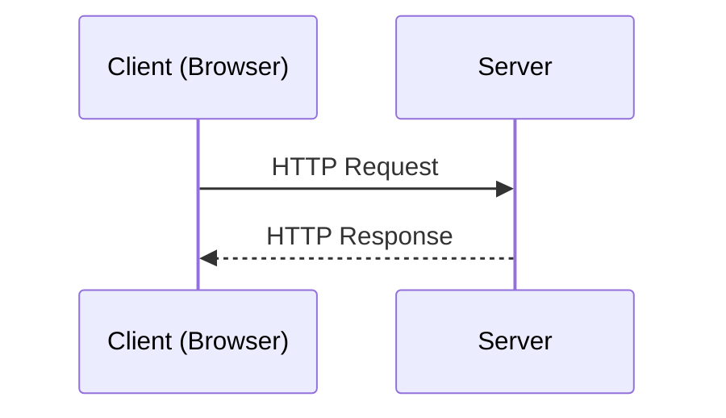
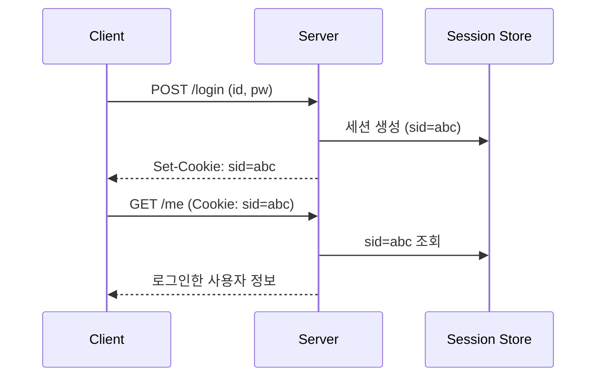
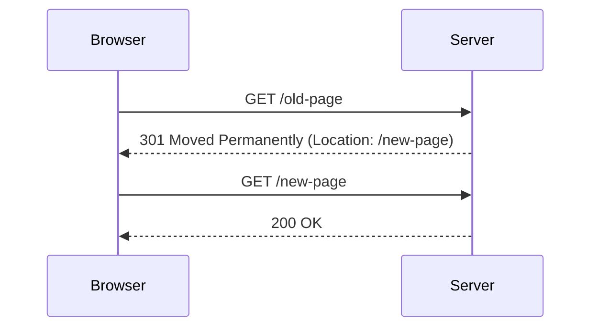
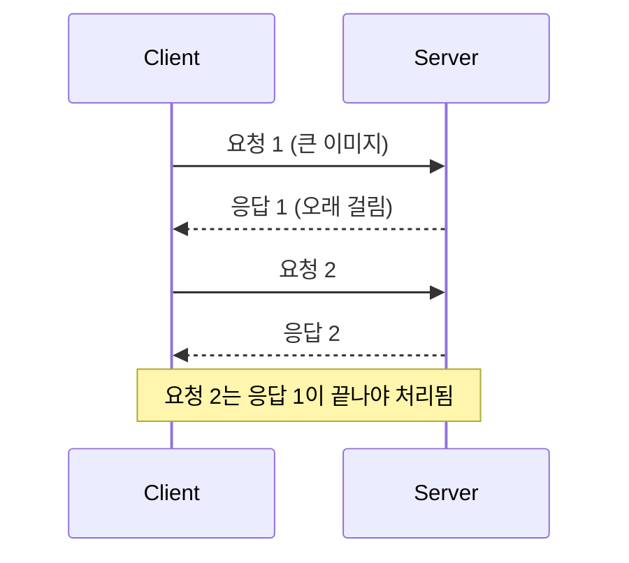
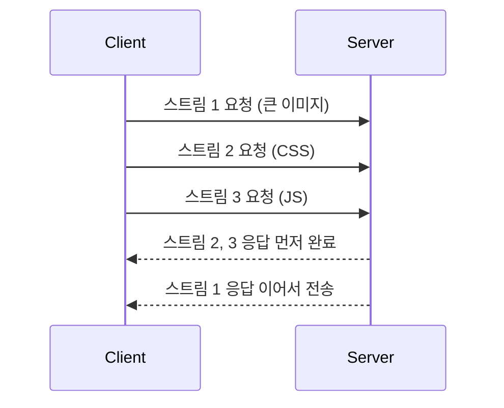
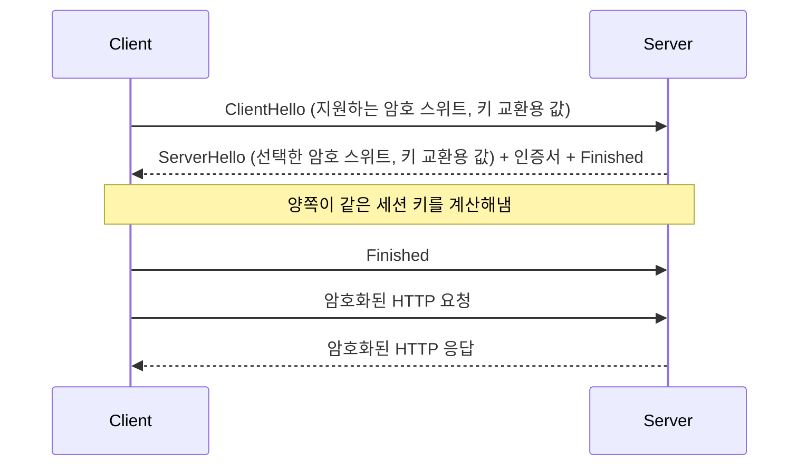
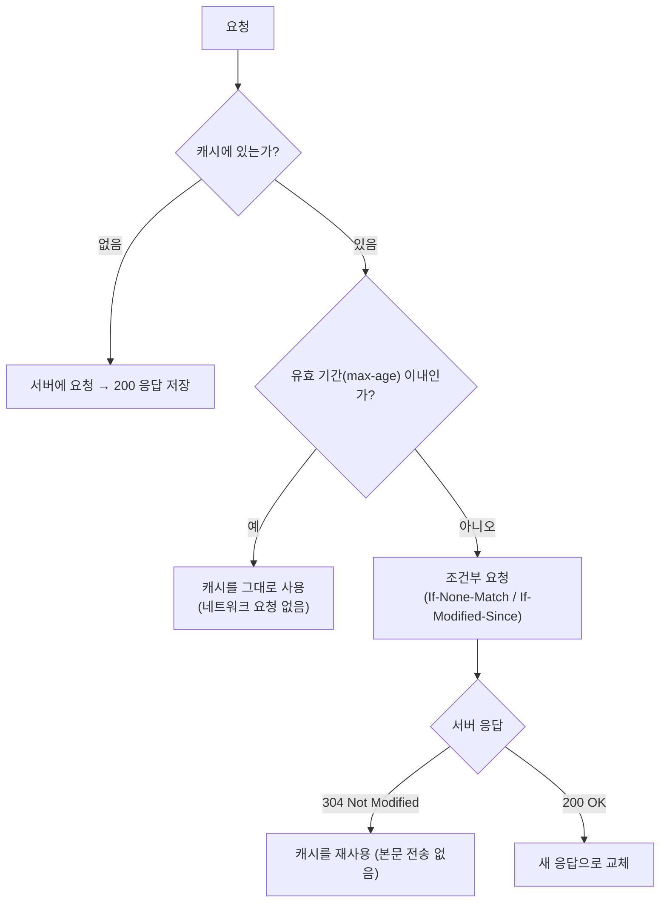

# 5주차 - HTTP / HTTPS

## 목차

1. [HTTP](#1-http)
2. [Stateless](#2-stateless)
3. [Method](#3-method)
4. [Status Code](#4-status-code)
5. [HTTP/1.1·2·3](#5-http1123)
6. [HTTPS](#6-https)
7. [TLS](#7-tls)
8. [HTTP Cache](#8-http-cache)
9. [Fetch/Axios](#9-fetchaxios)
10. [Resource Loading](#10-resource-loading)
11. [정리](#11-정리)

---

## 1. HTTP

### 개념

- **HTTP(HyperText Transfer Protocol)**: 웹에서 클라이언트와 서버가 데이터를 주고받을 때 쓰는 Application 계층 프로토콜
- 클라이언트가 요청(Request)을 보내면 서버가 응답(Response)을 돌려주는 구조
- 기본적으로 TCP 위에서 동작하고, 기본 포트는 80 (HTTPS는 443)
- HTTP/1.1까지는 사람이 읽을 수 있는 텍스트 기반 메시지, HTTP/2부터는 바이너리 형식



### URL 구조

```
https://example.com:443/users/1?sort=name#profile
└─┬─┘   └────┬────┘└┬┘└───┬───┘└───┬───┘└───┬───┘
scheme     host   port   path    query   fragment
```

| 구성 요소 | 설명 |
|---|---|
| scheme | 사용할 프로토콜 (http, https) |
| host | 접속할 서버의 도메인 또는 IP |
| port | 서버의 포트 (생략 시 http는 80, https는 443) |
| path | 서버 내 리소스 위치 |
| query | `?key=value&...` 형태로 붙는 추가 조건 |
| fragment | 페이지 내 특정 위치, 서버로는 전송되지 않고 브라우저만 사용 |

### HTTP 메시지 구조

- 요청과 응답 모두 **시작 줄 → 헤더 → 빈 줄 → 본문(Body)** 순서로 구성됨

```http
GET /api/users?id=1 HTTP/1.1
Host: example.com
Accept: application/json
User-Agent: Mozilla/5.0
```

```http
HTTP/1.1 200 OK
Content-Type: application/json
Content-Length: 27

{"id":1,"name":"kim"}
```

- 요청의 시작 줄: `메서드 경로 HTTP버전`
- 응답의 시작 줄: `HTTP버전 상태코드 상태메시지`
- 헤더와 본문 사이의 빈 줄이 두 영역을 구분하는 기준

### 자주 쓰는 헤더

| 헤더 | 방향 | 역할 |
|---|---|---|
| Host | 요청 | 요청 대상 도메인 (HTTP/1.1에서 필수) |
| User-Agent | 요청 | 클라이언트(브라우저) 정보 |
| Accept | 요청 | 클라이언트가 받을 수 있는 응답 형식 |
| Authorization | 요청 | 인증 정보 (토큰 등) |
| Cookie | 요청 | 저장된 쿠키 전달 |
| Content-Type | 양쪽 | 본문 데이터 형식 (application/json 등) |
| Content-Length | 양쪽 | 본문 크기(byte) |
| Set-Cookie | 응답 | 브라우저에 쿠키 저장 지시 |
| Location | 응답 | 리다이렉트할 URL |
| Cache-Control | 양쪽 | 캐시 정책 (8장에서 자세히) |

### Node.js로 보는 요청/응답

```js
const http = require('http');

http
  .createServer((req, res) => {
    console.log(req.method, req.url, req.headers.host); // 요청의 시작 줄, Host 헤더
    res.writeHead(200, { 'Content-Type': 'application/json' });
    res.end(JSON.stringify({ ok: true }));                // 응답 본문
  })
  .listen(3000);
```

---

## 2. Stateless

### 개념

- 서버가 클라이언트의 이전 요청 상태를 저장하지 않는 방식
- 각 요청은 독립적이고, 처리에 필요한 정보는 요청 자체에 모두 담아 보내야 함
- HTTP의 가장 중요한 설계 특징 중 하나

```
[Stateful]
             ┌───────────► Server A   로그인 상태를 기억함
  Client ────┤
             └──── ✕ ────► Server B   상태를 모름 → 다시 인증 필요

[Stateless]  (요청마다 인증 정보를 함께 전송)
             ┌───────────► Server A   처리 가능
  Client ────┤
             └───────────► Server B   처리 가능
```

### Stateful vs Stateless

| | Stateful | Stateless |
|---|---|---|
| 서버가 상태 저장 | 저장함 | 저장하지 않음 |
| 요청 처리 서버 | 이전에 응답한 서버가 같아야 함 | 어느 서버가 받아도 동일하게 처리 |
| 서버 확장 | 상태 공유/동기화 필요, 어려움 | 서버를 추가하기만 하면 됨 |
| 장애 대응 | 서버가 죽으면 상태 유실 | 다른 서버로 바로 대체 가능 |
| 단점 | 확장성 낮음 | 요청마다 보내는 데이터가 늘어남 |

### Stateless와 Connectionless는 다른 개념

- **Stateless**: 서버가 요청 사이의 "상태(맥락)"를 기억하지 않는다는 의미
- **Connectionless**: 요청-응답이 끝나면 연결(TCP)을 끊는다는 의미
- HTTP/1.1부터는 Keep-Alive가 기본이라 연결은 재사용되지만, 여전히 Stateless를 유지함

### 상태 유지가 필요할 때

- 로그인 유지, 장바구니처럼 요청 간 맥락이 필요한 기능은 **클라이언트가 상태 정보를 매 요청에 함께 보내는 방식으로** 해결함
- 대표적인 방법: Cookie + Session, Token(JWT)



### Cookie / Session / JWT 비교

| | Cookie + Session | JWT |
|---|---|---|
| 상태 저장 위치 | 서버(세션 저장소), 클라이언트는 세션 ID만 보관 | 토큰 자체에 정보 포함, 클라이언트가 보관 |
| 서버 부담 | 세션 저장소 조회 필요 | 서명 검증만 하면 됨 |
| 확장성 | 저장소 공유 필요 | 서버 간 공유 불필요 |
| 강제 만료 | 서버에서 세션 삭제하면 즉시 가능 | 발급된 토큰을 즉시 무효화하기 어려움 |
| 주의점 | CSRF 대비 필요 | 탈취 시 만료 전까지 사용 가능, 저장 위치(XSS) 주의 |

```js
// Cookie 방식: 브라우저가 쿠키를 자동으로 붙이도록 credentials 옵션 지정
await fetch('/api/me', { credentials: 'include' });

// JWT 방식: 토큰을 직접 헤더에 담아 전송
await fetch('/api/me', {
  headers: { Authorization: `Bearer ${token}` },
});
```

---

## 3. Method

### 개념

- 요청이 서버에게 **어떤 동작을 원하는지** 나타내는 값
- 같은 URL이라도 메서드에 따라 의미가 달라짐 (`GET /users/1` 조회, `DELETE /users/1` 삭제)

### 주요 메서드

| 메서드 | 용도 | Body | 안전 | 멱등 |
|---|---|---|---|---|
| GET | 리소스 조회 | 보통 없음 | O | O |
| POST | 리소스 생성, 처리 요청 | 있음 | X | X |
| PUT | 리소스 전체 교체(없으면 생성) | 있음 | X | O |
| PATCH | 리소스 일부 수정 | 있음 | X | X (구현에 따라 다름) |
| DELETE | 리소스 삭제 | 보통 없음 | X | O |
| HEAD | GET과 같지만 헤더만 응답 | 없음 | O | O |
| OPTIONS | 서버가 지원하는 메서드 확인, CORS Preflight | 없음 | O | O |

### 안전(Safe)과 멱등(Idempotent)

- **안전**: 호출해도 서버의 리소스 상태를 변경하지 않음 (조회 용도)
- **멱등**: 같은 요청을 여러 번 보내도 결과(서버 상태)가 한 번 보낸 것과 같음
- 멱등성이 중요한 이유: 네트워크 문제로 응답을 못 받았을 때 **재시도해도 안전한지** 판단하는 기준이 되기 때문
- 예: `DELETE /users/1`을 두 번 보내도 결과는 "1번 사용자가 없는 상태"로 동일 → 멱등
- 예: `POST /orders`를 두 번 보내면 주문이 두 개 생길 수 있음 → 멱등하지 않음

### PUT vs PATCH vs POST

| | 동작 | 예시 |
|---|---|---|
| POST | 새 리소스를 생성, 서버가 URL을 결정 | `POST /users` → 새 사용자 생성 |
| PUT | 지정한 URL의 리소스를 통째로 교체 | `PUT /users/1` + 전체 필드 |
| PATCH | 지정한 URL의 리소스 중 일부만 수정 | `PATCH /users/1` + 바꿀 필드만 |

### 코드 예시

```js
// GET: 조회 (데이터를 URL 쿼리로 전달)
await fetch('/api/users?page=1');

// POST: 생성
await fetch('/api/users', {
  method: 'POST',
  headers: { 'Content-Type': 'application/json' },
  body: JSON.stringify({ name: 'kim' }),
});

// PATCH: 일부 수정
await fetch('/api/users/1', {
  method: 'PATCH',
  headers: { 'Content-Type': 'application/json' },
  body: JSON.stringify({ name: 'lee' }),
});

// DELETE: 삭제
await fetch('/api/users/1', { method: 'DELETE' });
```

### GET에 Body를 쓰지 않는 이유

- 스펙상 금지는 아니지만, 일부 서버/프록시/캐시가 GET의 Body를 무시하거나 버릴 수 있어 동작이 보장되지 않음
- GET은 캐시 대상이 되기 쉽고 URL 자체가 요청을 식별하는 키 역할을 하므로, 조건은 쿼리 스트링으로 전달하는 것이 관례

---

## 4. Status Code

### 개념

- 서버가 요청을 어떻게 처리했는지 알려주는 3자리 숫자
- 첫 번째 자리로 큰 분류를 나눔

| 분류 | 의미 | 예시 |
|---|---|---|
| 1xx | 정보 응답, 처리 중 | 101 Switching Protocols |
| 2xx | 성공 | 200, 201, 204 |
| 3xx | 리다이렉션 | 301, 302, 304 |
| 4xx | 클라이언트 오류 | 400, 401, 403, 404 |
| 5xx | 서버 오류 | 500, 502, 503 |

### 자주 쓰는 상태 코드

| 코드 | 이름 | 설명 |
|---|---|---|
| 200 | OK | 요청 성공 |
| 201 | Created | 리소스 생성 성공 (POST 결과) |
| 204 | No Content | 성공했지만 응답 본문 없음 (DELETE 등) |
| 301 | Moved Permanently | 영구 이동, 이후 새 URL을 사용해야 함 |
| 302 | Found | 임시 이동 |
| 304 | Not Modified | 캐시된 것을 그대로 사용 (8장에서 이어짐) |
| 400 | Bad Request | 요청 형식이 잘못됨 |
| 401 | Unauthorized | 인증 필요 (로그인 안 됨) |
| 403 | Forbidden | 인증은 됐지만 권한 없음 |
| 404 | Not Found | 리소스 없음 |
| 405 | Method Not Allowed | 해당 URL에서 지원하지 않는 메서드 |
| 409 | Conflict | 현재 리소스 상태와 충돌 (중복 등) |
| 429 | Too Many Requests | 요청 횟수 제한 초과 |
| 500 | Internal Server Error | 서버 내부 오류 |
| 502 | Bad Gateway | 게이트웨이/프록시가 상위 서버에서 잘못된 응답을 받음 |
| 503 | Service Unavailable | 서버 과부하/점검으로 일시적으로 처리 불가 |
| 504 | Gateway Timeout | 게이트웨이/프록시가 상위 서버의 응답을 기다리다 시간 초과 |

### 헷갈리기 쉬운 코드 구분

- **401 vs 403**: 401은 "누구인지 모르겠다(인증 필요)", 403은 "누군지는 알지만 접근 권한이 없다"
- **301 vs 302**: 301은 검색 엔진/브라우저가 새 URL로 영구 갱신, 302는 이번 요청만 임시로 이동
- **307 / 308**: 302, 301과 비슷하지만 리다이렉트 시 **메서드와 Body를 그대로 유지**해야 한다는 점이 다름 (302는 브라우저가 POST를 GET으로 바꾸는 경우가 있음)
- **502 vs 504**: 둘 다 중간 서버(프록시)가 등장하는 상황, 502는 잘못된 응답을 받은 경우, 504는 응답 자체가 오지 않아 시간이 초과된 경우

### 리다이렉트 흐름



### 코드에서 상태 코드 다루기

```js
const res = await fetch('/api/users/1');

if (res.status === 404) {
  console.log('사용자가 없음');
} else if (res.status === 401) {
  console.log('로그인 필요');
} else if (res.ok) {
  // ok는 status가 200~299일 때 true
  const user = await res.json();
}
```

---

## 5. HTTP/1.1·2·3

### 버전별 흐름

- **HTTP/1.0**: 요청마다 TCP 연결을 새로 맺고 끊음
- **HTTP/1.1**: Keep-Alive를 기본으로 연결을 재사용, Host 헤더 필수, Chunked 전송 지원
- **HTTP/2**: 바이너리 프레임, 하나의 연결로 여러 요청을 동시에 처리(멀티플렉싱), 헤더 압축
- **HTTP/3**: TCP 대신 UDP 기반의 QUIC 위에서 동작

### HTTP/1.1의 한계: Head-of-Line Blocking

- 하나의 연결에서는 요청-응답이 순서대로 처리되기 때문에, 앞선 응답이 느리면 뒤의 요청도 함께 대기함
- 이를 피하려고 브라우저가 같은 도메인에 여러 연결(보통 6개)을 동시에 열어서 우회함



### HTTP/2의 개선점

- **멀티플렉싱**: 하나의 TCP 연결 안에서 여러 요청/응답을 스트림 단위로 쪼개 동시에 주고받음
- **헤더 압축(HPACK)**: 반복되는 헤더를 압축해서 전송량 감소
- **바이너리 프레임**: 텍스트 파싱보다 효율적이고 오류 가능성이 낮음
- 연결 하나로 충분해져서 파일을 하나로 합치거나 도메인을 분산시키는 기존 최적화 기법의 필요성이 줄어듦



### HTTP/2에도 남아있는 문제

- HTTP 레벨의 Head-of-Line Blocking은 해결했지만, 아래 TCP 계층에서는 여전히 하나의 연결로 모든 스트림이 흐름
- 패킷 하나가 유실되면 TCP가 재전송을 끝낼 때까지 **모든 스트림이 함께 멈춤** (TCP 레벨 HOL Blocking)

### HTTP/3와 QUIC

- **QUIC**: UDP 위에 신뢰성, 흐름 제어, 암호화(TLS 1.3)를 직접 구현한 전송 프로토콜
- 스트림마다 독립적으로 손실을 복구하기 때문에, 한 스트림의 패킷 유실이 다른 스트림을 막지 않음
- TCP 핸드셰이크와 TLS 핸드셰이크를 합쳐서 연결 수립 시간이 줄어듦 (재접속 시 0-RTT 가능)
- 연결을 IP/Port가 아닌 Connection ID로 식별해서, Wi-Fi에서 모바일 데이터로 전환돼도 연결이 유지됨 (Connection Migration)

```
     HTTP/1.1, HTTP/2                 HTTP/3
   ┌──────────────────┐        ┌──────────────────┐
   │       HTTP       │        │      HTTP/3      │
   ├──────────────────┤        ├──────────────────┤
   │       TLS        │        │  QUIC (TLS 1.3)  │
   ├──────────────────┤        ├──────────────────┤
   │       TCP        │        │       UDP        │
   ├──────────────────┤        ├──────────────────┤
   │        IP        │        │        IP        │
   └──────────────────┘        └──────────────────┘
```

### 버전 비교

| | HTTP/1.1 | HTTP/2 | HTTP/3 |
|---|---|---|---|
| 전송 프로토콜 | TCP | TCP | UDP (QUIC) |
| 메시지 형식 | 텍스트 | 바이너리 | 바이너리 |
| 동시 요청 | 연결 여러 개로 우회 | 하나의 연결에서 멀티플렉싱 | 하나의 연결에서 멀티플렉싱 |
| HOL Blocking | HTTP 레벨 발생 | HTTP 레벨 해결, TCP 레벨 남음 | 해결 |
| 헤더 압축 | 없음 | HPACK | QPACK |
| 연결 수립 | TCP + TLS 각각 | TCP + TLS 각각 | QUIC 하나로 통합 |
| 암호화 | 선택 (HTTPS) | 사실상 필수 | 필수 (TLS 1.3 내장) |

### 브라우저에서 확인하기

- 개발자 도구 Network 탭에서 **Protocol** 열을 켜면 요청별로 `http/1.1`, `h2`, `h3`로 표시됨
- 서버는 응답 헤더 `Alt-Svc`로 "HTTP/3로도 접속 가능하다"고 알려주고, 브라우저는 이후 요청부터 HTTP/3를 시도함

```js
// 실제 요청에 사용된 프로토콜 확인
const [entry] = performance.getEntriesByType('navigation');
console.log(entry.nextHopProtocol); // 'h2', 'h3' 등
```

---

## 6. HTTPS

### 개념

- **HTTPS**: HTTP 통신을 TLS로 암호화한 프로토콜 (HTTP over TLS)
- 기본 포트는 443
- 애플리케이션 계층(HTTP)과 전송 계층(TCP) 사이에 TLS 계층이 추가된 구조

### HTTP의 문제점

- **도청(Eavesdropping)**: 평문으로 전송되어 중간에서 내용을 그대로 볼 수 있음 (비밀번호, 개인정보 노출)
- **변조(Tampering)**: 중간에서 내용을 바꿔도 받는 쪽이 알 수 없음
- **위장(Impersonation)**: 접속한 서버가 진짜 그 서버인지 확인할 방법이 없음

```
[HTTP]  평문 전송
  Client ────────► [ 중간자 ] ────────► Server
                   내용 열람 / 변조 가능

[HTTPS]  TLS로 암호화
  Client ═══════ 암호화된 데이터 ═══════► Server
                 (중간자는 내용을 알 수 없음)
```

### HTTPS가 제공하는 것

| 보장 | 설명 | 사용되는 기술 |
|---|---|---|
| 기밀성 | 중간에서 내용을 볼 수 없음 | 대칭키 암호화 |
| 무결성 | 전송 중 내용이 바뀌지 않았음을 확인 | MAC / AEAD |
| 인증 | 접속한 서버가 진짜임을 확인 | 인증서, 전자서명 |

### 인증서와 CA

- 서버는 **인증서(Certificate)를** 통해 "이 공개키는 이 도메인의 것"임을 증명함
- 인증서는 신뢰할 수 있는 제3자인 **CA(Certificate Authority)가** 서명해서 발급함
- 브라우저와 OS에는 신뢰하는 Root CA 목록이 미리 내장되어 있음

```
Root CA                          ← 브라우저/OS에 내장 (신뢰의 시작점)
  │  서명
  ▼
Intermediate CA
  │  서명
  ▼
Server Certificate (example.com)
```

- 브라우저는 서버 인증서 → 중간 CA → Root CA 순으로 서명을 거슬러 올라가며 신뢰할 수 있는지 검증함 (인증서 체인)
- 검증에 실패하면(만료, 도메인 불일치, 신뢰할 수 없는 CA 등) 브라우저가 경고 화면을 띄움

### HTTP vs HTTPS

| | HTTP | HTTPS |
|---|---|---|
| 포트 | 80 | 443 |
| 암호화 | 없음 | TLS로 암호화 |
| 서버 인증 | 없음 | 인증서로 검증 |
| 속도 | 핸드셰이크 없음 | 초기 핸드셰이크 비용 있음 (TLS 1.3, HTTP/3에서 크게 줄어듦) |
| 기타 | - | HTTP/2, HTTP/3 사용 시 사실상 필수, SEO/브라우저 기능(Service Worker 등) 제약 |

### HSTS와 Mixed Content

- **HSTS**: 서버가 "앞으로 일정 기간 이 도메인은 무조건 HTTPS로만 접속하라"고 브라우저에 지시하는 응답 헤더. 첫 접속 이후엔 사용자가 `http://`로 입력해도 브라우저가 알아서 HTTPS로 바꿔서 요청함
- **Mixed Content**: HTTPS 페이지 안에서 HTTP 리소스(이미지, 스크립트 등)를 불러오는 상황. 스크립트처럼 위험한 리소스는 브라우저가 차단함

```http
Strict-Transport-Security: max-age=31536000; includeSubDomains
```

```js
// HTTP → HTTPS 리다이렉트 (Express 예시)
app.use((req, res, next) => {
  if (req.headers['x-forwarded-proto'] !== 'https') {
    return res.redirect(301, `https://${req.headers.host}${req.url}`);
  }
  next();
});
```

---

## 7. TLS

### 개념

- **TLS(Transport Layer Security)**: 통신 구간을 암호화하고 상대방을 인증하는 프로토콜 (SSL의 후속 버전)
- 핵심 과제: 처음 만나는 두 상대가 **안전하지 않은 네트워크 위에서** 어떻게 암호화 키를 안전하게 공유할 것인가

### 대칭키 vs 비대칭키

| | 대칭키 | 비대칭키 |
|---|---|---|
| 키 | 암호화/복호화에 같은 키 사용 | 공개키로 암호화, 개인키로 복호화 (한 쌍) |
| 속도 | 빠름 | 느림 |
| 문제점 | 키를 상대에게 안전하게 전달하기 어려움 | 대량의 데이터를 암호화하기엔 비효율적 |
| 예시 | AES | RSA, ECDHE |

### TLS의 접근: 두 방식을 함께 사용

- 핸드셰이크 단계에서 **비대칭키 방식으로 안전하게 공통 비밀(세션 키)을 만들고**
- 실제 데이터 전송은 그 세션 키로 **속도가 빠른 대칭키 암호화를** 사용함

### TLS 1.3 핸드셰이크 흐름



1. **ClientHello**: 클라이언트가 지원하는 TLS 버전, 암호 스위트 목록, 키 교환에 쓸 값을 전송
2. **ServerHello**: 서버가 사용할 암호 스위트를 선택하고, 자신의 키 교환 값과 인증서를 전송
3. **인증서 검증**: 클라이언트가 인증서 체인, 도메인 일치 여부, 유효기간을 확인
4. **세션 키 생성**: 양쪽이 서로 주고받은 값으로 각자 같은 세션 키를 계산 (키 자체는 네트워크로 전송되지 않음)
5. **Finished 교환 후**: 이후 모든 데이터는 세션 키로 암호화해서 주고받음

### 전방 비밀성(Forward Secrecy)

- 세션마다 임시 키(ECDHE)를 새로 만들어서 사용하기 때문에, 나중에 서버의 개인키가 유출되더라도 **과거에 녹화해둔 통신 내용은 복호화할 수 없음**

### TLS 1.2 vs TLS 1.3

| | TLS 1.2 | TLS 1.3 |
|---|---|---|
| 핸드셰이크 | 2-RTT | 1-RTT (재접속 시 0-RTT 가능) |
| 암호 스위트 | 오래되고 취약한 알고리즘도 선택 가능 | 안전한 알고리즘만 남김 |
| 전방 비밀성 | 설정에 따라 다름 | 항상 보장 |
| 핸드셰이크 암호화 | 일부만 | 인증서 등 대부분 암호화 |

### 코드와 명령어로 확인하기

```js
// Node.js에서 TLS 연결 정보 확인
const tls = require('tls');

const socket = tls.connect(443, 'example.com', { servername: 'example.com' }, () => {
  console.log(socket.getProtocol());     // 'TLSv1.3'
  console.log(socket.getCipher().name);  // 협상된 암호 스위트
  console.log(socket.getPeerCertificate().subject); // 서버 인증서 정보
  socket.end();
});
```

```bash
# 인증서 체인과 협상된 프로토콜 확인
openssl s_client -connect example.com:443
```

---

# Frontend 심화

## 8. HTTP Cache

### 개념

- 한 번 받은 응답을 저장해두고 재사용해서, 네트워크 요청 자체를 줄이거나 다운로드 양을 줄이는 방식
- 효과: 로딩 속도 향상, 서버 부하 감소, 네트워크 비용 절감

### 캐시의 종류

| 종류 | 위치 | 특징 |
|---|---|---|
| Private Cache | 브라우저 | 사용자 한 명만 사용, 개인화된 응답도 저장 가능 |
| Shared Cache | CDN, 프록시 서버 | 여러 사용자가 공유, 개인 정보가 담긴 응답은 저장하면 안 됨 |

### Cache-Control 지시자

| 지시자 | 의미 |
|---|---|
| max-age=N | N초 동안은 서버에 묻지 않고 캐시를 그대로 사용 |
| no-cache | 캐시에 저장은 하지만, 사용하기 전에 **매번 서버에 유효한지 확인** |
| no-store | 아예 저장하지 않음 (민감 정보) |
| public | CDN 같은 공유 캐시에도 저장 가능 |
| private | 브라우저 캐시에만 저장 가능 |
| s-maxage=N | 공유 캐시에서만 적용되는 유효 시간 |
| immutable | 유효 기간 동안 절대 바뀌지 않는 리소스, 새로고침해도 재검증하지 않음 |
| stale-while-revalidate=N | 만료된 캐시를 일단 사용하면서 뒤에서 새 버전을 받아옴 |

- 흔한 오해: `no-cache`는 "캐시하지 마라"가 아니라 "쓰기 전에 재검증하라"는 뜻. 저장을 막으려면 `no-store`

### 캐시 사용 흐름



### 재검증: ETag와 Last-Modified

- **ETag**: 리소스의 버전을 식별하는 값(보통 내용 해시). 다음 요청 때 `If-None-Match`에 담아 보내고, 같으면 서버가 304 응답
- **Last-Modified**: 리소스의 마지막 수정 시각. 다음 요청 때 `If-Modified-Since`에 담아 보냄
- 304 응답은 본문 없이 헤더만 오기 때문에, 유효성 확인은 하되 다운로드 비용은 아낄 수 있음

```http
# 첫 응답
HTTP/1.1 200 OK
ETag: "v1-abc123"
Cache-Control: max-age=60

# 만료 후 재요청
GET /data.json
If-None-Match: "v1-abc123"

# 바뀌지 않았을 때
HTTP/1.1 304 Not Modified
```

### 리소스별 캐시 전략

| 리소스 | 권장 설정 | 이유 |
|---|---|---|
| HTML | `no-cache` | 항상 최신 HTML을 확인해야 새 배포가 즉시 반영됨 |
| 해시가 붙은 JS/CSS (`app.3f2a1.js`) | `max-age=31536000, immutable` | 내용이 바뀌면 파일명이 바뀌므로 오래 캐싱해도 안전 |
| 이미지/폰트 | 긴 `max-age` | 자주 바뀌지 않음 |
| API 응답 (개인 정보) | `no-store` 또는 `private` | 다른 사용자에게 노출되면 안 됨 |

- 핵심 원리: **HTML은 매번 확인하고, 그 HTML이 가리키는 정적 파일은 파일명에 해시를 붙여 오래 캐싱하는** 조합

### Vary 헤더

- 같은 URL이라도 요청 헤더(예: `Accept-Encoding`, `Accept-Language`)에 따라 응답이 달라질 때, 캐시가 헤더 값별로 별도 저장하도록 지시하는 헤더

### 서버 설정과 fetch 옵션

```js
// Express: 정적 파일은 길게, HTML은 매번 재검증
app.use('/assets', express.static('dist/assets', { maxAge: '1y', immutable: true }));

app.get('/', (req, res) => {
  res.set('Cache-Control', 'no-cache');
  res.sendFile(path.join(__dirname, 'dist/index.html'));
});
```

```js
// fetch에서 캐시 동작 지정
fetch('/api/data', { cache: 'no-store' });     // 캐시를 사용하지도 저장하지도 않음
fetch('/api/data', { cache: 'reload' });       // 캐시를 무시하고 항상 새로 요청
fetch('/api/data', { cache: 'force-cache' });  // 만료됐어도 캐시가 있으면 사용
```

### 새로고침 종류에 따른 차이

- **일반 이동/링크 클릭**: 캐시를 적극 사용
- **새로고침(F5)**: 캐시된 리소스도 서버에 재검증 요청
- **강력 새로고침(Ctrl+Shift+R)**: 캐시를 무시하고 전부 새로 받음
- 개발자 도구 Network 탭의 **Disable cache** 옵션은 개발자 도구가 열려 있는 동안만 캐시를 끔

---

## 9. Fetch/Axios

### Fetch API

- 브라우저에 내장된 HTTP 요청 API (Promise 기반), 별도 설치 불필요
- Node.js 18부터 전역으로 제공

```js
const res = await fetch('/api/users', {
  method: 'POST',
  headers: { 'Content-Type': 'application/json' },
  body: JSON.stringify({ name: 'kim' }),
});

const data = await res.json(); // 본문 파싱도 별도의 Promise
```

### 핵심 주의점: 4xx/5xx에서도 reject되지 않음

- `fetch`의 Promise는 **네트워크 자체가 실패한 경우**(연결 불가, CORS 차단 등)에만 reject됨
- 404, 500 같은 HTTP 오류 응답은 정상 응답으로 취급되므로 직접 `res.ok`를 확인해야 함

```js
async function getUser(id) {
  const res = await fetch(`/api/users/${id}`);
  if (!res.ok) {
    throw new Error(`HTTP ${res.status}`); // 직접 에러로 변환
  }
  return res.json();
}
```

### 요청 취소와 타임아웃

- `fetch` 자체에는 타임아웃 옵션이 없어서 `AbortController`로 직접 구현함

```js
const controller = new AbortController();
const timer = setTimeout(() => controller.abort(), 5000);

try {
  const res = await fetch('/api/slow', { signal: controller.signal });
  console.log(await res.json());
} catch (e) {
  if (e.name === 'AbortError') console.log('시간 초과 또는 취소됨');
} finally {
  clearTimeout(timer);
}
```

### 쿠키와 credentials 옵션

| 값 | 동작 |
|---|---|
| same-origin (기본값) | 같은 출처 요청에만 쿠키 전송 |
| include | 다른 출처 요청에도 쿠키 전송 (서버의 CORS 설정 필요) |
| omit | 쿠키를 전송하지 않음 |

### Axios

- HTTP 요청을 더 편하게 다루도록 만든 라이브러리 (브라우저/Node.js 모두 지원)
- fetch가 직접 처리해야 하는 부분들을 기본 기능으로 제공함

```js
import axios from 'axios';

const { data } = await axios.post('/api/users', { name: 'kim' });
// JSON 직렬화/파싱을 자동으로 처리, 응답 본문은 data에 담김
```

### Fetch vs Axios

| | Fetch | Axios |
|---|---|---|
| 설치 | 불필요 (내장) | 라이브러리 설치 필요 |
| JSON 처리 | 직접 `JSON.stringify`, `res.json()` | 자동 변환 |
| 4xx/5xx 처리 | reject되지 않음, `res.ok` 확인 필요 | 자동으로 reject |
| 타임아웃 | AbortController로 직접 구현 | `timeout` 옵션 제공 |
| 인터셉터 | 없음 (직접 래핑) | 요청/응답 인터셉터 제공 |
| 업로드 진행률 | 기본 미지원 | 지원 |
| 번들 크기 | 0 | 추가됨 |

### Axios 인스턴스와 인터셉터

- 공통 설정(baseURL, 헤더)을 한 곳에 모으고, 모든 요청/응답에 공통 로직(토큰 첨부, 인증 만료 처리)을 끼워 넣을 수 있음

```js
const api = axios.create({ baseURL: '/api', timeout: 5000 });

// 요청 인터셉터: 모든 요청에 토큰 자동 첨부
api.interceptors.request.use((config) => {
  config.headers.Authorization = `Bearer ${getToken()}`;
  return config;
});

// 응답 인터셉터: 401이면 공통 처리
api.interceptors.response.use(
  (res) => res,
  (err) => {
    if (err.response?.status === 401) logout();
    return Promise.reject(err);
  }
);
```

```
api.get(...)
    │
    ▼
Request Interceptor    (토큰 첨부 등 공통 처리)
    │
    ▼
  Server
    │
    ▼
Response Interceptor   (401 공통 처리 등)
    │
    ▼
호출한 곳으로 결과 반환
```

### 선택 기준

- 단순한 요청이 대부분이고 번들 크기가 중요하면 fetch를 얇게 감싼 유틸로 충분
- 인터셉터, 타임아웃, 공통 에러 처리가 많이 필요한 프로젝트라면 Axios가 편리함
- 어느 쪽이든 **에러 처리 방식이 다르다는 점은** 반드시 의식해서 사용해야 함

---

## 10. Resource Loading

### 브라우저가 페이지를 그리는 과정

- HTML을 위에서부터 파싱하면서 필요한 리소스(CSS, JS, 이미지, 폰트)를 발견하는 대로 요청함

```
HTML ──► DOM ─────┐
                  ├──► Render Tree ──► Layout ──► Paint
CSS ───► CSSOM ───┘
```

- **CSS는 렌더링을 막음(Render-blocking)**: CSSOM이 완성돼야 화면을 그릴 수 있어서, CSS 로딩이 느리면 첫 화면 표시도 늦어짐
- **일반 `<script>`는 파싱을 막음(Parser-blocking)**: 스크립트를 내려받고 실행하는 동안 HTML 파싱이 멈춤

### script 로딩 방식 비교

```html
<script src="a.js"></script>
<script async src="b.js"></script>
<script defer src="c.js"></script>
<script type="module" src="d.js"></script>
```

| 방식 | 다운로드 | 실행 시점 | 실행 순서 |
|---|---|---|---|
| 일반 | HTML 파싱을 멈추고 다운로드 | 다운로드 직후 즉시 | 작성 순서 |
| async | 파싱과 병렬 | 다운로드가 끝나는 즉시 (파싱 중단) | 보장 안 됨 |
| defer | 파싱과 병렬 | HTML 파싱이 끝난 뒤 | 작성 순서 보장 |
| module | 파싱과 병렬 (defer와 유사) | HTML 파싱이 끝난 뒤 | 작성 순서 보장 |

- 다른 스크립트/DOM에 의존하지 않는 분석 도구 같은 스크립트는 `async`, DOM이나 다른 스크립트에 의존하면 `defer`가 일반적

### Preload Scanner

- 메인 파서가 스크립트 때문에 멈춰 있어도, 브라우저는 별도로 HTML을 앞서 훑으면서 이후에 필요한 리소스를 미리 요청해둠
- 그래서 `<script>`나 ``처럼 HTML에 직접 적힌 리소스는 일찍 발견되지만, **JS가 실행된 후에야 추가되는 리소스**(동적 삽입, CSS 안의 `@import`, `background-image` 등)는 발견이 늦어짐

### Resource Hints

| 힌트 | 역할 |
|---|---|
| `dns-prefetch` | 도메인의 DNS 조회만 미리 수행 |
| `preconnect` | DNS + TCP + TLS 연결까지 미리 수행 |
| `preload` | 현재 페이지에서 곧 필요한 리소스를 높은 우선순위로 미리 다운로드 |
| `prefetch` | 다음 페이지에서 필요할 만한 리소스를 유휴 시간에 미리 다운로드 |

```html
<link rel="preconnect" href="https://cdn.example.com">
<link rel="dns-prefetch" href="https://cdn.example.com">

<!-- 폰트는 CSS를 파싱해야 발견되므로 preload 효과가 큼 -->
<link rel="preload" href="/fonts/main.woff2" as="font" type="font/woff2" crossorigin>

<!-- 다음에 이동할 가능성이 높은 페이지의 리소스 -->
<link rel="prefetch" href="/next-page.js">
```

### 이미지 로딩

```html
<!-- 화면 밖 이미지는 스크롤할 때 로드 -->


<!-- 첫 화면의 핵심 이미지는 우선순위를 높임 -->


<!-- 화면 크기에 맞는 이미지 선택 -->

```

- `width`/`height`를 지정해두면 이미지가 로드되기 전에 공간을 미리 확보해서, 로드 후 레이아웃이 밀리는 현상(CLS)을 줄일 수 있음
- 첫 화면에 보이는 이미지에 `loading="lazy"`를 쓰면 오히려 로딩이 늦어질 수 있음

### 폰트 로딩

```css
@font-face {
  font-family: 'MyFont';
  src: url('/fonts/main.woff2') format('woff2');
  font-display: swap; /* 폰트가 오기 전에는 기본 폰트로 먼저 보여줌 */
}
```

- 폰트가 로드될 때까지 글자를 숨기는 기본 동작(FOIT)을 피하려고 `font-display: swap`을 자주 사용

### 코드 분할(Code Splitting)

- 처음 화면에 필요 없는 코드는 나중에 필요할 때 동적으로 불러와서 초기 로딩량을 줄임

```js
button.addEventListener('click', async () => {
  const { openModal } = await import('./modal.js'); // 클릭 시점에 별도 요청
  openModal();
});
```

### HTTP/2 이후의 관점 변화

- HTTP/1.1 시절: 요청 수를 줄이려고 파일을 하나로 합치거나 이미지 스프라이트를 사용
- HTTP/2 이후: 멀티플렉싱 덕분에 요청 수의 부담이 줄어서, 오히려 잘게 나눠서 **필요한 것만 캐시 단위로 재사용하는** 전략이 유리해짐

---

## 11. 정리

| 개념 | 핵심 |
|---|---|
| HTTP | 요청-응답 구조의 Application 계층 프로토콜, 시작 줄 + 헤더 + Body |
| Stateless | 서버가 요청 간 상태를 저장하지 않음, 확장성 확보, 상태는 Cookie/Token으로 전달 |
| Method | GET/POST/PUT/PATCH/DELETE, 안전(Safe)과 멱등(Idempotent) 개념 |
| Status Code | 1xx~5xx 분류, 401(인증) vs 403(권한), 502 vs 504 |
| HTTP/1.1·2·3 | 1.1의 HOL Blocking → 2의 멀티플렉싱 → 3의 QUIC(UDP)로 TCP HOL까지 해결 |
| HTTPS | HTTP + TLS, 기밀성/무결성/인증 보장, 인증서 체인으로 서버 신원 검증 |
| TLS | 비대칭키로 세션 키를 공유하고 대칭키로 데이터 암호화, TLS 1.3은 1-RTT |
| HTTP Cache | Cache-Control로 재사용 기간 설정, ETag/304로 재검증, HTML은 no-cache + 해시 파일은 장기 캐싱 |
| Fetch/Axios | fetch는 4xx/5xx에서 reject 안 됨(res.ok 확인 필요), Axios는 인터셉터/타임아웃 제공 |
| Resource Loading | CSS는 렌더링 차단, script는 async/defer로 조절, preload/preconnect로 발견 시점 앞당김 |