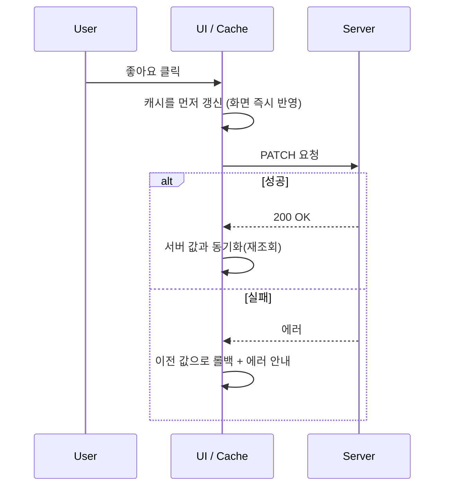
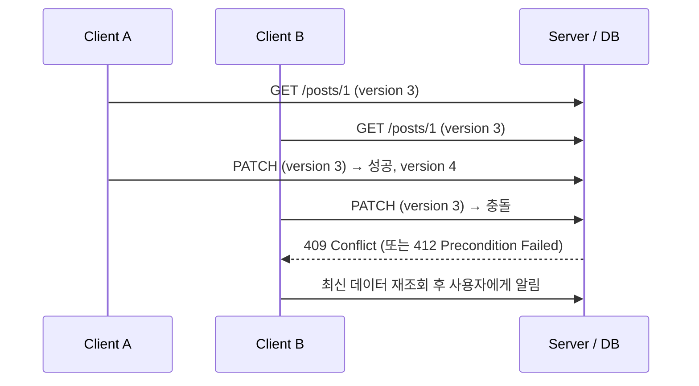

# [Week 6] 6주차 Database 정리

## 목차

1. [RDB/NoSQL](#1-rdbnosql)
2. [PK/FK](#2-pkfk)
3. [정규화](#3-정규화)
4. [JOIN](#4-join)
5. [Index](#5-index)
6. [B+Tree](#6-btree)
7. [Server State](#7-server-state)
8. [API 데이터 관리](#8-api-데이터-관리)
9. [Client Cache와 서버 데이터 정합성](#9-client-cache와-서버-데이터-정합성)
10. [정리](#10-정리)

---

## 1. RDB/NoSQL

### 개념

- **RDB(Relational Database)**: 데이터를 행(Row)과 열(Column)로 이루어진 테이블에 저장하고, 테이블 간의 관계로 데이터를 연결하는 데이터베이스
- **NoSQL(Not Only SQL)**: 테이블 구조에 얽매이지 않고 문서, 키-값, 그래프 등 다양한 모델로 데이터를 저장하는 데이터베이스의 총칭
- 둘 중 무엇이 더 좋다기보다, 데이터의 모양과 요구사항에 따라 선택하는 것

### RDB의 구조

```
users
┌────┬───────┬─────────────────┐
│ id │ name  │ email           │   ← 컬럼(스키마): 미리 정의된 구조
├────┼───────┼─────────────────┤
│ 1  │ kim   │ kim@example.com │   ← 행(Row): 데이터 한 건
│ 2  │ lee   │ lee@example.com │
└────┴───────┴─────────────────┘
```

- 모든 행은 **미리 정의한 스키마를** 따라야 함 (컬럼 추가/변경은 스키마 변경 작업이 필요)
- **SQL이라는** 표준 언어로 조회/수정
- 대표 제품: MySQL, PostgreSQL, Oracle, SQL Server

### 트랜잭션과 ACID

- **트랜잭션**: 하나의 작업 단위로 취급되어야 하는 여러 쿼리의 묶음 (전부 성공하거나 전부 실패)
- 예: 계좌 이체는 "출금"과 "입금"이 반드시 함께 성공해야 함

| 속성 | 의미 | 설명 |
|---|---|---|
| Atomicity (원자성) | 전부 아니면 전무 | 중간에 실패하면 이미 실행한 부분도 모두 되돌림 |
| Consistency (일관성) | 규칙 유지 | 트랜잭션 전후로 제약 조건(PK, FK, NOT NULL 등)이 깨지지 않음 |
| Isolation (격리성) | 동시 실행 간섭 방지 | 동시에 실행되는 트랜잭션이 서로의 중간 상태를 보지 못함 |
| Durability (지속성) | 커밋된 결과는 유지 | 커밋된 데이터는 장애가 나도 사라지지 않음 |

```js
// mysql2/promise 예시: 계좌 이체 트랜잭션
const conn = await pool.getConnection();
try {
  await conn.beginTransaction();
  await conn.query('UPDATE accounts SET balance = balance - ? WHERE id = ?', [1000, 1]);
  await conn.query('UPDATE accounts SET balance = balance + ? WHERE id = ?', [1000, 2]);
  await conn.commit();      // 둘 다 성공했을 때만 확정
} catch (e) {
  await conn.rollback();    // 하나라도 실패하면 모두 취소
  throw e;
} finally {
  conn.release();
}
```

### NoSQL의 종류

| 종류 | 데이터 모델 | 대표 제품 | 주 사용처 |
|---|---|---|---|
| Key-Value | 키로 값 하나를 조회 | Redis, DynamoDB | 캐시, 세션, 랭킹 |
| Document | JSON 형태의 문서 저장 | MongoDB | 구조가 유동적인 데이터, 콘텐츠 |
| Column-family | 컬럼 단위로 묶어 저장 | Cassandra, HBase | 대용량 쓰기, 시계열 |
| Graph | 노드와 간선으로 관계 저장 | Neo4j | SNS 관계, 추천 |

```js
// MongoDB 예시: 스키마 없이 구조가 다른 문서도 같은 컬렉션에 저장 가능
await db.collection('users').insertOne({ name: 'kim', tags: ['dev', 'seoul'] });
await db.collection('users').insertOne({ name: 'lee', address: { city: 'busan' } });
```

### RDB vs NoSQL

| | RDB | NoSQL |
|---|---|---|
| 스키마 | 고정 (사전에 정의) | 유연함 (또는 없음) |
| 관계 표현 | JOIN으로 테이블 연결 | 문서 내부에 포함(중첩)하거나 애플리케이션에서 처리 |
| 트랜잭션 | ACID를 강하게 보장 | 제품마다 다름 (단일 문서 단위만 보장하는 경우도 있음) |
| 확장 방식 | 주로 수직 확장 (서버 성능 증설) | 수평 확장(서버 추가)을 염두에 두고 설계된 경우가 많음 |
| 적합한 경우 | 정합성이 중요한 데이터 (결제, 주문, 회원) | 대량/유연한 데이터, 빠른 읽기·쓰기 |

- 수직 확장: 서버 하나의 CPU/메모리/디스크를 키우는 방식, 한계가 있음
- 수평 확장: 서버를 여러 대로 늘려 데이터를 나눠 저장하는 방식(샤딩), 대신 JOIN/트랜잭션이 복잡해짐
- RDB도 복제(Replication)와 샤딩으로 확장할 수 있고, 일부 NoSQL도 트랜잭션을 지원함. 경계가 점점 흐려지는 추세

---

## 2. PK/FK

### PK (Primary Key)

- 테이블에서 각 행을 **유일하게 식별하는** 컬럼
- 제약: 중복 불가(UNIQUE), NULL 불가(NOT NULL), 테이블당 하나만 존재
- MySQL(InnoDB)에서는 PK 순서대로 데이터가 물리적으로 정렬되어 저장됨 (클러스터드 인덱스, 5장에서 이어짐)

```sql
CREATE TABLE users (
  id    BIGINT PRIMARY KEY AUTO_INCREMENT,
  email VARCHAR(255) NOT NULL UNIQUE,
  name  VARCHAR(50)  NOT NULL
);
```

### PK 선택: 자연키 vs 대리키

| | 자연키 (Natural Key) | 대리키 (Surrogate Key) |
|---|---|---|
| 정의 | 업무적으로 의미가 있는 값 (주민번호, 이메일) | 의미 없이 시스템이 부여하는 값 (AUTO_INCREMENT, UUID) |
| 장점 | 별도 컬럼이 필요 없음 | 값이 바뀔 일이 없고, 짧고 안정적 |
| 단점 | 값이 바뀌거나 정책이 변경될 수 있음, 개인정보 노출 위험 | 값 자체에는 의미가 없음 |
| 실무 | 대부분 대리키를 PK로 쓰고, 자연키는 UNIQUE 제약으로 보장 | |

### AUTO_INCREMENT vs UUID

| | AUTO_INCREMENT | UUID (v4) |
|---|---|---|
| 크기 | 8byte (BIGINT) | 16byte (바이너리) / 36자 (문자열) |
| 순서 | 순차 증가 | 무작위 |
| 생성 위치 | DB가 생성 | 애플리케이션/클라이언트에서도 생성 가능 |
| 단점 | 분산 환경에서 충돌 관리 필요, ID 노출 시 규모 추측 가능 | 무작위라 B+Tree 인덱스에 삽입 시 페이지 분할이 잦음 (6장) |

- 시간 순서가 반영되는 UUIDv7 같은 방식은 UUID의 장점과 순차 삽입의 장점을 함께 얻을 수 있어 최근 많이 쓰임

### FK (Foreign Key)

- 다른 테이블의 PK를 참조하는 컬럼. **테이블 간의 관계를** 표현하고 **참조 무결성을** 보장함
- 참조하는 값이 부모 테이블에 존재하지 않으면 INSERT/UPDATE가 거부됨

```sql
CREATE TABLE orders (
  id      BIGINT PRIMARY KEY AUTO_INCREMENT,
  user_id BIGINT NOT NULL,
  total   INT    NOT NULL,
  FOREIGN KEY (user_id) REFERENCES users(id) ON DELETE RESTRICT
);
```

```
users                     orders
┌────┬───────┐            ┌────┬─────────┬───────┐
│ id │ name  │            │ id │ user_id │ total │
├────┼───────┤            ├────┼─────────┼───────┤
│ 1  │ kim   │◄───────────│ 10 │ 1       │ 5000  │
│ 2  │ lee   │◄─────┐     │ 11 │ 1       │ 3000  │
└────┴───────┘      └─────│ 12 │ 2       │ 7000  │
                          └────┴─────────┴───────┘
                          user_id = 3 은 users에 없으므로 INSERT 거부
```

### 참조 동작 옵션 (ON DELETE / ON UPDATE)

| 옵션 | 부모 행을 삭제/수정할 때 |
|---|---|
| RESTRICT / NO ACTION | 자식 행이 있으면 삭제/수정을 거부 |
| CASCADE | 자식 행도 함께 삭제/수정 |
| SET NULL | 자식 행의 FK 컬럼을 NULL로 변경 |
| SET DEFAULT | 자식 행의 FK 컬럼을 기본값으로 변경 |

- CASCADE는 편하지만 의도치 않게 대량의 데이터가 삭제될 수 있어서, 중요한 데이터에는 RESTRICT를 기본으로 쓰는 경우가 많음

### 테이블 간 관계

```
1:1   users ──── profiles          (사용자 한 명 : 프로필 하나)
1:N   users ────< orders           (사용자 한 명 : 주문 여러 개)
N:M   students >────< courses      (학생 여러 명 : 강의 여러 개)
```

- **N:M 관계는 RDB에서 직접 표현할 수 없어서**, 중간에 연결 테이블(Junction Table)을 두고 1:N 두 개로 풀어냄

```
students              enrollments                 courses
┌────┬──────┐         ┌────────────┬───────────┐  ┌────┬─────────┐
│ id │ name │         │ student_id │ course_id │  │ id │ title   │
├────┼──────┤         ├────────────┼───────────┤  ├────┼─────────┤
│ 1  │ kim  │◄────────│ 1          │ 100       │─►│100 │ db      │
│ 2  │ lee  │◄──┐     │ 1          │ 101       │─►│101 │ network │
└────┴──────┘   └─────│ 2          │ 100       │  └────┴─────────┘
                      └────────────┴───────────┘
                      PK = (student_id, course_id)  ← 복합키
```

### FK 사용 시 알아둘 점

- FK 컬럼에는 **인덱스가 필요함**: 부모 행을 삭제/수정할 때마다 자식 테이블에서 참조 여부를 검사하고, JOIN에서도 자주 쓰임 (MySQL InnoDB는 FK 생성 시 인덱스를 자동 생성하지만, PostgreSQL은 직접 만들어야 함)
- 대규모 서비스에서는 쓰기 성능, 샤딩, 마이그레이션 편의성을 이유로 FK 제약을 걸지 않고 애플리케이션에서 무결성을 관리하기도 함 (트레이드오프)

```js
// FK 위반 에러 처리 (PostgreSQL, pg 라이브러리)
try {
  await client.query('INSERT INTO orders (user_id, total) VALUES ($1, $2)', [999, 5000]);
} catch (e) {
  if (e.code === '23503') {
    console.log('존재하지 않는 사용자입니다 (FK 위반)');
  } else if (e.code === '23505') {
    console.log('이미 존재하는 값입니다 (UNIQUE 위반)');
  } else {
    throw e;
  }
}
```

---

## 3. 정규화

### 개념

- 데이터의 **중복을 최소화하고** **이상 현상(Anomaly)을** 방지하기 위해 테이블을 분리하는 과정
- 같은 정보가 여러 곳에 저장되어 있으면, 하나만 수정하고 나머지를 놓쳤을 때 데이터가 서로 모순됨

### 이상 현상 (Anomaly)

```
orders_raw (정규화 전)
┌──────────┬──────────┬────────────────┬─────────┬───────┐
│ order_id │ customer │ customer_phone │ product │ price │
├──────────┼──────────┼────────────────┼─────────┼───────┤
│ 1        │ kim      │ 010-1111       │ pen     │ 1000  │
│ 1        │ kim      │ 010-1111       │ note    │ 2000  │
│ 2        │ lee      │ 010-2222       │ pen     │ 1000  │
└──────────┴──────────┴────────────────┴─────────┴───────┘
```

| 이상 현상 | 설명 | 위 테이블에서의 예 |
|---|---|---|
| 갱신 이상 | 중복된 값 중 일부만 수정해서 불일치 발생 | kim의 전화번호를 바꿀 때 2개 행을 모두 수정해야 하고, 하나를 놓치면 모순 |
| 삽입 이상 | 불필요한 정보가 있어야만 데이터를 추가할 수 있음 | 아직 주문하지 않은 고객은 order_id가 없어서 등록할 수 없음 |
| 삭제 이상 | 일부 데이터를 지웠더니 의도하지 않은 정보도 함께 사라짐 | 주문 2를 삭제하면 lee의 고객 정보도 사라짐 |

### 함수적 종속성 (Functional Dependency)

- **A → B**: A 값이 정해지면 B 값이 하나로 정해진다는 관계 (A가 B를 결정함)
- 예: `customer → customer_phone`, `product → price`
- 정규화는 이 종속 관계를 기준으로 "같은 대상에 대한 정보는 한 테이블에 모으고, 다른 대상의 정보는 분리"하는 작업

### 제1정규형 (1NF)

- **모든 컬럼의 값이 원자값(더 이상 쪼갤 수 없는 값)이어야 함**
- 한 컬럼에 여러 값을 넣거나, 같은 속성이 반복되는 컬럼(phone1, phone2, ...)을 두면 위반

```
위반                                     1NF 만족
┌────┬──────┬───────────────────┐        ┌────┬──────┬──────────┐
│ id │ name │ phones            │        │ id │ name │ phone    │
├────┼──────┼───────────────────┤        ├────┼──────┼──────────┤
│ 1  │ kim  │ 010-1111,010-3333 │        │ 1  │ kim  │ 010-1111 │
└────┴──────┴───────────────────┘        │ 1  │ kim  │ 010-3333 │
                                         └────┴──────┴──────────┘
                                         (또는 phones 테이블을 따로 분리)
```

### 제2정규형 (2NF)

- 1NF를 만족하면서, **부분 함수 종속을 제거**
- 복합키(여러 컬럼으로 이뤄진 PK)에서 **키의 일부에만 종속되는 컬럼이** 있으면 위반

```
order_items  PK = (order_id, product_id)
┌──────────┬────────────┬──────────────┬──────────┐
│ order_id │ product_id │ product_name │ quantity │
└──────────┴────────────┴──────────────┴──────────┘
product_name 은 product_id 만으로 결정됨 (키의 일부에만 종속) → 위반

분리 결과
order_items(order_id, product_id, quantity)
products(product_id, product_name)
```

### 제3정규형 (3NF)

- 2NF를 만족하면서, **이행적 함수 종속을 제거**
- A → B, B → C 이면 A → C 가 "이행적으로" 성립하는데, 키가 아닌 컬럼이 다른 키가 아닌 컬럼을 결정하면 위반

```
employees
┌─────────────┬──────────┬─────────┬───────────┐
│ employee_id │ name     │ dept_id │ dept_name │
└─────────────┴──────────┴─────────┴───────────┘
employee_id → dept_id → dept_name   (이행적 종속) → 위반

분리 결과
employees(employee_id, name, dept_id)
departments(dept_id, dept_name)
```

### BCNF (Boyce-Codd 정규형)

- 3NF를 만족하면서, **모든 결정자(다른 컬럼을 결정하는 컬럼)가 후보키여야** 함
- 3NF에서 남을 수 있는 예외적인 이상 현상까지 제거하는 강화된 형태
- 실무에서는 3NF까지 만족하면 충분한 경우가 많음

### 정규화 결과: 테이블 분리

```
customers                    orders              order_items               products
┌────┬──────┬───────┐        ┌────┬─────────┐    ┌──────────┬────────────┐  ┌────┬──────┬───────┐
│ id │ name │ phone │◄───────│ id │ cust_id │◄───│ order_id │ product_id │─►│ id │ name │ price │
└────┴──────┴───────┘        └────┴─────────┘    └──────────┴────────────┘  └────┴──────┴───────┘
```

- 전화번호는 customers에만 저장되므로 한 번만 수정하면 되고, 주문이 없는 고객도 등록할 수 있음
- 대신 주문 정보를 한 번에 보려면 **JOIN이 필요함** (4장)

### 반정규화 (Denormalization)

- 조회 성능을 위해 **의도적으로 중복을 허용하는** 것
- 정규화로 테이블이 많이 나뉠수록 JOIN이 늘어나서 읽기 성능이 떨어질 수 있음

| 방법 | 예시 |
|---|---|
| 중복 컬럼 추가 | orders에 customer_name을 함께 저장해서 JOIN 생략 |
| 집계값 저장 | posts에 comment_count 컬럼을 두고 댓글 작성/삭제 시 갱신 |
| 테이블 합치기 | 항상 함께 조회되는 1:1 관계 테이블을 하나로 합침 |

| | 정규화 | 반정규화 |
|---|---|---|
| 데이터 중복 | 최소 | 허용 |
| 쓰기 | 한 곳만 수정, 단순 | 중복된 곳을 모두 수정해야 함 (불일치 위험) |
| 읽기 | JOIN이 많아질 수 있음 | JOIN 감소, 빠름 |
| 용도 | 기본 설계 | 성능 병목이 확인된 부분에 선택적으로 적용 |

- 주문 시점의 상품명/가격을 orders 쪽에 복사해서 저장하는 것은 성능 목적의 반정규화가 아니라, **당시 값을 보존하기 위한 의도된 설계임** (상품 가격이 나중에 바뀌어도 과거 주문 금액은 그대로여야 하므로)

---

## 4. JOIN

### 개념

- 둘 이상의 테이블을 **공통 컬럼(보통 PK-FK 관계)을 기준으로 연결해서** 하나의 결과로 조회하는 연산
- 정규화로 나뉜 데이터를 다시 합쳐서 볼 때 사용

### 예시 데이터

```
users                   orders
┌────┬──────┐           ┌─────┬─────────┬──────┐
│ id │ name │           │ id  │ user_id │ item │
├────┼──────┤           ├─────┼─────────┼──────┤
│ 1  │ kim  │           │ 101 │ 1       │ pen  │
│ 2  │ lee  │           │ 102 │ 1       │ note │
│ 3  │ park │           │ 103 │ 2       │ book │
└────┴──────┘           └─────┴─────────┴──────┘
```

### INNER JOIN

- 양쪽 테이블에서 **조건이 일치하는 행만** 반환

```sql
SELECT u.name, o.item
FROM users u
INNER JOIN orders o ON o.user_id = u.id;
```

```
┌──────┬──────┐
│ name │ item │
├──────┼──────┤
│ kim  │ pen  │
│ kim  │ note │
│ lee  │ book │
└──────┴──────┘      ← 주문이 없는 park은 결과에서 빠짐
```

### LEFT (OUTER) JOIN

- **왼쪽 테이블의 모든 행을** 반환하고, 오른쪽에 일치하는 행이 없으면 NULL로 채움

```sql
SELECT u.name, o.item
FROM users u
LEFT JOIN orders o ON o.user_id = u.id;
```

```
┌──────┬──────┐
│ name │ item │
├──────┼──────┤
│ kim  │ pen  │
│ kim  │ note │
│ lee  │ book │
│ park │ NULL │       ← 주문이 없어도 포함됨
└──────┴──────┘
```

- 활용: "주문이 **없는** 사용자 찾기"

```sql
SELECT u.name
FROM users u
LEFT JOIN orders o ON o.user_id = u.id
WHERE o.id IS NULL;      -- 매칭되는 주문이 없는 행만 남김
```

### JOIN 종류 정리

| JOIN | 결과 | 일치하지 않는 행 |
|---|---|---|
| INNER JOIN | 양쪽 모두 일치하는 행 | 제외 |
| LEFT JOIN | 왼쪽 전체 + 일치하는 오른쪽 | 왼쪽은 유지, 오른쪽은 NULL |
| RIGHT JOIN | 오른쪽 전체 + 일치하는 왼쪽 | 오른쪽은 유지, 왼쪽은 NULL |
| FULL OUTER JOIN | 양쪽 전체 | 양쪽 모두 유지, 없는 쪽은 NULL |
| CROSS JOIN | 두 테이블의 모든 조합 (카테시안 곱) | 조건 없음 |
| SELF JOIN | 같은 테이블끼리 JOIN | 계층 구조(사원-상사) 조회 등 |

- RIGHT JOIN은 테이블 순서만 바꾸면 LEFT JOIN과 같아서 실무에서는 LEFT JOIN으로 통일하는 경우가 많음
- MySQL은 FULL OUTER JOIN을 직접 지원하지 않아서 `LEFT JOIN UNION RIGHT JOIN`으로 대체함

```sql
-- SELF JOIN: 사원과 그 사원의 상사 이름 조회
SELECT e.name AS employee, m.name AS manager
FROM employees e
LEFT JOIN employees m ON e.manager_id = m.id;
```

### ON vs WHERE (LEFT JOIN의 함정)

```sql
-- (1) 조건을 ON에 둠: park, lee도 NULL과 함께 결과에 남음
SELECT u.name, o.item
FROM users u
LEFT JOIN orders o ON o.user_id = u.id AND o.item = 'pen';

-- (2) 조건을 WHERE에 둠: item이 NULL인 행이 걸러져서 사실상 INNER JOIN처럼 동작
SELECT u.name, o.item
FROM users u
LEFT JOIN orders o ON o.user_id = u.id
WHERE o.item = 'pen';
```

- ON은 **JOIN할 때** 적용되는 조건, WHERE는 **JOIN이 끝난 결과에** 적용되는 필터
- 외부 조인에서 오른쪽 테이블의 조건을 WHERE에 걸면 NULL 행이 사라지는 점에 주의

### N+1 문제

- 목록 1번 조회 후, 목록의 각 항목마다 연관 데이터를 조회하느라 **쿼리가 N번 추가로 실행되는** 문제
- ORM의 지연 로딩(Lazy Loading)에서 흔하게 발생함

```js
// N+1 발생: 사용자 수만큼 쿼리가 추가로 실행됨
const users = await db.query('SELECT * FROM users');             // 1번
for (const u of users) {
  u.orders = await db.query(
    'SELECT * FROM orders WHERE user_id = ?', [u.id]             // N번
  );
}

// 해결 1: IN 절로 한 번에 조회 후 메모리에서 매핑
const ids = users.map((u) => u.id);
const orders = await db.query('SELECT * FROM orders WHERE user_id IN (?)', [ids]);   // 총 2번

// 해결 2: JOIN으로 한 번에 조회
const rows = await db.query(
  'SELECT u.id, u.name, o.item FROM users u LEFT JOIN orders o ON o.user_id = u.id'
);
```

- 프론트엔드의 "목록 조회 후 항목마다 상세 API 호출"도 같은 구조의 N+1 문제임 (8장)

---

## 5. Index

### 개념

- 테이블의 특정 컬럼 값과 **그 행의 위치를 정렬된 상태로 따로 저장해서**, 조회 속도를 높이는 자료구조
- 대부분의 RDB는 인덱스를 **B+Tree로** 구현함 (6장)
- 인덱스가 없으면 조건에 맞는 행을 찾기 위해 **테이블 전체를 읽는 Full Table Scan(O(N))이** 필요하고, 인덱스가 있으면 트리를 따라 내려가서 **O(log N)으로** 찾음

```
[인덱스 없음]  WHERE email = 'kim@example.com'
  row1 → row2 → row3 → ... → rowN        전체를 순서대로 확인 (Full Scan)

[인덱스 있음]
  index(email): 정렬된 트리를 따라 내려감 → 해당 행의 위치 → 행 접근
```

```sql
CREATE INDEX idx_users_email ON users (email);
```

### 인덱스의 종류

| 종류 | 설명 |
|---|---|
| Primary (Clustered) Index | PK 기준으로 데이터 자체가 정렬되어 저장됨, 테이블당 하나 |
| Secondary (Non-clustered) Index | 별도의 인덱스 구조를 만들고 PK(또는 행 위치)를 가리킴, 여러 개 가능 |
| Unique Index | 중복을 허용하지 않는 인덱스 |
| Composite Index | 여러 컬럼을 묶어서 만드는 인덱스 |
| Covering Index | 쿼리에 필요한 컬럼이 모두 인덱스에 포함되어 테이블 접근이 필요 없는 경우 |

### Clustered vs Non-clustered

```
[Clustered Index - InnoDB의 PK]
  leaf 노드가 실제 행 데이터를 포함
  ┌──────────────────────────────┐
  │ id=1 | kim | kim@example.com │
  │ id=2 | lee | lee@example.com │   ← 인덱스를 찾으면 곧바로 행을 얻음
  └──────────────────────────────┘

[Secondary Index - email]
  leaf 노드는 인덱스 컬럼 값 + PK 만 가진다
  ┌────────────────────────┐
  │ kim@example.com → id=1 │
  │ lee@example.com → id=2 │          ① secondary 인덱스에서 PK를 찾고
  └────────────────────────┘          ② PK 인덱스(clustered)에서 다시 행을 찾음
```

- Secondary Index로 조회하면 **인덱스를 두 번 탐색하게** 되는 구조(InnoDB 기준)
- 그래서 PK는 짧을수록 유리함 (모든 Secondary Index의 leaf에 PK가 복사되어 저장되기 때문)

### Composite Index와 Leftmost Prefix

- `(a, b, c)` 순서로 만든 인덱스는 **a → b → c 순으로 정렬되어** 있음
- 앞쪽(왼쪽) 컬럼부터 차례로 사용되는 조건에서만 인덱스를 제대로 활용할 수 있음

```sql
CREATE INDEX idx_abc ON t (a, b, c);
```

| 조건 | 인덱스 활용 |
|---|---|
| `WHERE a = 1` | 사용 |
| `WHERE a = 1 AND b = 2` | 사용 |
| `WHERE a = 1 AND b = 2 AND c = 3` | 전체 사용 |
| `WHERE b = 2` | 사용 못 함 (맨 앞 컬럼 a가 없음) |
| `WHERE a = 1 AND c = 3` | a까지만 사용 (b를 건너뛰어서 c는 활용 못 함) |
| `WHERE a = 1 AND b > 2 AND c = 3` | a, b까지만 사용 (범위 조건 뒤의 컬럼은 활용 못 함) |

- 컬럼 순서의 일반적인 기준: 동등(=) 조건 컬럼을 앞에, 범위 조건 컬럼을 뒤에. 그 안에서는 값의 종류가 많은(카디널리티가 높은) 컬럼을 앞에
- 정답은 쿼리 패턴에 따라 달라지므로, 실제로 자주 실행되는 쿼리를 기준으로 설계해야 함

### 인덱스를 타지 못하는 경우

| 상황 | 예시 | 개선 방향 |
|---|---|---|
| 컬럼에 함수/연산 적용 | `WHERE YEAR(created_at) = 2024` | `created_at >= '2024-01-01' AND created_at < '2025-01-01'` |
| 앞쪽 와일드카드 LIKE | `WHERE name LIKE '%kim'` | 접두 검색(`'kim%'`)으로 변경, 또는 Full-text 인덱스 사용 |
| 암묵적 형변환 | 문자열 컬럼 `phone`을 `WHERE phone = 1011111111`(숫자)로 비교 | 컬럼 타입에 맞는 값으로 비교 |
| 컬럼 가공 | `WHERE price * 2 > 1000` | `WHERE price > 500` |
| 카디널리티가 매우 낮은 컬럼 | 성별처럼 값이 2~3종류뿐인 컬럼 | 옵티마이저가 Full Scan이 더 낫다고 판단할 수 있음 |
| OR 조건 | 각 조건의 컬럼에 인덱스가 따로 없는 경우 | 컬럼별 인덱스 구성 또는 UNION으로 분리 |

### 인덱스의 비용

- **쓰기 비용 증가**: INSERT/UPDATE/DELETE 때마다 관련된 모든 인덱스(B+Tree)도 함께 수정해야 함
- **저장 공간**: 인덱스도 별도의 자료구조라서 디스크/메모리를 차지함
- 따라서 "모든 컬럼에 인덱스를 건다"가 아니라 **읽기 패턴에 맞춰 필요한 것만** 만드는 게 원칙
- 읽기 비중이 높은 테이블은 인덱스의 효과가 크고, 쓰기가 매우 잦은 테이블은 인덱스 수를 신중히 정해야 함

### EXPLAIN으로 확인하기

```sql
EXPLAIN SELECT * FROM users WHERE email = 'kim@example.com';
```

| 컬럼 | 의미 |
|---|---|
| type | 접근 방식. `ALL`(풀 스캔) < `index` < `range` < `ref` < `eq_ref` < `const` 순으로 효율적 |
| key | 실제로 사용된 인덱스 |
| rows | 읽을 것으로 예상되는 행 수 |
| Extra | `Using index`(커버링), `Using filesort`(별도 정렬), `Using temporary`(임시 테이블) 등 부가 정보 |

```js
// Node.js에서 실행 계획 확인
const [plan] = await pool.query(
  'EXPLAIN SELECT * FROM users WHERE email = ?',
  ['kim@example.com']
);
console.log(plan[0].type, plan[0].key, plan[0].rows); // 예: 'const', 'idx_users_email', 1
```

---

## 6. B+Tree

### 왜 B+Tree인가

- DB의 데이터는 디스크에 저장되고, 디스크는 **페이지(Page, 보통 4~16KB) 단위로** 읽음
- 디스크 접근은 메모리 접근보다 훨씬 느리기 때문에, DB 성능은 **디스크를 몇 번 읽느냐가** 좌우함
- 이진 탐색 트리(BST)는 노드 하나에 키가 1개뿐이라 트리가 깊어지고(높이 약 log₂N), 한 단계 내려갈 때마다 디스크 접근이 필요함
- B+Tree는 **노드 하나(페이지 하나)에 수백 개의 키를 담아** 트리의 높이를 극단적으로 낮춤

### B+Tree의 특징

- B-Tree의 변형으로, 두 가지가 다름
  - **데이터는 리프 노드에만 저장하고**, 내부 노드는 **탐색 경로를 안내하는 키만** 가짐
  - **리프 노드끼리 연결 리스트로 이어져** 있음

```
                 ┌──────────────┐
                 │   30  │  60  │                ← 내부 노드 (경로 안내용 키만 저장)
                 └──┬────┬────┬─┘
          ┌─────────┘    │    └─────────┐
          ▼              ▼              ▼
    ┌───────────┐  ┌───────────┐  ┌───────────┐
    │ 5 10 20   ├─►│ 30 40 50  ├─►│ 60 70 80  │   ← 리프 노드 (실제 데이터, 서로 연결됨)
    └───────────┘  └───────────┘  └───────────┘
      30 미만        30 이상 60 미만     60 이상
```

### B-Tree vs B+Tree

| | B-Tree | B+Tree |
|---|---|---|
| 데이터 저장 위치 | 내부 노드와 리프 노드 모두 | 리프 노드에만 |
| 내부 노드 | 키 + 데이터 | 키만 (같은 크기 페이지에 더 많은 키를 담을 수 있음 → 높이가 낮아짐) |
| 리프 노드 연결 | 없음 | 연결 리스트로 연결 |
| 범위 검색 | 트리를 오르내리며 순회해야 함 | 시작 리프를 찾은 뒤 링크를 따라가면 끝 |
| 검색 소요 | 데이터 위치에 따라 다름 | 항상 리프까지 내려가서 일정함 |

### 탐색 과정

1. 루트 노드에서 시작해 키 범위를 비교하며 알맞은 자식으로 내려감
2. 내부 노드를 거쳐 리프 노드에 도달
3. 리프 노드 안에서 키를 찾음 (노드 내부에서는 이진 탐색)

- 읽는 페이지 수 = **트리의 높이** (보통 3~4)

### 범위 검색이 빠른 이유

```sql
SELECT * FROM users WHERE id BETWEEN 25 AND 55;
```

```
① 25가 속한 리프 [5 10 20 ...]를 찾음 (루트 → 리프)
② 리프의 링크를 따라 오른쪽으로 이동하며 55 이하까지 수집
   [5 10 20] ─► [30 40 50] ─► [60 70 80]
                 ▲ 여기부터 55를 넘을 때까지 읽고 종료
```

- 해시 인덱스는 정렬 정보가 없어서 범위 검색이 불가능하지만, B+Tree는 **정렬 상태 + 리프 연결** 덕분에 범위 검색, ORDER BY, MIN/MAX를 효율적으로 처리함

### 트리의 높이는 얼마나 될까

- 가정: 페이지 크기 16KB, 내부 노드 하나가 자식을 약 500개 가리킴, 리프 페이지 하나에 행 약 100개

| 트리 높이 | 저장 가능한 행 수 (대략) | 디스크 접근 횟수 |
|---|---|---|
| 2 | 500 × 100 = 약 5만 건 | 2 |
| 3 | 500² × 100 = 약 2,500만 건 | 3 |
| 4 | 500³ × 100 = 약 125억 건 | 4 |

- 수천만 건의 데이터도 **3번의 페이지 읽기로** 찾을 수 있음. 게다가 루트와 상위 내부 노드는 자주 쓰여서 대부분 메모리에 캐싱되어 있음
- 이 수치는 가정에 따른 대략적인 예시이고, 실제 값은 키 크기·행 크기·DB 설정에 따라 달라짐

### 삽입과 노드 분할 (Split)

- 새 키를 넣으려는 리프가 가득 차 있으면, 노드를 **둘로 쪼개고** 가운데 키를 부모에게 올려줌
- 부모도 가득 차 있으면 같은 과정이 위로 전파됨 (루트가 분할되면 트리의 높이가 1 늘어남)

```
리프 하나에 최대 3개의 키를 담을 수 있다고 가정

삽입 전    [10 20 30]
insert 25  → [10 20 25 30]   최대 개수 초과 → 분할

삽입 후    [10 20] ─► [25 30]      부모 노드에 키 25 추가
```

- 삭제할 때는 반대로 노드가 최소 채움 기준 미만이 되면 형제 노드와 **병합하거나 키를 재분배함**

### PK 종류와 B+Tree의 관계

```
[순차 PK (AUTO_INCREMENT)]
  새 행이 항상 맨 오른쪽 리프에만 추가됨 → 분할이 적고 페이지가 꽉 차게 채워짐

[무작위 PK (UUID v4)]
  새 행이 트리의 임의의 리프 중간에 삽입됨 → 가득 찬 리프가 자주 분할되고 페이지에 빈 공간이 생김(단편화)
```

- 2장에서 UUID(v4)를 PK로 쓸 때 쓰기 성능이 떨어질 수 있다고 한 이유가 바로 이것

---

# Frontend 심화

## 7. Server State

### 개념

- **Server State**: 서버(DB)가 원본을 가지고 있고, 클라이언트는 그 **복사본(스냅샷)을 잠시 들고 있는** 데이터
- 클라이언트가 직접 소유하는 상태(Client State)와는 성격이 완전히 다름

### Client State vs Server State

| | Client State | Server State |
|---|---|---|
| 소유 | 클라이언트 | 서버 (클라이언트는 복사본만 보유) |
| 접근 방식 | 동기적 (바로 읽고 씀) | 비동기 (네트워크 요청 필요) |
| 최신성 | 항상 최신 | 가져오는 순간부터 오래된 값(stale)이 될 수 있음 |
| 변경 주체 | 나 자신 | 다른 사용자, 다른 탭, 서버 로직 등 누구나 |
| 예시 | 모달 열림 여부, 입력 중인 폼 값, 선택된 탭 | 사용자 목록, 게시글, 주문 내역 |

### 직접 관리하면 생기는 문제

- 요청 하나에 loading / error / data 상태를 매번 직접 만들어야 함
- 같은 데이터를 쓰는 컴포넌트가 여러 개면 **똑같은 요청이 중복으로** 나감
- 페이지를 이동했다 돌아오면 캐시가 없어서 **매번 처음부터 다시 로딩**
- 응답이 뒤바뀌어 도착하는 경쟁 상태(Race Condition), 재시도, 취소 처리를 모두 직접 구현해야 함
- 이 문제들은 서버 상태가 **캐싱, 동기화, 갱신이** 필요한 특수한 상태이기 때문에 생김

### Server State 라이브러리 (React Query / SWR)

- 서버 상태의 캐싱, 중복 요청 제거, 재요청, 로딩/에러 상태 관리를 대신 해주는 라이브러리

```js
import { useQuery } from '@tanstack/react-query';

function UserList() {
  const { data, isPending, error } = useQuery({
    queryKey: ['users'],                               // 캐시를 식별하는 키
    queryFn: () => fetch('/api/users').then((r) => r.json()),
    staleTime: 60_000,                                 // 1분 동안은 fresh로 간주
  });

  if (isPending) return <Spinner />;
  if (error) return <ErrorView error={error} />;
  return <List users={data} />;
}
```

### 핵심 개념

| 개념 | 설명 |
|---|---|
| queryKey | 캐시 항목을 식별하는 키. 키가 같으면 같은 데이터를 공유하고, 키가 바뀌면 새로 요청 |
| staleTime | 데이터를 fresh(신선)하다고 보는 시간. 이 시간 안에는 캐시를 그대로 쓰고 재요청하지 않음 (기본값 0) |
| gcTime | 어떤 컴포넌트도 쓰지 않는 캐시를 메모리에 유지하는 시간 (기본 5분, v4까지는 cacheTime) |
| 중복 요청 제거 | 같은 queryKey 요청이 동시에 여러 번 발생해도 네트워크 요청은 한 번만 보냄 |
| 재요청 시점 | 컴포넌트 마운트, 창 포커스 복귀, 네트워크 재연결, 지정한 주기(refetchInterval) |
| 재시도 | 실패 시 기본적으로 지수 백오프(Exponential Backoff)로 몇 차례 재시도 |

### 캐시 데이터의 생명주기

```
요청 성공
   │
   ▼
 fresh ──── staleTime 경과 ────► stale ───── 사용하는 컴포넌트 0개 ─────► inactive ──── gcTime 경과 ────► 삭제
   │                              │
   │ 재요청 없이 캐시 사용          │ 캐시를 즉시 보여주고, 뒤에서 조용히 refetch
   ▼                              ▼
```

- **stale-while-revalidate** 방식: 오래된 데이터라도 일단 즉시 보여주고, 백그라운드에서 새 데이터를 받아와 교체함 → 화면이 비어 보이는 시간이 없음
- 5주차 HTTP Cache의 `stale-while-revalidate`와 같은 아이디어를 애플리케이션 레벨에서 구현한 것

---

## 8. API 데이터 관리

### Query Key 설계

- 키는 **계층적인 배열로** 설계해서, 상위 키로 하위 캐시를 한꺼번에 다룰 수 있게 함
- 요청에 영향을 주는 변수(필터, 페이지, id 등)는 반드시 키에 포함 → 변수가 바뀌면 자동으로 새 요청

```js
// 키 생성 로직을 한 곳에 모아서 오타와 불일치를 방지 (Query Key Factory)
const userKeys = {
  all: ['users'],
  lists: () => [...userKeys.all, 'list'],
  list: (filters) => [...userKeys.lists(), filters],
  detail: (id) => [...userKeys.all, 'detail', id],
};

useQuery({ queryKey: userKeys.list({ page, status }), queryFn: ... });
useQuery({ queryKey: userKeys.detail(userId), queryFn: ... });

// 'users'로 시작하는 모든 캐시를 한 번에 무효화
queryClient.invalidateQueries({ queryKey: userKeys.all });
```

### API 호출 계층 분리

```
 Component         화면 렌더링에만 집중
     │
     ▼
 Custom Hook       useUsers(), useUpdateUser()  ← queryKey, 캐시 정책
     │
     ▼
 API Function      getUsers(), updateUser()     ← 엔드포인트, 요청/응답 타입
     │
     ▼
 HTTP Client       axios 인스턴스 / fetch 래퍼   ← baseURL, 인증 헤더, 공통 에러 처리
```

- 컴포넌트가 URL과 fetch 세부사항을 직접 알지 않게 해서, API가 바뀌어도 수정 범위를 좁힘

```js
// API 함수 (HTTP 세부사항만 담당)
export const getUsers = (params) => api.get('/users', { params }).then((r) => r.data);

// 커스텀 훅 (캐시 정책만 담당)
export const useUsers = (params) =>
  useQuery({ queryKey: userKeys.list(params), queryFn: () => getUsers(params), staleTime: 30_000 });
```

### 페이지네이션: Offset vs Cursor

| | Offset 방식 | Cursor 방식 |
|---|---|---|
| 요청 | `?page=3&size=20` | `?cursor=105&size=20` |
| SQL | `LIMIT 20 OFFSET 40` | `WHERE id < 105 ORDER BY id DESC LIMIT 20` |
| 장점 | 특정 페이지로 바로 이동 가능 | 깊은 페이지에서도 빠르고, 데이터가 추가/삭제돼도 중복·누락이 없음 |
| 단점 | 앞의 행을 읽고 버려야 해서 뒤 페이지일수록 느림, 중간에 데이터가 바뀌면 중복/누락 발생 | 임의의 페이지로 점프할 수 없음 |
| 적합한 UI | 페이지 번호가 있는 게시판 | 무한 스크롤, 피드 |

- Offset은 `OFFSET 100000`이면 앞의 10만 건을 읽고 버린 뒤에야 20건을 반환함 (5장의 인덱스를 써도 건너뛰는 비용은 남음)
- Cursor는 `WHERE id < ?` 조건으로 인덱스를 바로 탐색해서 시작 지점을 찾음

```js
import { useInfiniteQuery } from '@tanstack/react-query';

const { data, fetchNextPage, hasNextPage } = useInfiniteQuery({
  queryKey: ['posts'],
  queryFn: ({ pageParam }) => api.get('/posts', { params: { cursor: pageParam, size: 20 } }).then((r) => r.data),
  initialPageParam: null,
  getNextPageParam: (lastPage) => lastPage.nextCursor ?? undefined, // undefined면 마지막 페이지
});
```

---

## 9. Client Cache와 서버 데이터 정합성

### 문제 정의

- 클라이언트 캐시는 서버 데이터의 **과거 시점 스냅샷임**
- 서버 데이터가 바뀌면 캐시와 서버 사이에 불일치(stale)가 생기고, 사용자는 오래된 정보를 보게 됨
- 캐시를 많이 쓸수록 빠르지만 불일치 위험이 커지고, 자주 갱신할수록 정확하지만 요청이 늘어남 → **정합성과 성능 사이의 트레이드오프**

### 불일치가 생기는 대표적인 경우

- **다른 사용자/탭/기기가** 데이터를 변경했는데 내 화면은 모르는 경우
- **내가 수정(mutation)한 뒤** 목록 같은 관련 화면의 캐시가 그대로 남아 있는 경우
- **응답 순서가 뒤바뀌어** 오래된 요청의 결과가 최신 결과를 덮어쓰는 경우
- **서버에서 계산되는 값**(합계, 재고, 순위)을 클라이언트가 임의로 갱신했다가 실제와 달라지는 경우

### 정합성 유지 전략

| 전략 | 방식 | 장점 | 단점 |
|---|---|---|---|
| 무효화 (Invalidate) | 수정 성공 후 관련 캐시를 stale로 표시하고 다시 조회 | 단순하고 정확함 | 추가 요청 발생 |
| 캐시 직접 갱신 | 수정 응답 값으로 캐시를 바로 덮어씀 | 추가 요청 없음 | 서버의 계산 로직과 어긋날 위험 |
| 낙관적 업데이트 | 서버 응답 전에 화면을 먼저 바꾸고, 실패하면 롤백 | 체감 속도가 매우 빠름 | 롤백 처리가 복잡함 |
| 폴링 / 포커스 재조회 | 일정 주기, 또는 탭에 다시 돌아올 때 재조회 | 구현이 쉬움 | 불필요한 요청, 반영 지연 |
| 실시간 푸시 | WebSocket/SSE로 서버가 변경을 알려주면 무효화/갱신 | 즉각 반영 | 서버 인프라와 연결 관리 필요 |
| 조건부 요청 | ETag/`If-None-Match`로 변경 여부만 확인 (304) | 전송량 절약 | 요청 자체는 발생 |

### 1) 무효화 (Invalidate)

```js
const queryClient = useQueryClient();

const mutation = useMutation({
  mutationFn: (newTodo) => api.post('/todos', newTodo),
  onSuccess: () => {
    queryClient.invalidateQueries({ queryKey: ['todos'] }); // 목록 캐시를 stale 처리 → 자동 재조회
  },
});
```

- 가장 기본이 되는 방식. "무엇을 수정하면 어떤 쿼리를 무효화할지"를 쿼리 키 설계(8장)와 함께 정리해둬야 함

### 2) 캐시 직접 갱신

```js
const mutation = useMutation({
  mutationFn: (patch) => api.patch(`/todos/${id}`, patch).then((r) => r.data),
  onSuccess: (updatedTodo) => {
    queryClient.setQueryData(['todos', id], updatedTodo); // 서버가 돌려준 최신 값으로 교체
  },
});
```

- 수정 API가 최신 상태 전체를 응답으로 주는 경우에 적합함

### 3) 낙관적 업데이트 (Optimistic Update)



```js
const mutation = useMutation({
  mutationFn: (next) => api.patch(`/todos/${next.id}`, next),

  onMutate: async (next) => {
    await queryClient.cancelQueries({ queryKey: ['todos'] });     // 진행 중인 재조회가 낙관적 값을 덮어쓰지 않도록 취소
    const previous = queryClient.getQueryData(['todos']);         // 롤백용 스냅샷
    queryClient.setQueryData(['todos'], (old) =>
      old.map((t) => (t.id === next.id ? { ...t, ...next } : t)) // 화면 먼저 변경
    );
    return { previous };
  },

  onError: (err, next, context) => {
    queryClient.setQueryData(['todos'], context.previous);        // 실패 시 되돌림
  },

  onSettled: () => {
    queryClient.invalidateQueries({ queryKey: ['todos'] });       // 성공/실패와 무관하게 서버 값으로 최종 동기화
  },
});
```

- 실패 확률이 낮고 즉각적인 반응이 중요한 동작(좋아요, 체크박스, 정렬 변경)에 적합
- 결제, 재고 차감처럼 **실패 시 사용자에게 큰 혼란을 주는 동작에는 적합하지 않음**

### 응답 순서 역전 (Race Condition)

```
t1   요청 A ("ab" 검색) ──────────────────────────► 응답 A (늦게 도착)
t2        요청 B ("abc" 검색) ────► 응답 B
                                    │                │
화면:                              B 표시        A가 B를 덮어씀 → 잘못된 결과
```

- 해결 방법
  - 쿼리 키가 바뀌면 React Query가 **키별로 캐시를 분리하므로** 서로 덮어쓰지 않음
  - 직접 구현한다면 이전 요청을 `AbortController`로 취소하거나, 마지막 요청의 id만 반영
  - 낙관적 업데이트 전에 `cancelQueries`로 진행 중인 요청을 취소하는 것도 같은 맥락

```js
// 직접 구현 시: 새 요청이 시작되면 이전 요청을 취소
let controller;
async function search(keyword) {
  controller?.abort();
  controller = new AbortController();
  const res = await fetch(`/api/search?q=${keyword}`, { signal: controller.signal });
  return res.json();
}
```

### 동시 수정 충돌과 낙관적 락 (DB와의 연결)

- 두 사용자가 같은 데이터를 동시에 수정하면, 나중에 저장한 사람이 앞선 사람의 변경을 조용히 덮어쓰는 **갱신 손실(Lost Update)이** 생김
- 해결: 행에 **version(또는 updated_at)을** 두고, 수정 시 "내가 읽었던 버전 그대로일 때만" 반영하는 **낙관적 락(Optimistic Lock)**

```sql
UPDATE posts
SET title = 'new title', version = version + 1
WHERE id = 1 AND version = 3;   -- 읽었을 때의 version이 3이어야만 수정됨
-- 영향받은 행이 0개면 그 사이에 누군가 수정한 것 → 충돌
```



- HTTP 레벨에서는 5주차의 ETag를 `If-Match` 헤더에 담아 보내고, 일치하지 않으면 **412 Precondition Failed로** 응답하는 방식으로 같은 효과를 낼 수 있음

```js
async function savePost(post) {
  const res = await fetch(`/api/posts/${post.id}`, {
    method: 'PATCH',
    headers: { 'Content-Type': 'application/json', 'If-Match': post.etag },
    body: JSON.stringify({ title: post.title }),
  });

  if (res.status === 412 || res.status === 409) {
    await queryClient.invalidateQueries({ queryKey: ['posts', post.id] }); // 최신 값을 다시 받아옴
    throw new Error('다른 사용자가 먼저 수정했습니다. 최신 내용을 확인해주세요.');
  }
  return res.json();
}
```

### 데이터 성격별 전략 선택

| 데이터 | 권장 전략 |
|---|---|
| 거의 바뀌지 않는 데이터 (국가 목록, 코드 테이블) | staleTime을 길게, 수동 갱신 |
| 내가 수정하는 데이터 (프로필, 설정) | 수정 후 무효화 또는 응답으로 캐시 갱신 |
| 반응성이 중요한 가벼운 동작 (좋아요, 체크) | 낙관적 업데이트 |
| 다른 사람이 수시로 바꾸는 데이터 (알림, 댓글) | 폴링 또는 실시간 푸시 + 무효화 |
| 정확해야 하는 데이터 (결제, 재고, 잔액) | 캐시를 믿지 않고 항상 서버에 확인, 최종 검증은 서버가 수행 |

- **핵심 원칙**: 클라이언트 캐시는 UX를 위한 임시 복사본이고, 최종적인 진실(Source of Truth)은 항상 서버에 있음. 중요한 검증(권한, 재고, 금액)은 클라이언트의 캐시 값을 신뢰하지 않고 서버에서 다시 수행해야 함

---

## 10. 정리

| 개념 | 핵심 |
|---|---|
| RDB/NoSQL | RDB는 고정 스키마 + ACID + JOIN, NoSQL은 유연한 모델 + 수평 확장, 선택은 데이터 성격에 따라 |
| PK/FK | PK는 행을 유일하게 식별, FK는 테이블 간 참조 무결성 보장, N:M은 연결 테이블로 해소 |
| 정규화 | 중복과 이상 현상을 제거하기 위한 테이블 분리(1NF~BCNF), 성능이 필요할 땐 선택적 반정규화 |
| JOIN | 테이블 연결, INNER/LEFT 등 종류별 결과 차이, ON vs WHERE, N+1 문제 주의 |
| Index | 조회 속도를 높이는 정렬된 자료구조, Leftmost Prefix, 쓰기 비용과의 트레이드오프, EXPLAIN으로 확인 |
| B+Tree | 한 노드에 많은 키를 담아 높이를 낮춤, 데이터는 리프에만, 리프 연결로 범위 검색 효율적 |
| Server State | 서버가 원본이고 클라이언트는 스냅샷, 캐싱·동기화가 필요해서 React Query/SWR로 관리 |
| API 데이터 관리 | Query Key 설계, API 계층 분리, Offset vs Cursor 페이지네이션 |
| Client Cache와 정합성 | 무효화/낙관적 업데이트/폴링/푸시로 stale 해소, 경쟁 상태와 낙관적 락으로 충돌 방지, 최종 진실은 서버 |